summary: Automate Delivery Session 1
id: automate-delivery-1
categories: automate-delivery
tags: anz
status: Published 
authors: Brandon Neo
Feedback Link: mailto:d1-apac@dynatrace.com
Analytics Account: UA-175467274-1

# Automate Delivery - Session 1
<!-- ------------------------ -->
## Introduction 
Duration: 1

The labs contains the steps for Automate Delivery: Integration of Load Test Tools with Dynatrace Session 1 training.

You will get access to a EC2 instance that has been provided for the purposes of this training.

### Prerequisites
- Dynatrace SaaS/Managed Account. Get your free SaaS trial [here](https://www.dynatrace.com/trial/).
- Chrome Browser 

### What You’ll Learn 
- Integrate JMeter with Dynatrace.  
- Push events in Dynatrace and create request-attributes 
  - Dev/Test team can isolate the requests invoked during the load-tests.

Negative
: As different teams might have their own proprietary test-beds/suits, so we will demo stimulating requests using curl commands too.

<!-- ------------------------ -->
## Useful Commands ✅ 

Positive
: To start the docker with sample application:
   `docker run -d --name SampleBankApp -p 4000:3000 nikhilgoenka/sample-bank-app`
  * This would start the docker on port localhost:4000 with docker name as **SampleBankApp**
   
Positive
: To start the jenkins docker:
   `docker run -d --network mynetwork --name Jenkins-Dynatrace -p 8020:8080  -v /var/jenkins:/var/jenkins_home -v /var/run/docker.sock:/var/run/docker.sock nikhilgoenka/jenkins-dynatrace-workshop`
   * -d runs the docker in daemon mode.
   * -p 8020:8080 - By default, jenkins docker would be running on 8080. Specifying **-p 8020:8080** binds the 8080 in docker to localhost on 8020. So, you can forward/listen requests from docker using `localhost:8020`.
   * -v Bind mounts a volume.
    By default, jenkins docker is maintaining the pipeline/data information in /var/jenkins_home. 
    Specifying **-v /var/jenkins:/var/jenkins_home** would mount the localhost:/var/jenkins directory so that the pipeline data is not lost once pipeline is re-started.
    Specifying **-v /var/run/docker.sock:/var/run/docker.sock** will allow the jekins docker to leverage the dockerd running on localhost. This would be required since we are starting the
    sample-app dockers while running the pipeline.

Positive
: To run the ansible-tower docker:
   `docker run -d --name ansible-tower -p 8090:443 ybalt/ansible-tower`
   This would start the docker on port **localhost:8090** with docker name as **ansible-tower**

**Other useful commands:**
* To **view all docker containers**: `docker ps -a`
* To **view the downloaded images** on localhost: `docker images`
* To **remove a particular image**: `docker rmi <IMAGE-NAME>`
* To **stop a docker**: `docker stop <CONTAINER-ID>`
* To **remove a docker**: `docker rm <CONTAINER-ID>`
* To **run a docker in interactive bash**: `docker run -it <CONTAINER> /bin/bash`
* To **delete all the unused images**: `docker system prune -a -f`
* To **pull a particular image**: `docker pull <docker-image>`
* Jenkins pipeline:
   Command: `https://github.com/nikhilgoenkatech/JenkinsBankApp`

<!-- ------------------------ -->
## Preconfiguration Setup
Duration: 5

Log back into your Dynatrace environment and check if OneAgent is still running.

On your left navigation, select **Hosts** and you should still see a monitored EC2 host. 

### Check if OneAgent is running

Log back into your Dynatrace environment and check if OneAgent is still running.

On your left navigation, select **Hosts** and you should still see a monitored EC2 host. 

### Running Jenkins in Docker

The Jenkins docker would already be present in your ubuntu instances and can be seen with “docker images”

To run the Jenkins docker, execute `docker run -d --network mynetwork --name Jenkins-Dynatrace -p 8020:8080  -v /var/jenkins:/var/jenkins_home -v /var/run/docker.sock:/var/run/docker.sock nikhilgoenka/jenkins-dynatrace-workshop`

### Retrieving Jenkins Password

The initial password can be retrieved as `cat /var/Jenkins/secrets/initialAdminPassword`

With the retrieved password, access the Jenkins URL via your web browser. 

Within your Host View, dropdown the **Properties and Tags** and you will get a list of various metadata associated with the host created. Locate the **Public IP Address** and copy its value.

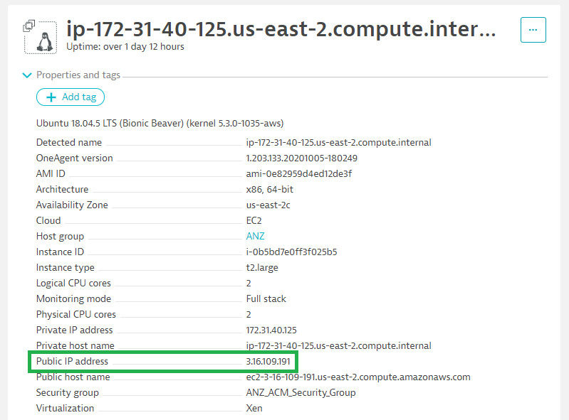

Open up your **web browser** and access the Jenkins URL via `<IP address>:8020`

<!-- ------------------------ -->
## Setting up Jenkins 
Duration: 15

### Installing Docker Pipeline Plugin
Once you login, you will see the screen as below. Click on “Install suggested plugins” as below:

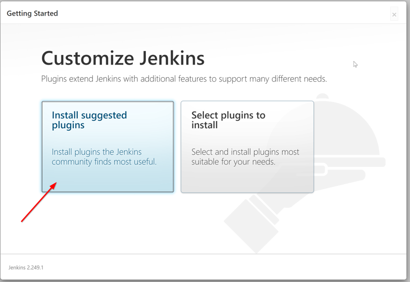

Further, add an admin user with username “admin” and password “dynatrace” 

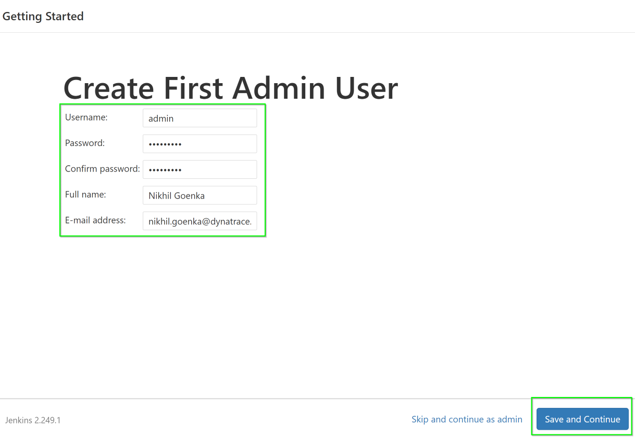

* Click on **Manage Jenkins** on the left menu

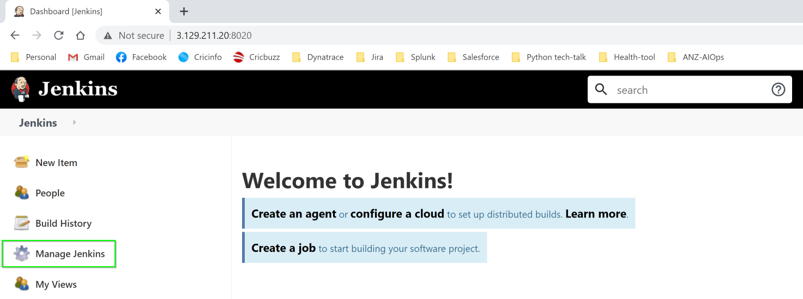

* Click on **Manage Plugins** as highlighted below:

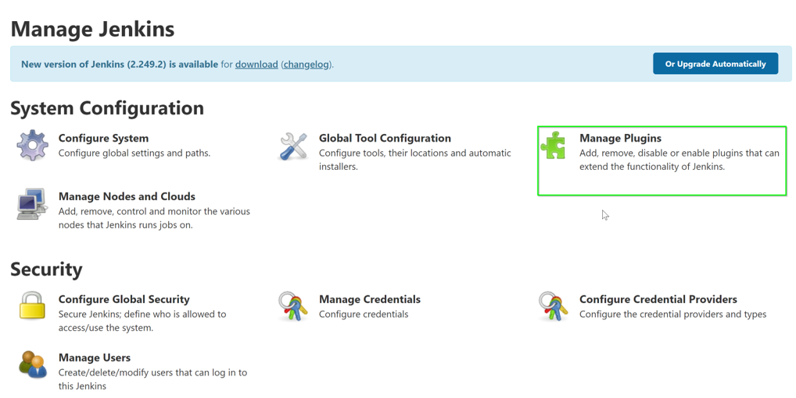

* Now, click on **Available plugins** and input `docker` in the **search bar**
* Select **Docker Pipeline**
* Click on **Install without restart** 

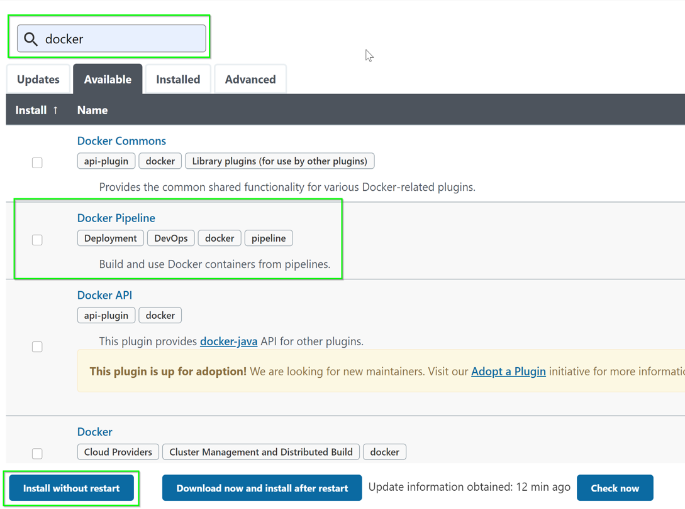

### Configure Environment Variables

Within Jenkins, click on **Manage Jenkins  > Configure System**

* Look for **environment variables** as per image below:

* Add the following environment variables:
  * DT_URL with value https://mou612.managed-sprint.dynalabs.io/e/{environmentid}
  * DT_TOKEN
  * PUBLIC_IP

### Configure Jenkins Pipeline

* Click on “New Item” on the left side:

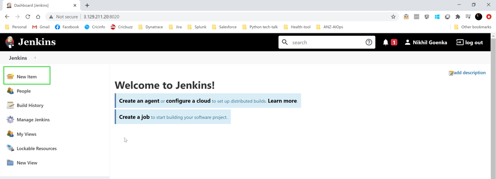

* Add a pipeline as per below:
  * Item name - `My Pipeline`
  * Choose **Pipeline**
  * Click on **OK**

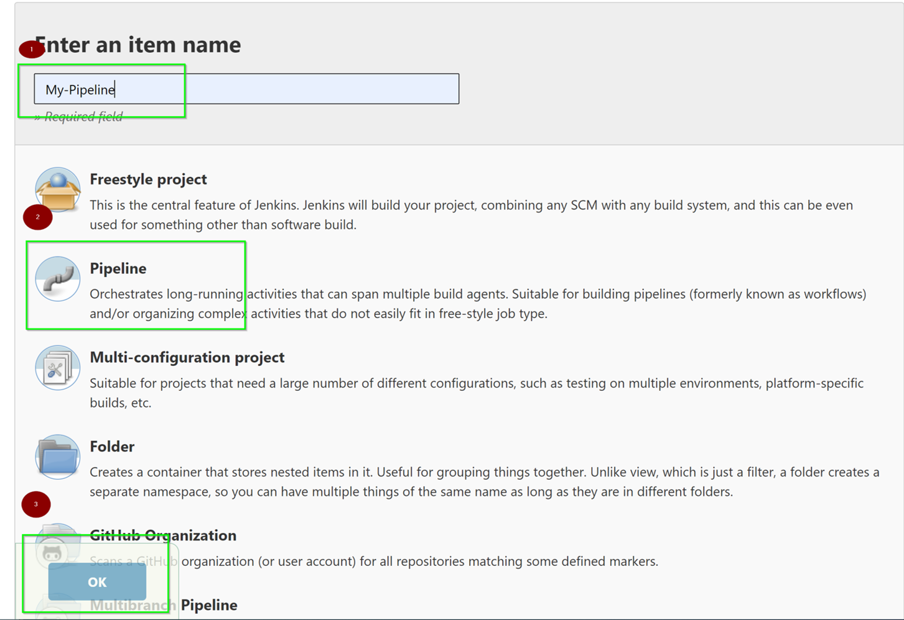

* Use the pipeline definitions as per below:
  * Definition - Dropdown **Pipeline script from SCM**
  * SCM - Dropdown **Git**
  * Repository URL - `https://github.com/nikhilgoenkatech/JenkinsBankApp/`
  * Click on **OK**

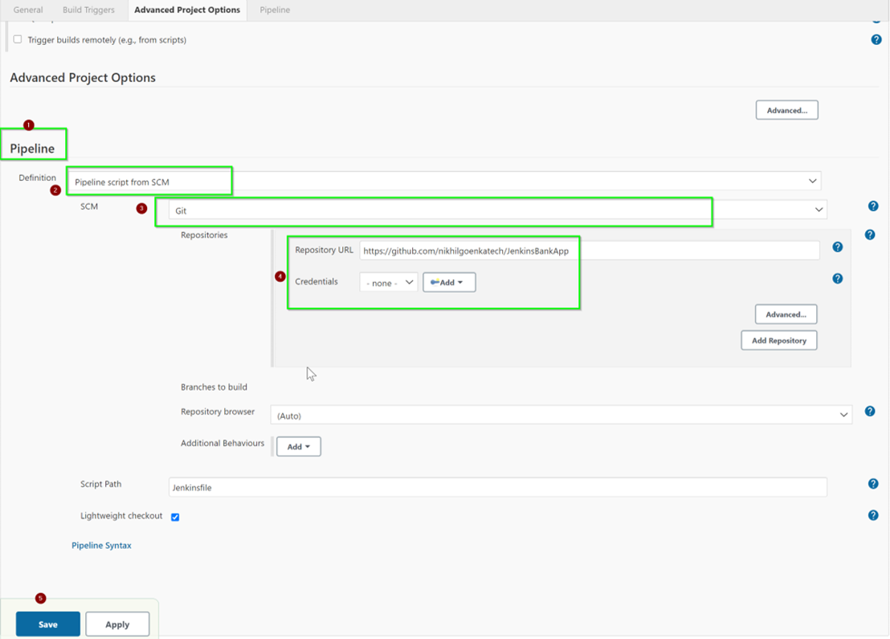

<!-- ------------------------ -->
## Create Auto Tag rule for Jenkins
Duration: 10

### Creating Auto Tags

Within Dynatrace, on the left menu go to **Settings > Tags > Automatically applied tags**

Use the following:
* Tag name - `JenkinInstance`
* Optional Tag value - `{Ec2Instance:SecurityGroup}`
* Conditions - 
  * Dropdown **AWS Security Group** 
  * Dropdown **begins with** 
  * ANZ_ACM_Security_Group
  * **Check** Case sensitive 
* Click on **Save**

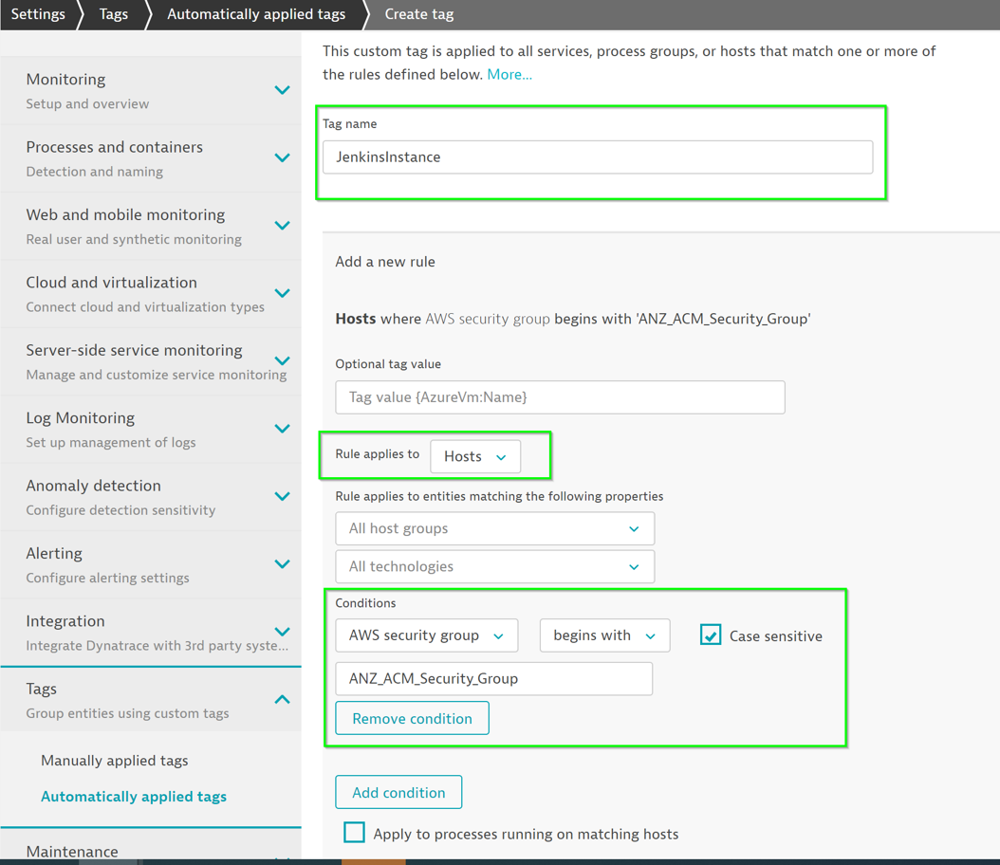

Within the Host Properties and tags, **JenkinsInstance tag** will be added

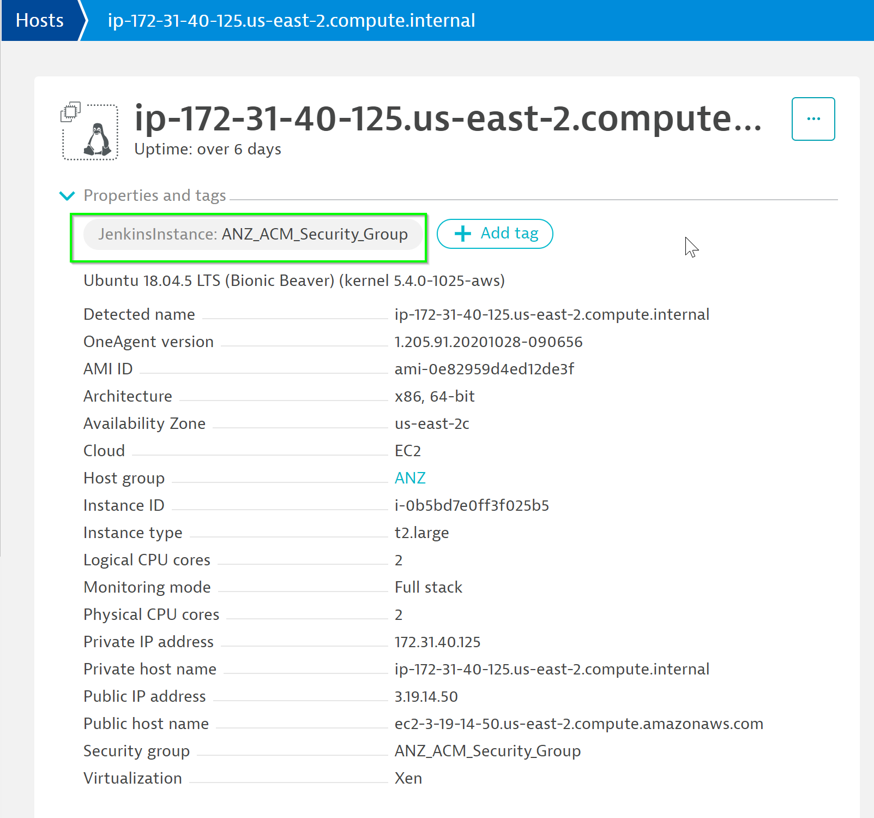

Back in Jenkins, click on **Build Now** for the **My-Pipeline**

### Creating Tags for Build Stages

Use the following:
* Tag name - `DockerService`
* Rule applies to - Dropdown **Services**
* Optional Tag value - `{ProcessGroup:DetectedName}`
* Conditions - 
  * Dropdown **Docker container name** 
  * Dropdown **exists** 
* Click on **Save**

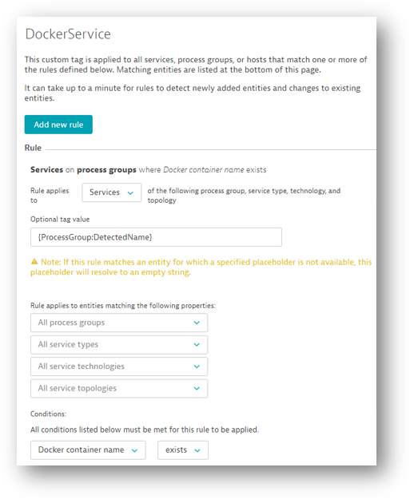

Use the following:
* Tag name - `Environment`
* Rule applies to - Dropdown **Services**
* Optional Tag value - `{ProcessGroup:Environment:ENVIRONMENT}`
* Conditions - 
  * Dropdown **ENVIRONMENT (Environment)** 
  * Dropdown **exists** 
* Click on **Save**

### Review changes in Dynatrace

You can see the changes reflected in **SampleOnlineBankStaging Process View**

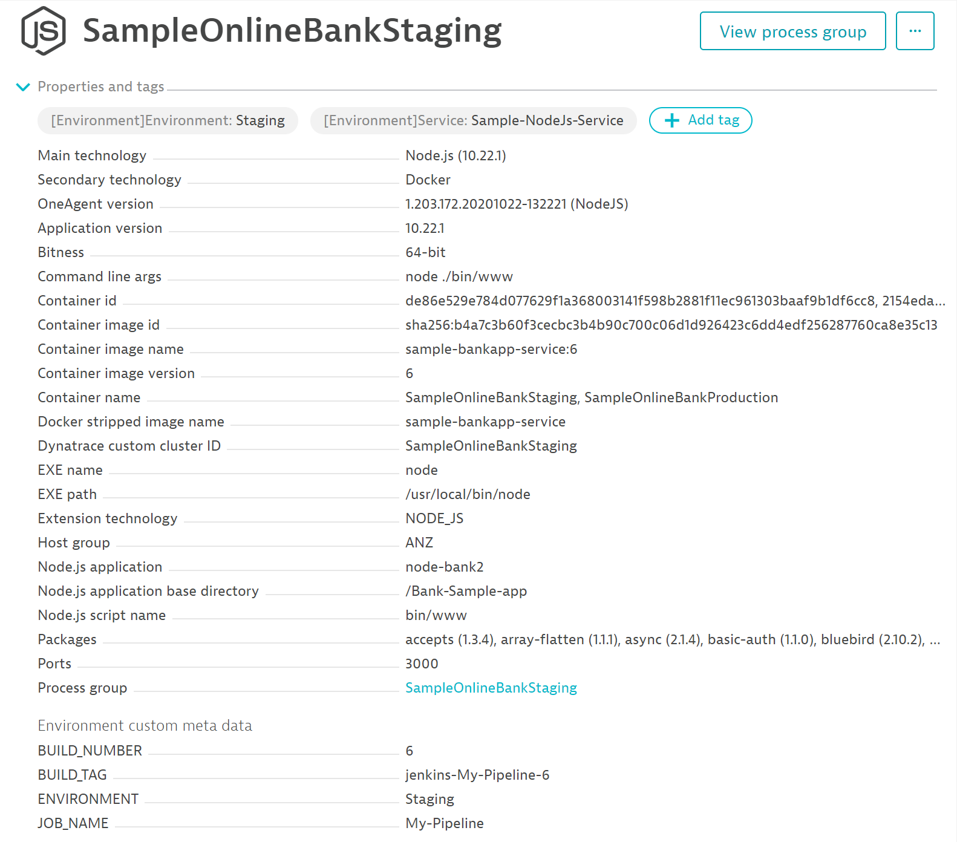

You also can see the changes reflected in **node-bank2 Service View**

<!-- ------------------------ -->

## Feedback
Duration: 3

We hope you enjoyed this lab and found it useful. We would love your feedback!
<form>
  <name>How was your overall experience with this lab?</name>
  <input value="Excellent" />
  <input value="Good" />
  <input value="Average" />
  <input value="Fair" />
  <input value="Poor" />
</form>

<form>
  <name>What did you benefit most from this lab?</name>
  <input value="Using OneAgent Operator to deploy in Kubernetes" />
  <input value="Setting up Kubernetes integation" />
  <input value="Enabling early access feature flags" />
  <input value="Learning Kubernetes View in Dynatrace" />
</form>

<form>
  <name>How likely are you to recommend this lab to a friend or colleague?</name>
  <input value="Very Likely" />
  <input value="Moderately Likely" />
  <input value="Neither Likely nor unlikely" />
  <input value="Moderately Unlikely" />
  <input value="Very Unlikely" />
</form>

Positive
: 💡 For other ideas and suggestions, please **[reach out via email](mailto:APAC-SE-Central@dynatrace.com?subject=Automate Feedback 1 - Ideas and Suggestions")**.