summary: Automate Delivery Session 2
id: automate-delivery-2
categories: automate-delivery
tags: anz
status: Published
authors: Nikhil Goenka
Feedback Link: mailto:d1-apac@dynatrace.com
Analytics Account: UA-175467274-1

# Automate Delivery - Session 2
<!-- ------------------------ -->
## Introduction
Duration: 1

This lab is the fourth session of the AIOps Enablement Series for ANZ Bank. This track focuses on the Automate Delivery, which relates to how you could integate Dynatrace with orchestration tools to create **Progressive Delivery**.

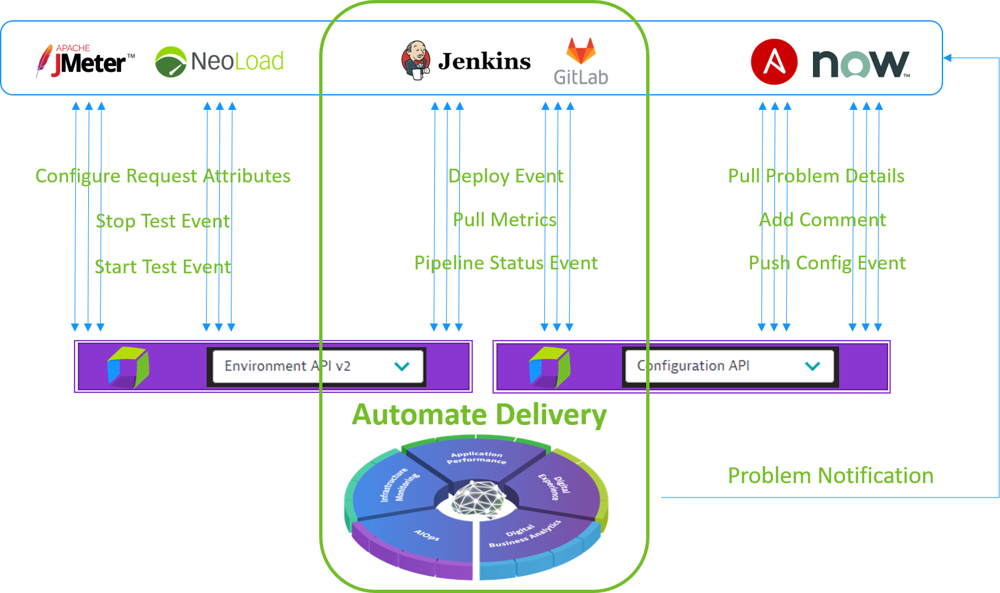

Throughout these labs, we will be using the **deployment approach / strategies** based on the example below.

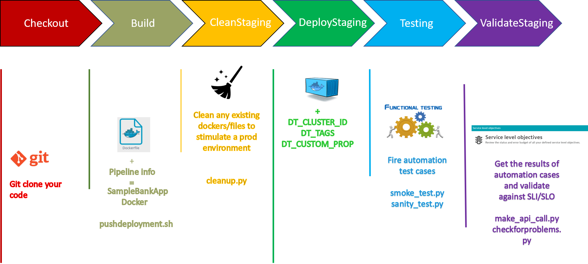

### What You’ll Learn
- Integrate Jenkins with Dynatrace
- Setup Docker Pipeline in Jenkins
- Leveraging Auto tags Rules for pipelines in Dynatrace
  - Creating tags from Build Stages

Negative
: As different teams might have their own proprietary test-beds/suits, so we will demo stimulating requests using curl commands too.

<!-- ------------------------ -->
## Useful Commands ✅

Positive
: To start the docker with sample application:
   `docker run -d --name SampleBankApp -p 4000:3000 nikhilgoenka/sample-bank-app`
  * This would start the docker on port localhost:4000 with docker name as **SampleBankApp**

Positive
: To start the jenkins docker:
   `docker run -d --network mynetwork --name Jenkins-Dynatrace -p 8020:8080  -v /var/jenkins:/var/jenkins_home -v /var/run/docker.sock:/var/run/docker.sock nikhilgoenka/jenkins-dynatrace-workshop`
   * -d runs the docker in daemon mode.
   * -p 8020:8080 - By default, jenkins docker would be running on 8080. Specifying **-p 8020:8080** binds the 8080 in docker to localhost on 8020. So, you can forward/listen requests from docker using `localhost:8020`.
   * -v Bind mounts a volume.
    By default, jenkins docker is maintaining the pipeline/data information in /var/jenkins_home.
    Specifying **-v /var/jenkins:/var/jenkins_home** would mount the localhost:/var/jenkins directory so that the pipeline data is not lost once pipeline is re-started.
    Specifying **-v /var/run/docker.sock:/var/run/docker.sock** will allow the jekins docker to leverage the dockerd running on localhost. This would be required since we are starting the
    sample-app dockers while running the pipeline.

Positive
: To run the ansible-tower docker:
   `docker run -d --name ansible-tower -p 8090:443 ybalt/ansible-tower`
   This would start the docker on port **localhost:8090** with docker name as **ansible-tower**

**Other useful commands:**
* To **view all docker containers**: `docker ps -a`
* To **view the downloaded images** on localhost: `docker images`
* To **remove a particular image**: `docker rmi <IMAGE-NAME>`
* To **stop a docker**: `docker stop <CONTAINER-ID>`
* To **remove a docker**: `docker rm <CONTAINER-ID>`
* To **run a docker in interactive bash**: `docker run -it <CONTAINER> /bin/bash`
* To **delete all the unused images**: `docker system prune -a -f`
* To **pull a particular image**: `docker pull <docker-image>`
* Jenkins pipeline:
   Command: `https://github.com/nikhilgoenkatech/JenkinsBankApp`

<!-- ------------------------ -->
## Prerequisites / Preconfiguration
Duration: 10

Negative
: Note that this lab is part of the larger session - [AIOps Hands On Workshop Series](https://dynatrace-apac.github.io/anz). Please refer also to the last session [Automate Delivery Sesssion 1](https://dynatrace-apac.github.io/workshops/automate-delivery-1/)

Log back into your Dynatrace environment and check if OneAgent is still running.

On your left navigation, select **Hosts** and you should still see a monitored EC2 host.

### Check if OneAgent is running

Log back into your Dynatrace environment and check if OneAgent is still running.

On your left navigation, select **Hosts** and you should still see a monitored EC2 host.

### Running Jenkins in Docker

Negative
: Before you start the Jenkins docker, please remove the existing Jenkins-docker as below with this command
`docker rm Jenkins-Dynatrace`

The Jenkins docker would already be present in your ubuntu instances and can be seen with “docker images”


To start the Jenkins docker, execute `docker run -d --network mynetwork --name Jenkins-Dynatrace -p 8020:8080  -v /var/jenkins:/var/jenkins_home -v /var/run/docker.sock:/var/run/docker.sock nikhilgoenka/jenkins-dynatrace-workshop`
In our last session, we mounted the docker data in host-volume '/var/jenkins', so our pipeline and other jenkins data would be restored from that directory.

### Stop/Remove all sample-bank-apps
Verify if you have any old docker(s) for sample-bank-app in your environment using `docker ps -a`

If output of above command shows any docker with name "SampleOnlineBankStaging"; remove them by executing `docker stop SampleOnlineBankStaging` followed by `docker rm SampleOnlineBankStaging`


Similarly, if you have any production dockers, remove them by executing `docker stop SampleOnlineBankProduction` followed by `docker rm SampleOnlineBankProduction`


### Login into Jenkins

Login into Jenkins through **web browser** and access the Jenkins URL via `<IP address>:8020` with username `admin` and password `dynatrace`


### Configure Environment Variables

As AWS instance was restarted, Public IP-address may have changed, so look for the **Properties and Tags** on dynatrace>Hosts and you will get a list of various metadata associated with the host created. Locate the **Public IP Address** and copy its value.


Further, change the value of environment variable created earlier to reflect the new IP-address, as below:

Within Jenkins, click on **Manage Jenkins  > Configure System**


* Look for **environment variables** as per image below:

* Modify the following environment variables:
  * PUBLIC_IP

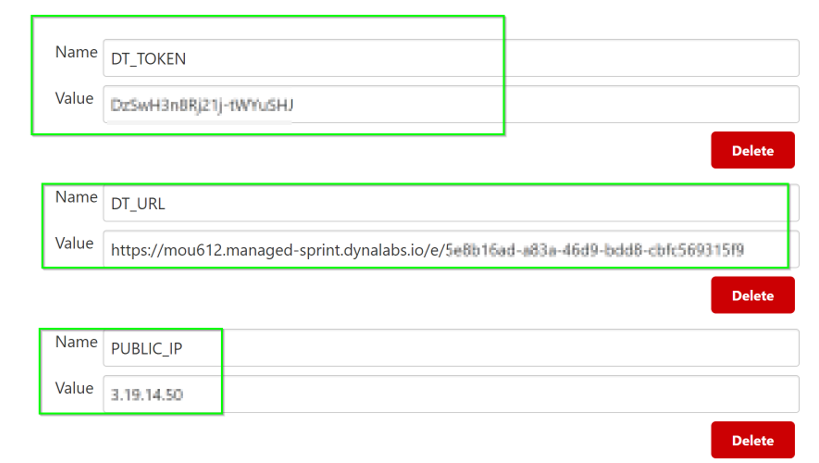


<!-- ------------------------ -->
## Creating Jenkins Build
Duration: 20

During the build, we will create a synthethic monitor, so make sure the token that has been imported in Jenkins has appropriate permissions as below.
To verify token permission, follow the steps below:

* Go to **Settings > Integration > Dynatrace API > Generate Token**
* Select the token that was imported into Jenkins. 
* Make sure it has the permission to **Create and read synthetic monitors**
* If not, toggle **Create and read synthetic monitors, locations, and nodes**.
* Click on **Save**

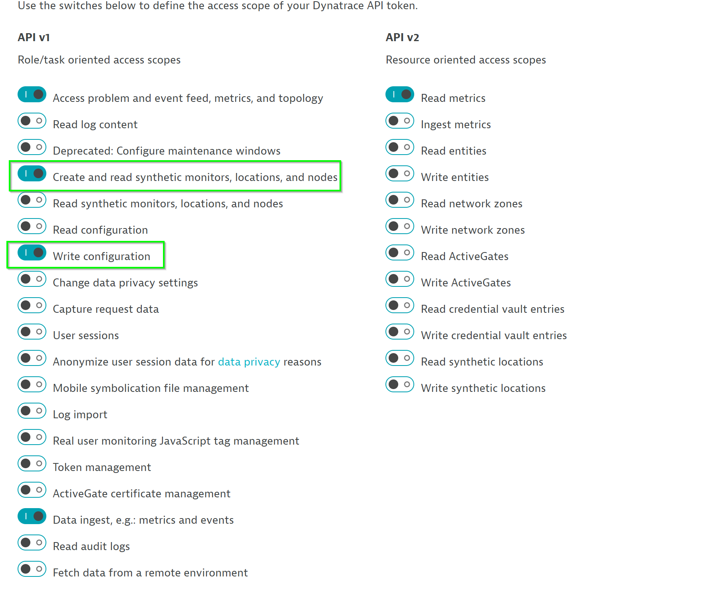

### Simulate SLA/SLO
To simulate SLA/SLO, select one of the requests from the sample-bank-app by navigating to **Transaction & Services > node-bank > View dynamic requests** and select timeframe as **Last 7 days**.
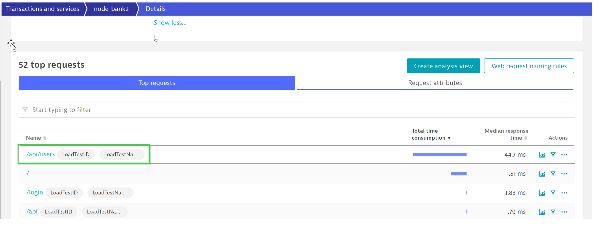

**Mark the request as key-request** as shown below.


Negative
: After marking the key-request, access the request within browser at **http://{IP-address}:3000/api/users** so that new requests appear under anomaly detections.

Now, let us configure the request to have a *hypothetical threshold* (which will be your SLA/SLO). To do so, navigate to **Transaction & Services > node-bank > Edit > Anomaly detection**.


Set the **threshold to a low value say (eg. 2ms)** so that a problem will be generated.
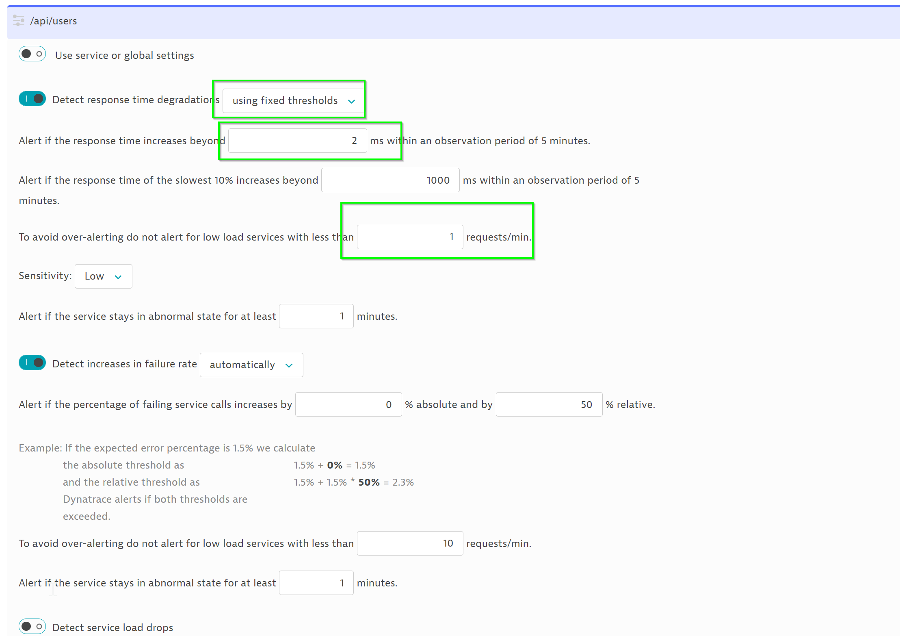

### Trigger a new Jenkins-build
Within Jenkins, navigate to **Homepage** and click on **Build Now** as seen below


### Build failure
The build is likely to fail with a problem highlighting the **key-requests has exceeded configured threshold**. 
A sample problem looks like below:
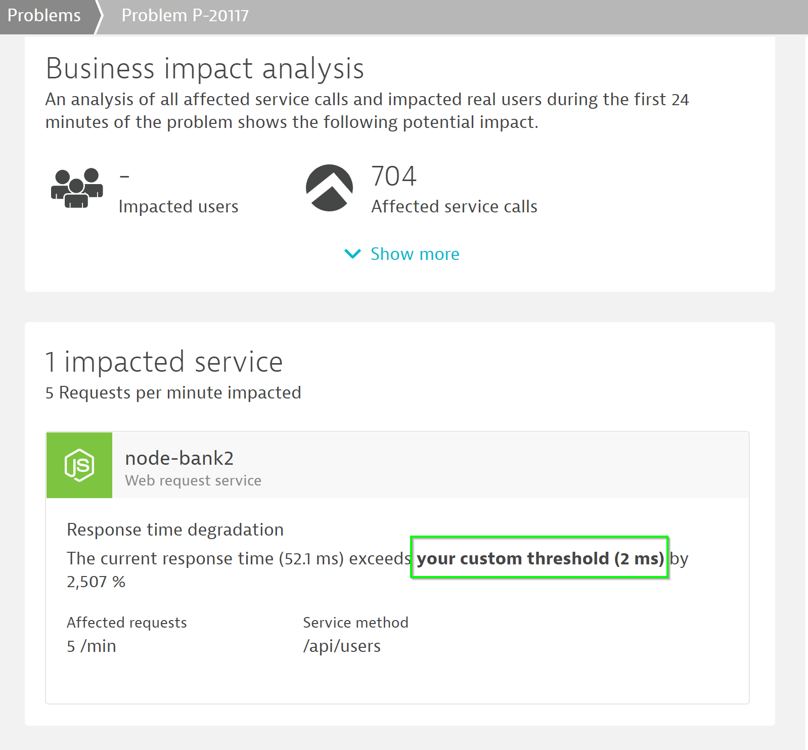

On the right-hand side of the problem generated, DT would highlight the **probable root-cause** and the **associated tools** that can be used to analysis the issue.

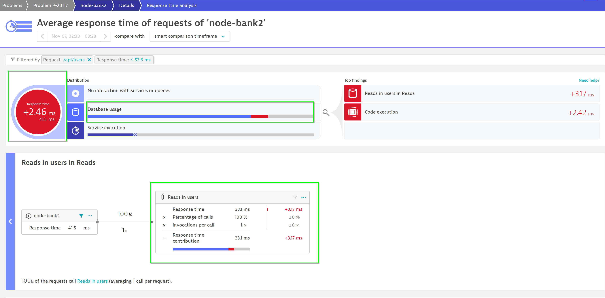

Positive
: Using these tools would help the developer to get to a quicker resolution.

As one problem would be open, our pipeline would be stalled with Staging not proceeding to Production. So in order to proceed, **manually close the problem** within dynatrace.


From Jenkins, **trigger the build** again.


<!-- ------------------------ -->
## Decoding steps in each stage
Duration: 20

In Jenkins, Click on **individual stages > Logs** to view details involved in that step.
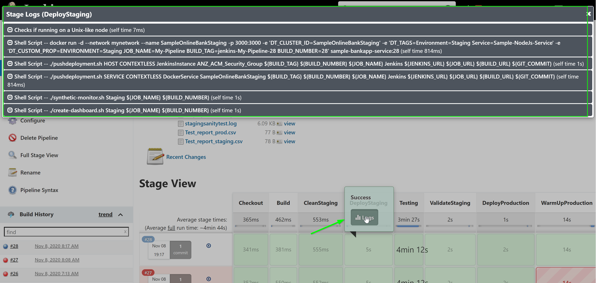

### Understanding the tags in more detail
Referring to the Jenkins File, the following code handles the **pushing of Jenkins deployment information** into Dynatrace.

```yaml
dir ('dynatrace-scripts') {
    // push a deployment event on the host with the tag JenkinsInstance created using automatic tagging rule
    sh './pushdeployment.sh HOST CONTEXTLESS JenkinsInstance ANZ_ACM_Security_Group ' +
        '${BUILD_TAG} ${BUILD_NUMBER} ${JOB_NAME} ' +
        'Jenkins ${JENKINS_URL} ${JOB_URL} ${BUILD_URL} ${GIT_COMMIT}'
```

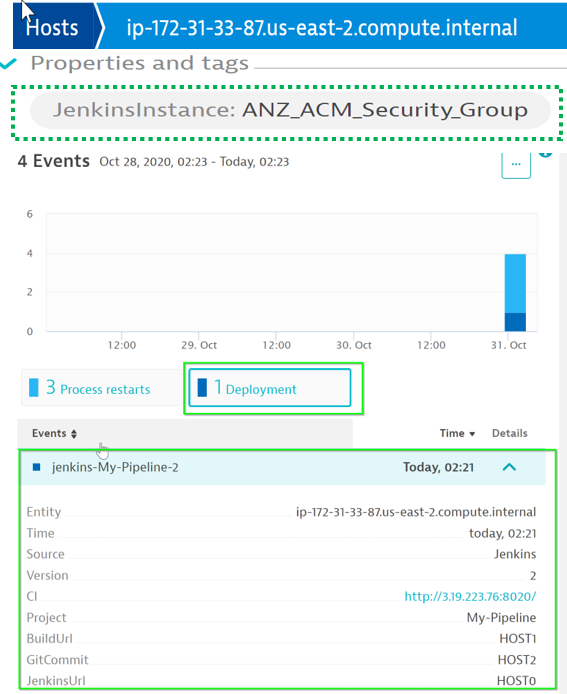


Referring to the Jenkins File, the following code handles the **pushing of deployment information** into Dynatrace.
This step utilizes environment varibles such as **DT_CLUSTER_ID**, **DT_TAGS** and **DT_CUSTOM_PROP**

```yaml
stage('DeployStaging') {
    // Lets deploy the previously build container
    def app = docker.image("sample-bankapp-service:${BUILD_NUMBER}")
    app.run("--network mynetwork --name SampleOnlineBankStaging -p 3000:3000 " +
            "-e 'DT_CLUSTER_ID=SampleOnlineBankStaging' " +
            "-e 'DT_TAGS=Environment=Staging Service=Sample-NodeJs-Service' " +
            "-e 'DT_CUSTOM_PROP=ENVIRONMENT=Staging JOB_NAME=${JOB_NAME} " +
                "BUILD_TAG=${BUILD_TAG} BUILD_NUMBER=${BUILD_NUMBER}'")
```


### Review changes in Dynatrace

You can see the changes reflected in **SampleOnlineBankStaging Process View**


You also can see the changes reflected in **node-bank2 Service View**


### Automate/Continuous Feedback from Dynatrace

```yaml
stage('Testing') {
  // lets push an event to dynatrace that indicates that we START a load test
  dir ('dynatrace-scripts') {
      sh './pushevent.sh SERVICE CONTEXTLESS DockerService SampleOnlineBankStaging ' +
          '"STARTING Load Test" ${JOB_NAME} "Starting a Load Test as part of the Testing stage"' +
          ' ${JENKINS_URL} ${JOB_URL} ${BUILD_URL} ${GIT_COMMIT}'
  }

  // lets run some test scripts
  dir ('sample-bank-app-service-tests') {
      // start load test - simulating traffic for Staging enviornment on port 3000

      sh "rm -f stagingloadtest.log stagingloadtestcontrol.txt"
      sh "python3 smoke-test.py 3000 200 ${BUILD_NUMBER} stagingloadtest.log ${PUBLIC_IP} SampleOnlineBankStaging"
      archiveArtifacts artifacts: 'stagingloadtest.log', fingerprint: true
  }

  // lets push an event to dynatrace that indicates that we STOP a load test
  dir ('dynatrace-scripts') {
      sh './pushevent.sh SERVICE CONTEXTLESS DockerService SampleOnlineBankStaging '+
          '"STOPPING Load Test" ${JOB_NAME} "Stopping a Load Test as part of the Testing stage" '+
          '${JENKINS_URL} ${JOB_URL} ${BUILD_URL} ${GIT_COMMIT}'
  }
```


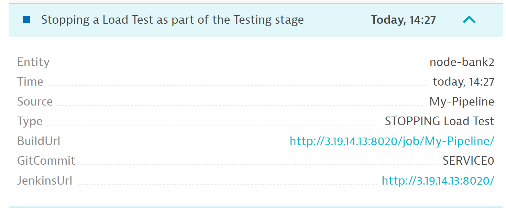

Positive
: Davis would ingest and analyse the data which would further help in identifying probable root-cause and thereby, helping the backend teams to a quicker resolution.

### Automate UI tests using Synthetic browsers

```bash
// Create a sample synthetic monitor so as to check the UI functionlity
sh './synthetic-monitor.sh Staging '+  '${JOB_NAME} ${BUILD_NUMBER}'
```

The script would **leverage API to create a synthetic browser and perform the different user-actions**. To view the synthetic browser, navigate to **Synthetic within Dynatrace**


In an event of any issues with UI funcitonality, DT would automtically trigger a problem, thereby **halting the erroneous build to be shipped to production**.

### Dashboard creation
Leveraging the dashboard API, a dashboard is generated with information of the **health metrics of hosts/services/requests invoked duringJenkins pipeline**. These can be used to give a quick sneak peek of any issues to the operation/devOps team.

```bash
// Create a sample dashboard for the staging stage
sh './create-dashboard.sh Staging '+  '${JOB_NAME} ${BUILD_NUMBER}'
```
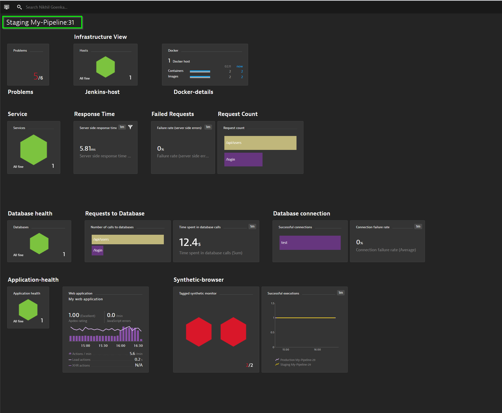


<!-- ------------------------ -->

## Feedback
Duration: 3

We hope you enjoyed this lab and found it useful. We would love your feedback!
<form>
  <name>How was your overall experience with this lab?</name>
  <input value="Excellent" />
  <input value="Good" />
  <input value="Average" />
  <input value="Fair" />
  <input value="Poor" />
</form>

<form>
  <name>What did you benefit most from this lab?</name>
  <input value="Integrate Jenkins with Dynatrace" />
  <input value="Setup Docker Pipeline in Jenkins" />
  <input value="Leveraging Dynatrace for pipelines in Dynatrace" />
  <input value="Creating synthetic browser in Dynatrace" />
  <input value="Creating Dashboard using API" />
</form>

<form>
  <name>How likely are you to recommend this lab to a friend or colleague?</name>
  <input value="Very Likely" />
  <input value="Moderately Likely" />
  <input value="Neither Likely nor unlikely" />
  <input value="Moderately Unlikely" />
  <input value="Very Unlikely" />
</form>

Positive
: 💡 For other ideas and suggestions, please **[reach out via email](mailto:APAC-SE-Central@dynatrace.com?subject=Automate Feedback 1 - Ideas and Suggestions")**.
root@ip-172-31-33-87:/home/d1pacmworkshop#
