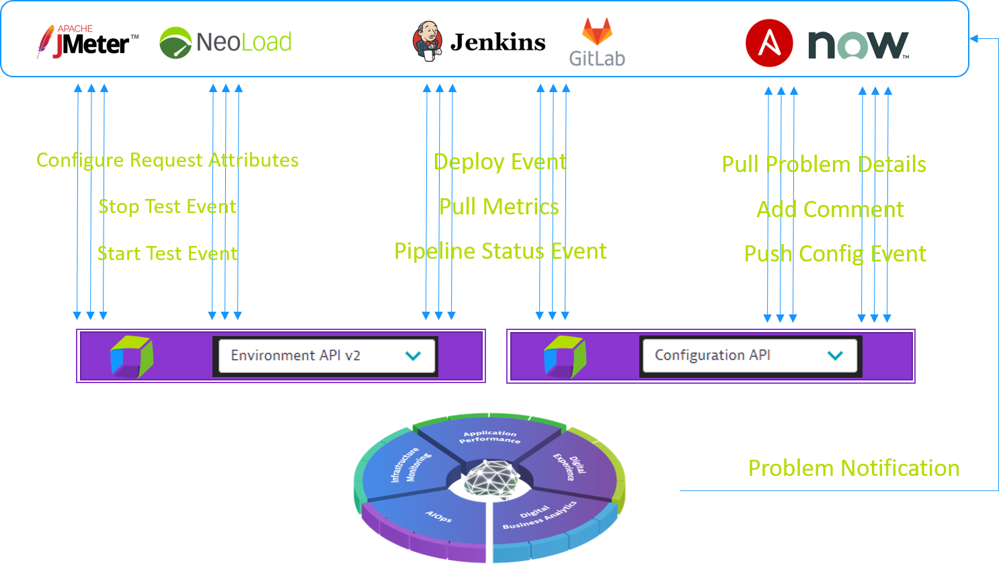
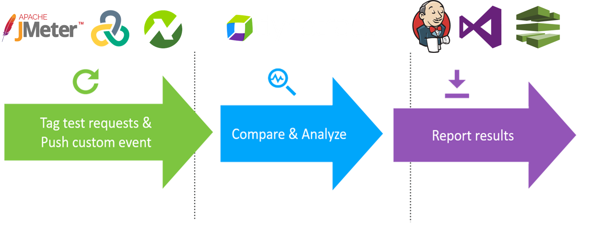
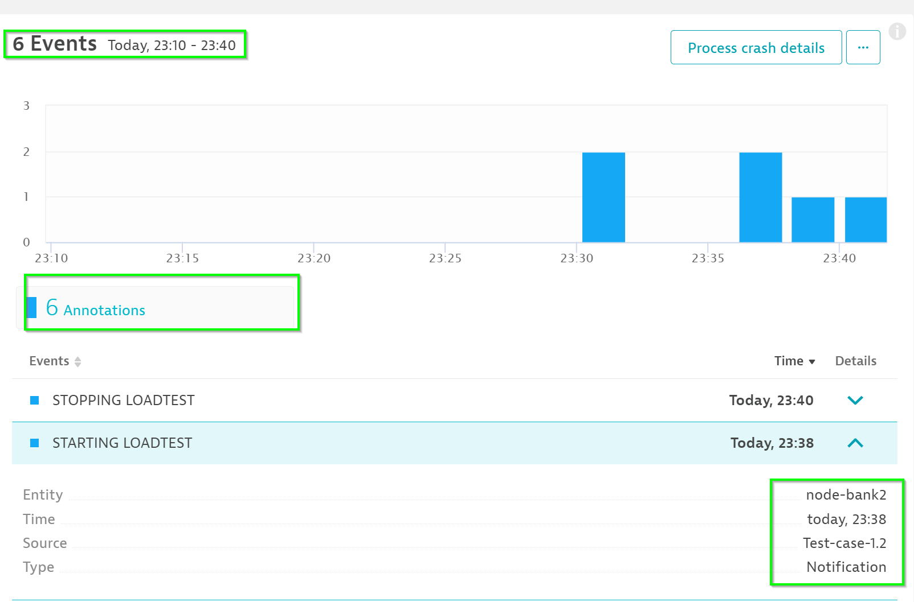

summary: Automate Feedback Session 1
id: automate-feedback-1
categories: automate-feedback
tags: anz
status: Published 
authors: Brandon Neo
Feedback Link: mailto:d1-apac@dynatrace.com
Analytics Account: UA-175467274-1

# Automate Feedback - Session 1
<!-- ------------------------ -->
## Introduction 
Duration: 1

This lab is the first session of the AIOps Enablement Series for ANZ Bank. This track focuses on the Automate Feedback, which relates to how you could integate Dynatrace with load testing tools to create **Performance as a service**.

Negative
: The content for the labs are for reference purposes only. Full instructions and details will be provided within the actual labs.

<!-- ------------------------ -->
## Understanding Dynatrace Integration
Duration: 5

By integrating Dynatrace into your existing load testing process, you can stop broken builds in your delivery pipeline earlier.

### Tag tests with HTTP headers 

While executing a load test from your load testing tool of choice (JMeter, Neotys, LoadRunner, etc) each simulated HTTP request can be tagged with additional HTTP headers that contain test-transaction information (for example, script name, test step name, and virtual user ID). Dynatrace can analyze incoming HTTP headers and extract such contextual information from the header values and tag the captured requests with request attributes. Request attributes enable you to filter your monitoring data based on defined tags.

Positive
: Documented steps can be found here [here](https://www.dynatrace.com/support/help/setup-and-configuration/integrations/third-party-integrations/test-automation-frameworks/dynatrace-and-load-testing-tools-integration/)

<!-- ------------------------ -->
## Defining Request Attribute
Duration: 10

You can use any (or multiple) HTTP headers or HTTP parameters to pass context information. 
The extraction rules can be configured via **Settings > Server-side service monitoring > Request attributes.**

The header x-dynatrace-test is used in the following examples with the following set of key/value pairs for the header:

|    |           |
|----|-----------|
| **Code**  |**Description**   |
| **VU**  |   Virtual User ID of the unique user who sent the request.      |
| **SI**  |   Source ID identifies the product that triggered the request (JMeter, LoadRunner, Neotys, or other)     |
| **TSN**   |   Test Step Name is a logical test step within your load testing script (for example, Login or Add to cart.     |
| **LSN** |   Load Script Name - name of the load testing script. This groups a set of test steps that make up a multi-step transaction (for example, an online purchase).      |
| **LTN**  |   The Load Test Name uniquely identifies a test execution (for example, 6h Load Test – June 25)     |
| **PC**  |   Page Context provides information about the document that is loaded in the currently processed page.     |

<!-- ------------------------ -->
## Request Tag-based Analysis
Duration: 20

### Creating Tags

Tagging is a powerful mechanism. However, to reap its benefits, tagging should be used carefully and in a meaningful way. To guide you towards this end, we provide you with specific recommendations and best practices, which are described below. With auto-tagging based on metadata, tags can be generated automatically and assigned to monitored entities with the specific metadata values that Dynatrace detects automatically.

Positive
: Documentation for [Best Practices for Tagging](https://www.dynatrace.com/support/help/how-to-use-dynatrace/tags-and-metadata/) 

### Naming Rules

Dynatrace automatically provides names, but they don’t enable you to quickly identify where an application or service belongs to. To achieve this, it's recommended that you use service naming rules and process group naming rules. This can be done in Dynatrace using metadata imported from the monitored applications.

You can use Dynatrace Naming Rules to differentiate requests

Positive
: Documented steps can be found [here](https://www.dynatrace.com/support/help/how-to-use-dynatrace/tags-and-metadata/setup/how-to-define-tags/)

### Annotate Dynatrace with Events 

The Events API delivers details about all uncorrelated events that Dynatrace collects within your environment. Information returned for each event includes attributes about the event source, the entity where the event was collected, and other event-specific details.

PUSH endpoint enables third-party systems such as CI platforms (Jenkins, Bamboo, Electric Cloud, etc.) to provide additional details for Dynatrace automated root cause analysis.

Positive
: Documented steps can be found [here](https://www.dynatrace.com/support/help/dynatrace-api/environment-api/events/push-deployment-events-from-jenkins/)

### Compare and Analyze events

There are different ways to analyze the data. Your approach should be based on the type of performance analysis you want to do (for example, crashes, resource and performance hotspots, or scalability issues). 

Positive
: Documented steps can be found [here](https://www.dynatrace.com/support/help/shortlink/load-testing-process#compare--analyze)

<!-- ------------------------ -->
## Automate with Curl
Duration: 10

The steps that we ran through could be automated with by initiating HTTP requests through curl.

<!-- ------------------------ -->

## Feedback
Duration: 3

We hope you enjoyed this lab and found it useful. We would love your feedback!
<form>
  <name>How was your overall experience with this lab?</name>
  <input value="Excellent" />
  <input value="Good" />
  <input value="Average" />
  <input value="Fair" />
  <input value="Poor" />
</form>

<form>
  <name>What did you benefit most from this lab?</name>
  <input value="Defining Load Testing Request Attribute" />
  <input value="Annotate Dynatrace with Events from Load Testing" />
  <input value="Automating with Curl" />
  <input value="Compare and Analyze events" />
</form>

<form>
  <name>How likely are you to recommend this lab to a friend or colleague?</name>
  <input value="Very Likely" />
  <input value="Moderately Likely" />
  <input value="Neither Likely nor unlikely" />
  <input value="Moderately Unlikely" />
  <input value="Very Unlikely" />
</form>

Positive
: 💡 For other ideas and suggestions, please **[reach out via email](mailto:d1-apac@dynatrace.com?subject=Automate Feedback 1 - Ideas and Suggestions")**.