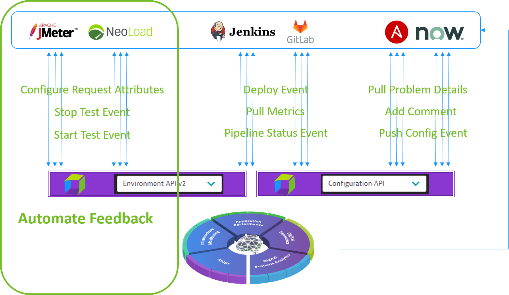
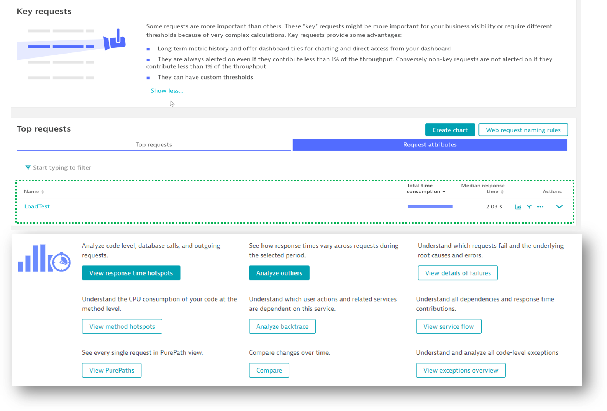
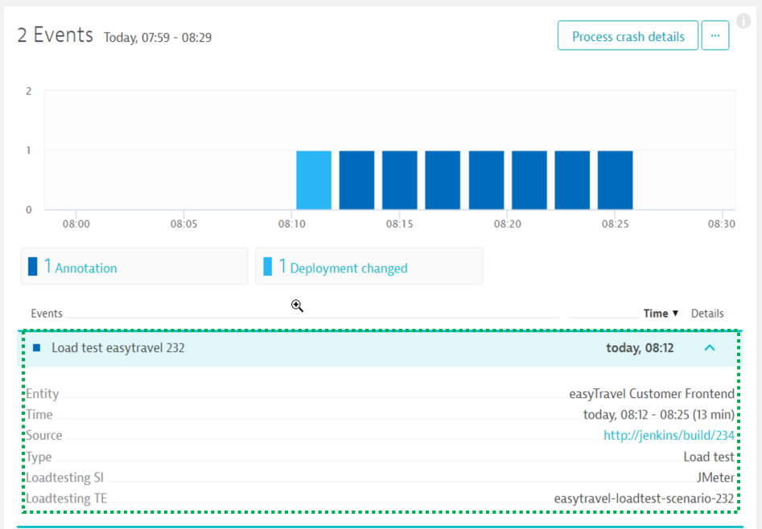

summary: Automate Feedback Session 2
id: automate-feedback-2
categories: automate-feedback
tags: anz
status: Published 
authors: Brandon Neo
Feedback Link: mailto:d1-apac@dynatrace.com
Analytics Account: UA-175467274-1

# Automate Feedback - Session 2
<!-- ------------------------ -->
## Introduction 
Duration: 1

This lab is the second session of the AIOps Enablement Series for ANZ Bank. This track focuses on the Automate Feedback, which relates to how you could integate Dynatrace with load testing tools to create **Performance as a service**.

### Prerequisites
- Dynatrace SaaS/Managed Account. Get your free SaaS trial [here](https://www.dynatrace.com/trial/).
- Chrome Browser 

### What You’ll Learn 
- Creating Manual Tags in Dynatrace to define unique entity
- Load test web requests renaming
- Compare features to differentiate load test / actual requests
- Mark Load test requests as Key Requests
- Create dashboards for load-requests basic tiles
  - Response time
  - Failure rates
  - Database performance
 

<!-- ------------------------ -->
## Tag-based Analysis of Requests
Duration: 5

By integrating Dynatrace into your existing load testing process, you can stop broken builds in your delivery pipeline earlier.

### Defining a Unique Entity

Tagging is a powerful mechanism. However, to reap its benefits, tagging should be used carefully and in a meaningful way. To guide you towards this end, we provide you with specific recommendations and best practices, which are described below. With auto-tagging based on metadata, tags can be generated automatically and assigned to monitored entities with the specific metadata values that Dynatrace detects automatically.

[Best Practices for Tagging](https://www.dynatrace.com/support/help/how-to-use-dynatrace/tags-and-metadata/) 

### Pushing Events to defined tag

**Full integration and approach is documentated [here]**(https://www.dynatrace.com/support/help/setup-and-configuration/integrations/third-party-integrations/test-automation-frameworks/dynatrace-and-load-testing-tools-integration/)

<!-- ------------------------ -->
## Renaming Load Test Requests
Duration: 20

### Naming Rules

Dynatrace automatically provides names, but they don’t enable you to quickly identify where an application or service belongs to. To achieve this, it's recommended that you use service naming rules and process group naming rules. This can be done in Dynatrace using metadata imported from the monitored applications.

You can use Dynatrace Naming Rules to differentiate requests

Documentation [here](https://www.dynatrace.com/support/help/how-to-use-dynatrace/tags-and-metadata/setup/how-to-define-tags/)

<!-- ------------------------ -->
## Analyzing Dynatrace Events 
Duration: 10

### Annotate Dynatrace with Events 

The Events API delivers details about all uncorrelated events that Dynatrace collects within your environment. Information returned for each event includes attributes about the event source, the entity where the event was collected, and other event-specific details.

PUSH endpoint enables third-party systems such as CI platforms (Jenkins, Bamboo, Electric Cloud, etc.) to provide additional details for Dynatrace automated root cause analysis.

Documentation [here](https://www.dynatrace.com/support/help/dynatrace-api/environment-api/events/push-deployment-events-from-jenkins/)

### Compare and Analyze events

There are different ways to analyze the data. Your approach should be based on the type of performance analysis you want to do (for example, crashes, resource and performance hotspots, or scalability issues). 

Documentation [here] (https://www.dynatrace.com/support/help/shortlink/load-testing-process#compare--analyze)

### Marking Load Test Key Requests

<!-- ------------------------ -->
## Creating Dashboards for Load Tests
Duration: 10

### Selecting load-test requests tiles

<!-- ------------------------ -->

## Feedback
Duration: 3

We hope you enjoyed this lab and found it useful. We would love your feedback!
<form>
  <name>How was your overall experience with this lab?</name>
  <input value="Excellent" />
  <input value="Good" />
  <input value="Average" />
  <input value="Fair" />
  <input value="Poor" />
</form>

<form>
  <name>What did you benefit most from this lab?</name>
  <input value="Using OneAgent Operator to deploy in Kubernetes" />
  <input value="Setting up Kubernetes integation" />
  <input value="Enabling early access feature flags" />
  <input value="Learning Kubernetes View in Dynatrace" />
</form>

<form>
  <name>How likely are you to recommend this lab to a friend or colleague?</name>
  <input value="Very Likely" />
  <input value="Moderately Likely" />
  <input value="Neither Likely nor unlikely" />
  <input value="Moderately Unlikely" />
  <input value="Very Unlikely" />
</form>

Positive
: 💡 For other ideas and suggestions, please **[reach out via email](mailto:APAC-SE-Central@dynatrace.com?subject=Automate Feedback 1 - Ideas and Suggestions")**.