summary: Autonomous Cloud with Dynatrace
id: autonomous-cloud
categories: autonomous-cloud
tags: autonomous-cloud
status: Published 
authors: Brandon Neo
Feedback Link: mailto:APAC-SE-Central@dynatrace.com

# Autonomous Cloud with Dynatrace
<!-- ------------------------ -->
## Introduction 
Duration: 1

This repository contains labs for the Hands-On Autonomous Cloud Session. We will be providing the necessary details for your to access your environment.

For the purposes of the Hands-On, we will automate and make the steps seamless for the participants

You will be provided with the following:
- Dynatrace environment
- Kubernetes Server running
   - Sockshop Application (sample app) 
      - with Dev and Prod Environments
- Jenkins environment
- Ansible environment

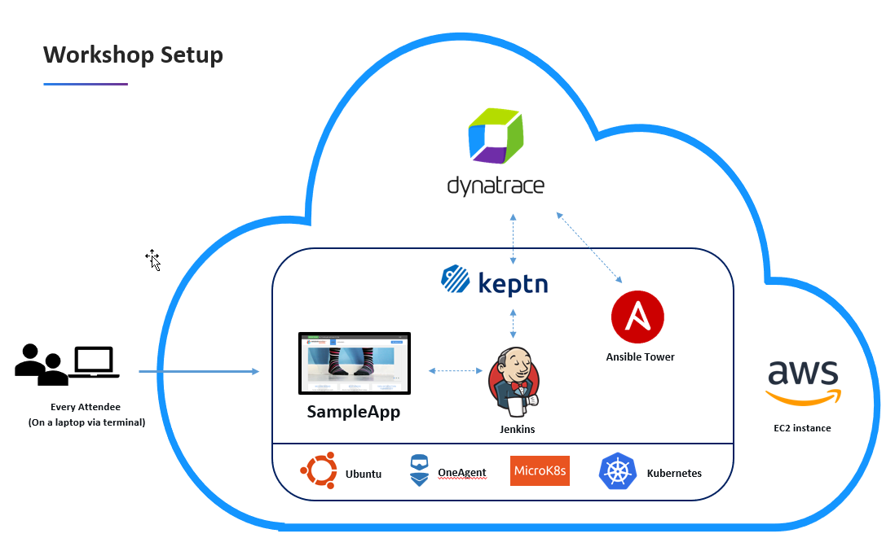

### Prerequisites
- Chrome Browser
- Autonmous Workshop Email with credentials

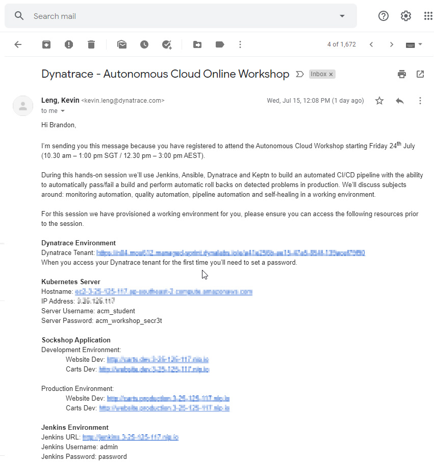

### What You’ll Learn
- Deploy a pipeline (Sockshop) in Jenkins 
- Installing Keptn 
- Integrating Jenkins to Keptn and Dynatrace
- Using Jenkins + Keptn with Dynatrace for
   - Automate Quality with Quality Gates evaluation
   - Automate Testing Load Testing and Performance Testing
   - Automate Operations with Self-healing with Ansible

<!-- ------------------------ -->
## Deploy SampleApp in Jenkins
Duration: 5

### Login to your Jenkins Instance

Access your Jenkins environment via a web browser with credentials from your email


### Build a pipeline

Once you logged in, mouseover "<b>DeploySockShop</b>" in the list, click on the down arrow and select "<b>Build Now</b>"

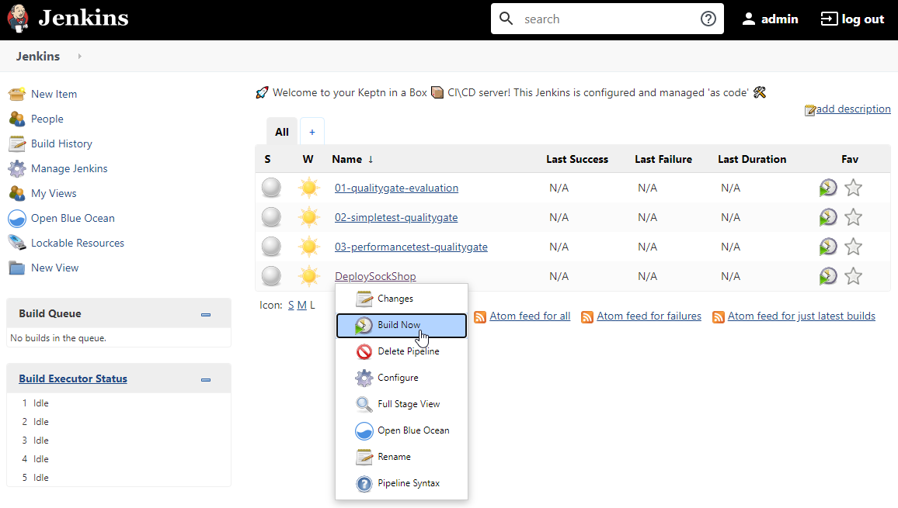

This process will take about 1-2 mins so we will let it run. 

Once finished, you can click on "<b>DeploySockshop</b>" again and see the various stages of the pipeline build. 

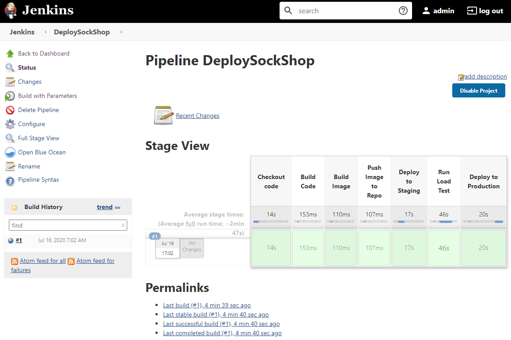


This is just a demonstration of a working pipeline so there's no need to wait for it to complete.

<!-- ------------------------ -->
## Setting up Keptn
Duration: 5

### Login to your Kubernetes Instance

Login to the Kubernetes server via a SSH terminal (eg. Putty, Terminal, MobaXterm)

Access your Kubernetes environment with credentials from your email

Once you logged in, you can issue the commands below to install Keptn<br>
Part of the Keptn setup has been automated within the shell script below.

```bash
cd dtacmworkshop/keptn
sudo ./installKeptn.sh
```


Keptn will install it's necessary components required for its setup.
Setup will take a 2-3 minutes.


Once completed, take note of the <b>keptn API token</b> which is required for the next step.
You can also use the Keptn Bridge and API Endpoint

For example:<br>
KEPTN BRIDGE: http://bridge.keptn.<b><i>YOUR-IP-ADDRESS</i></b>.nip.io<br> 
KEPTN ENDPOINT: https://api.keptn.<b><i>YOUR-IP-ADDRESS</i></b>.nip.io/<b>swagger-ui/</b>

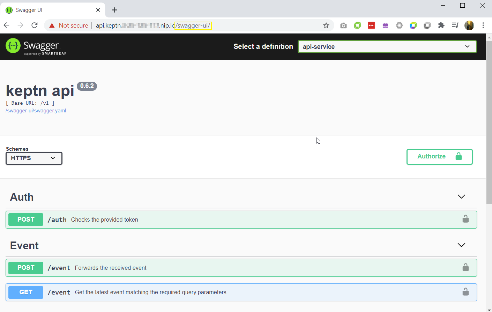
Take note of to append <b>"/swagger-ui/"</b> to the end to view the Keptn API Swagger UI 

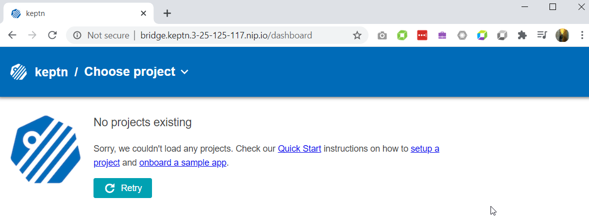
There would be no project running at the moment on Keptn's bridge, but we will be creating at the next step.

<!-- ------------------------ -->
## Configuring Keptn within Jenkins
Duration: 5

### Setting up Keptn Plugin within Jenkins

Back within Jenkins, select <b>Jenkins (from the top left) > Manage Jenkins > Configure System</b>


Scroll down and under <b>"Global Properties"</b> enter the KEPTN API Token from the Terminal into the field<br>
Click "<b>Save</b>" to save your setting.


Steps have been pre-configured prior to the labs. To find out more about the plugin, refer to the [Keptn Jenkins Shared Library](https://github.com/keptn-sandbox/keptn-jenkins-library) on Github. 

<!-- ------------------------ -->
## Keptn's SLI/SLO-based Quality Gates
Duration: 20

We will be using Jenkins Pipeline to triggers an SLI/SLO-based Quality Gate Evaluation in Keptn. 
This can also be done through the Keptn CLI or the API. 


Within Jenkins, mouseover "<b>01-qualitygate-evaluation</b>" in the list, click on the down arrow and select "<b>Build Now</b>"

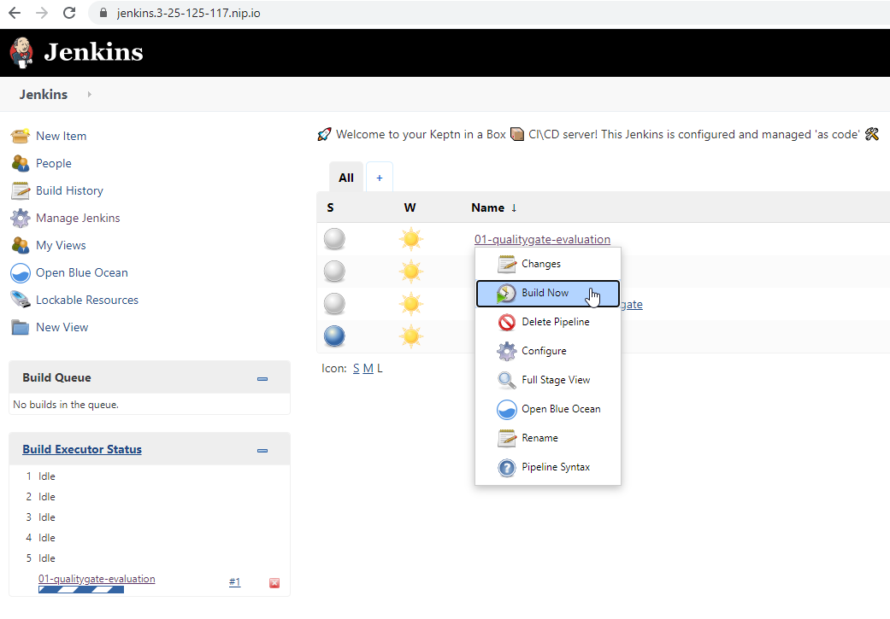

The initial build will fail as Jenkins by default doesn't scan the pipeline for parameters and there are several that have to be specified. Click on "<b>01-qualitygate-evaluation</b>" to drill into the pipeline.


Click on <b>"01-qualitygate-evaluation"</b> and select <b>"Build with Parameters"</b> on the left menu.

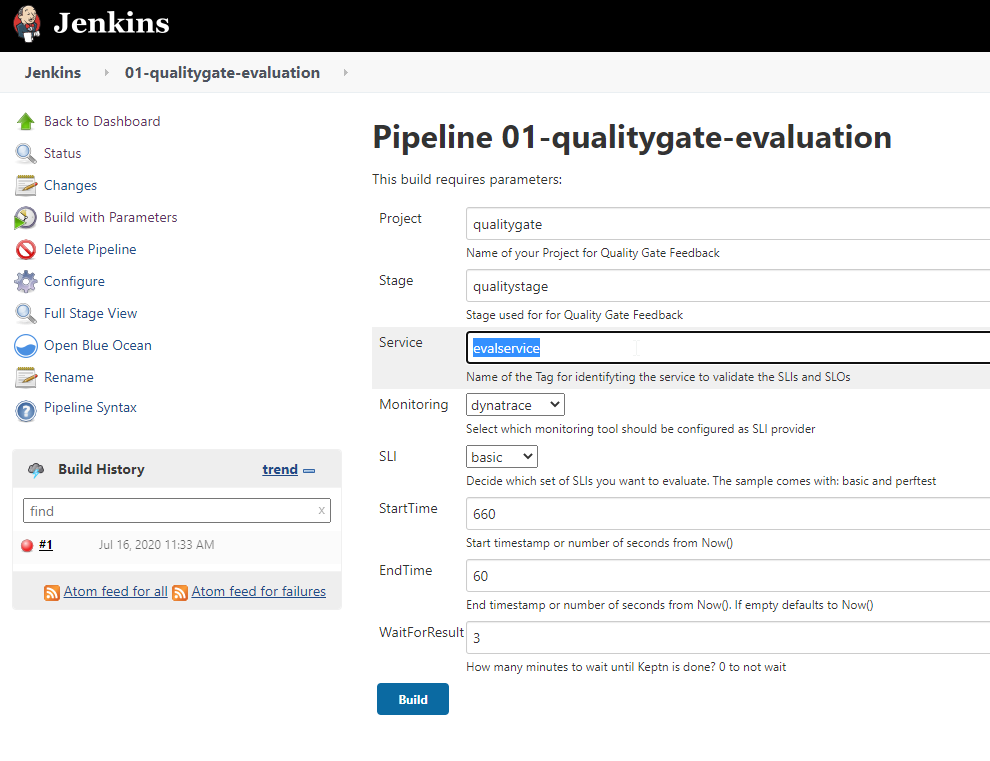

As with the preconfigured form, we will be using the <b>"evalservice"</b> tag within Dynatrace to identify the appropriate service which we will validate the SLI and SLO. The name of the tag can be passed to our Jenkins Pipeline as a parameter. So we will first need to tag a service within Dynatrace.

### Login to your Dynatrace Environment

Access your Jenkins environment via a web browser with credentials from your email. <br>
When you access your Dynatrace tenant for the first time you’ll need to set a password.<br>


Once you logged into Dynatrace, you will find a preconfigured Dashboard. 

### Setup Tag within Dynatrace

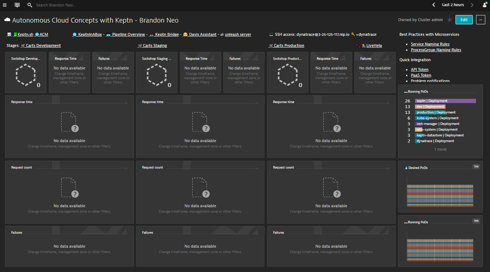

This prebuild dashboard will also contain links providing quick access to the various portals. 

Select "<b>Transactions and Services</b>" on the left navigation bar and select "<b>front-end</b>" service. <br>
This can be either for Dev or Prod service. 


Drop-down "<b>Properties and tags</b>", Click on "<b>Add-tag</b>" and enter "<b>evalservice</b>" as tag

### Build the pipeline in Jenkins

Back in Jenkins, click on "<b>Build</b>" button to run the pipeline

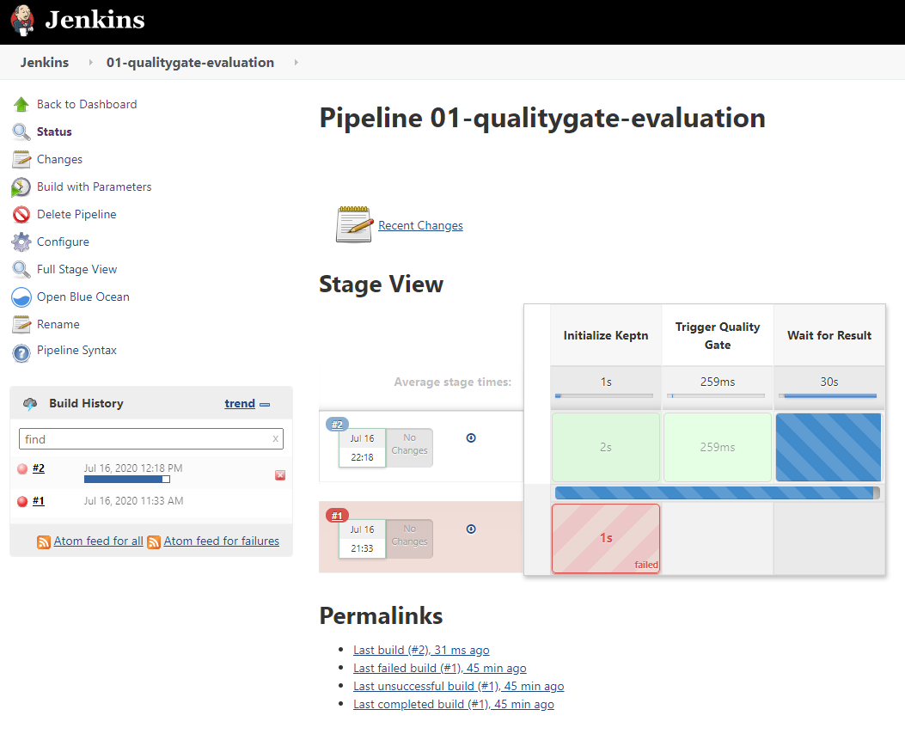

Once the pipeline completes, you can see the changes reflected in Keptn's bridge and Dynatrace.<br>
Within Dynatrace, you will also discover a new custom info event.<br>
The new event will contain details of the quality gate results with details such as JobURL, JobName from Jenkins as well as Keptn source and Keptn's bridge.<br>
The links will also bring you to Jenkin's and Keptn's portals with more detailed information on each side.


To find out more about the setup of this hands-on, the full tutorial could be found [here](https://github.com/keptn-sandbox/jenkins-tutorial/blob/master/README.md#11-integrate-keptns-slislo-based-quality-gates).

<!-- ------------------------ -->
## Jenkins Simple Load Test
Duration: 20

### Load Testing in Pipeline

This is an extended version of the previous build where the pipeline also has a very simple load-testing capability built-into one of the stages.


Go to "<b>Transactions and Services</b>", filter with "<b>[Kubernetes]stage:dev</b>" tag and tag "<b>testservice</b>" to identify the service. 

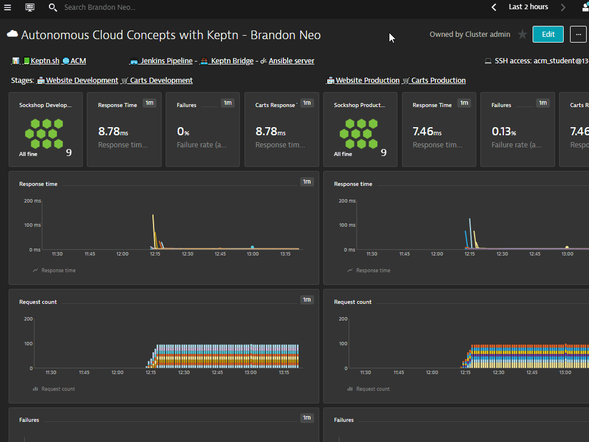

Back In Jenkins, click on "<b>Back to Dashboard</b>" to return to the list of Jenkin's pipelines.<br>
Mouseover "<b>02-simpletest-qualitygate</b>" in the list, click on the down arrow and select "<b>Build Now</b>"<br>
As per the previous lab, the initial build will fail but you can drill into the "<b>Build with parameters</b>" on the 2nd attempt.

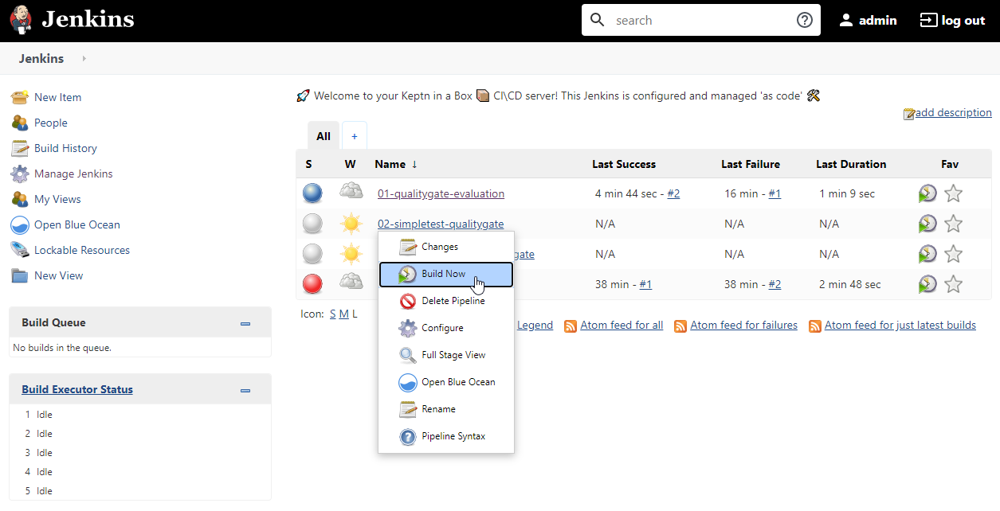

Change the form with the following details:<br>
Service: <b>testservice</b><br>
DeploymentURI: <b>Website Dev URL</b> (as provided in email)<br>
URL Paths: <b>/:homepage;/category.html:Category</b><br>

Once completed, you can click on "<b>Build</b>" button to start the pipeline.

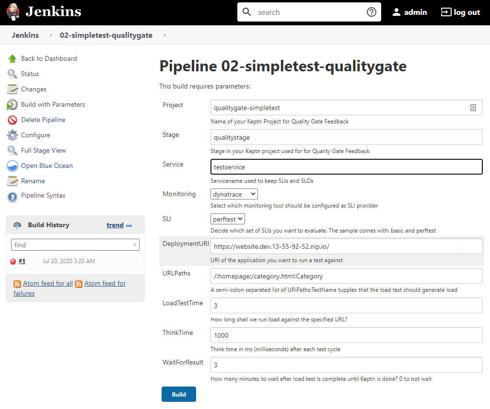

You can also get the URL of your Carts Dev URL from your dashboard.<br>
Simply right-click and copy link address. 

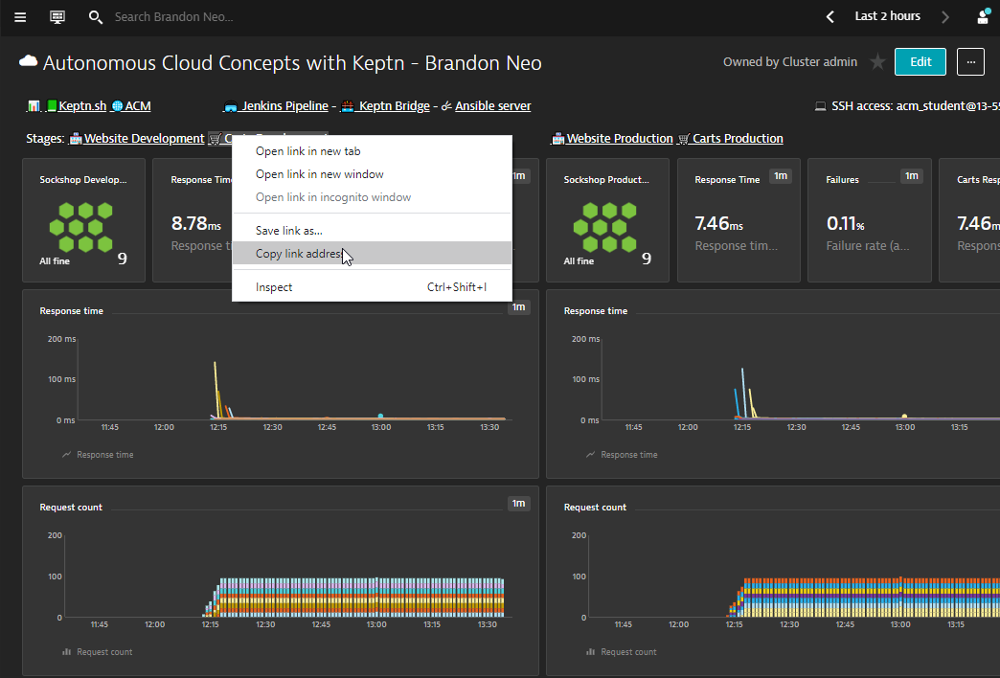

Once completed, you can look at Keptn's bridge / Dynatrace's Frontend Service / Jenkins for the changes.<br>
You will find the additional SLIs based on the calculated service metrics.

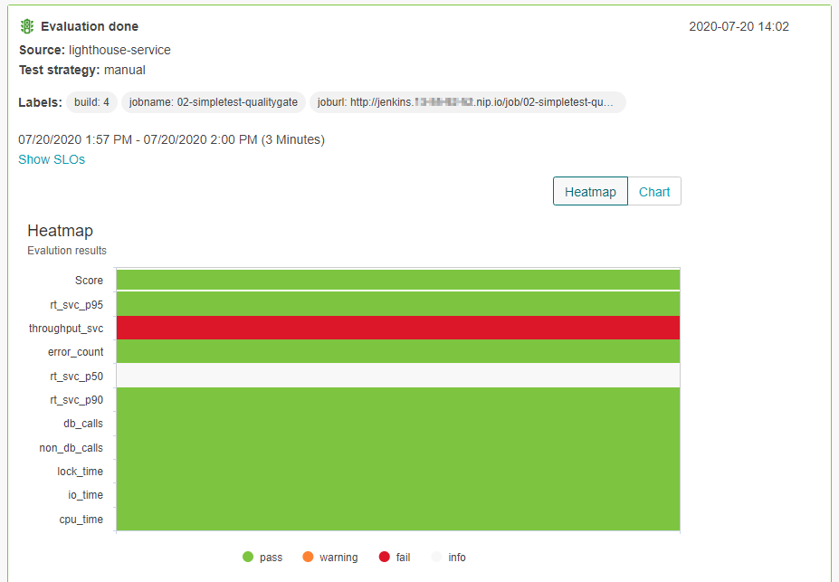

To find out more about the setup of this hands-on, the full tutorial could be found [here](https://github.com/keptn-sandbox/jenkins-tutorial/blob/master/README.md#12-integrate-keptns-slislo-based-quality-gates---with-simple-testing-tool-in-pipeline).

<!-- ------------------------ -->
## Keptn's Performance Test Quality Gate
Duration: 20

### Performance Testing in Pipeline

This lab extends the previous one where we had Jenkins execute a simple test as part of the Jenkins Pipeline. Keptn was then used for SLI/SLO based quality-gate evaluation. In this tutorial we use Keptn to also take care of the actual test execution using JMeter.


We will also be using calculated service metrics as defined SLIs for the test execution.<br>
The creation of these service metrics was created as part of the lab setup. <br>
These metrics could be found in <b>Settings > Server-side service monitoring > Calculated Service metrics</b><br>

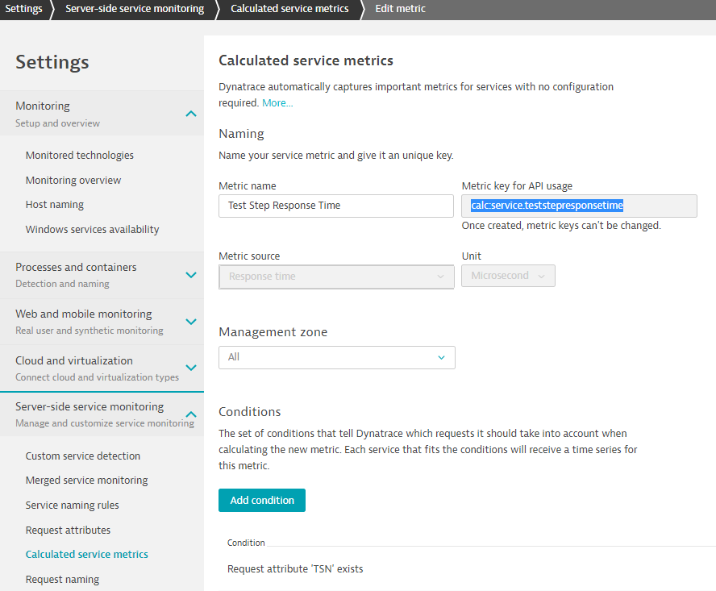

These metrics as well as their dimensions will be used during the execution of the SLIs. <br>
As we already added the "<b>testservice</b>" tagged, we can simply run the 3rd pipeline within Jenkins. <br>
Back in Jenkins, click on "<b>03-performancetest-qualitygate</b>". <br><br>
Change the form with the following details:<br>
Service: <b>testservice</b><br>
DeploymentURI: <b>Website Dev URL</b> (as provided in email)

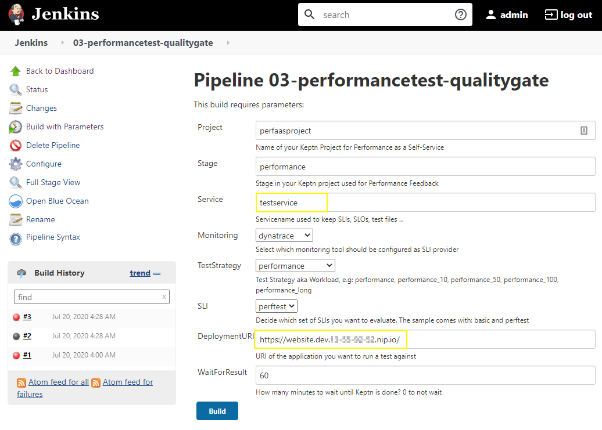

Once completed, you can click on "<b>Build</b>" button to start the pipeline.

You can also get the URL of your Carts Dev URL from your dashboard.<br>
Simply right-click and copy link address. 

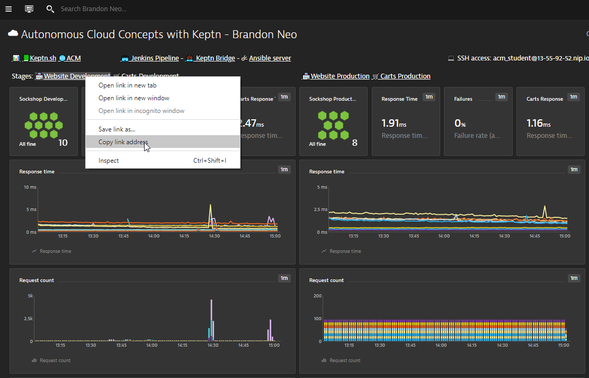

Once completed, you can look at Keptn's bridge / Dynatrace's Frontend Service / Jenkins for the changes.<br>
Within Dynatrace, you can see the automated performance tests that generated a pass result for the quality gate.<br>
You can also drill in context into Keptn's bridge as well as Jenkins.


<!-- ------------------------ -->
## Automate SampleApp Deployment
Duration: 20

We will now modify the SampleApp Sockshop by automating it with Keptn's SLI/SLO-based Quality Gates.

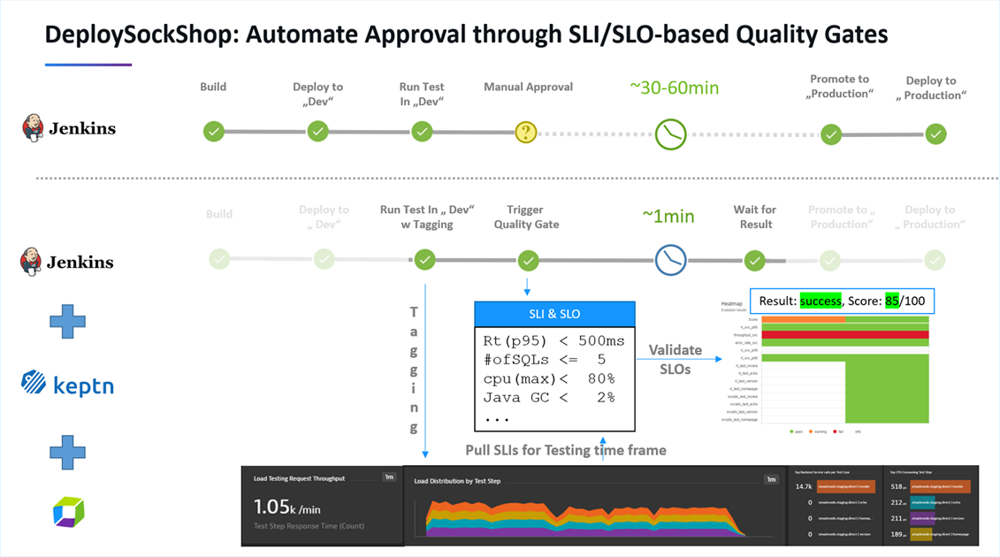

Within Jenkins, mouseover "<b>DeploySockShop</b>" in the list, click on the down arrow and select "<b>Configure</b>"<br>
Open another browser tab, go to [Dynatrace APAC's Autonomous Cloud's Git Repo](https://github.com/Dynatrace-APAC/Workshop-Autonomous-Cloud/blob/master/jenkins/DeploySockShop_Keptn_LoadTest_and_QualityGate.Jenkinsfile).<br>
Copy the <b>amended SockShop Jenkinsfile raw file</b> and replace it within the Pipeline section in Jenkins.  


Click on "<b>Save</b>" and at the "<b>Build with Parameters</b>" page, select "<b>Build Two</b>" and start the build. 

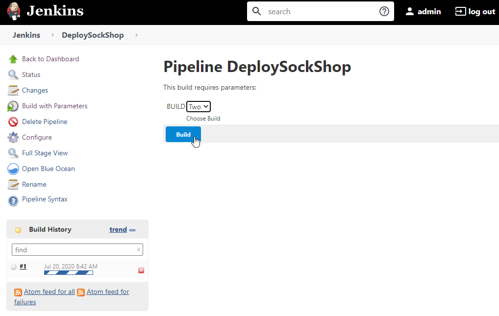

<!-- ------------------------ -->
## Self Healing as a Service
Duration: 20

Dynatrace integrates with many runbook automation tools such as Ansible. We'll be using Ansible to showcase self-healing problems and automate operations. 

### Generate Load for Carts Service

Within the SSH terminal, run the following commands to trigger load for the carts service.

```bash
cd ~acm_student/dtacmworkshop/utils/
sudo ./cartsLoadTest.sh
```

### Login to Ansible Tower

Access your Ansible environment via a web browser with credentials from your email.

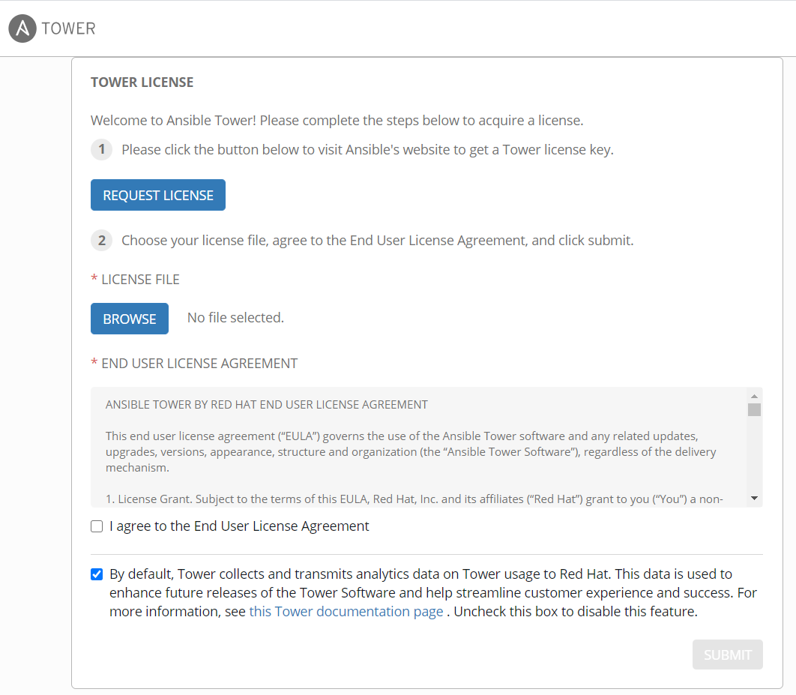

### Configure Dynatrace Problem Notification

Within Ansible, click on "<b>Templates</b>" on the left navigation and copy the URL for <b>Remediation</b> Job template. <br>
In the Dynatrace UI, navigate to <b>Settings > Integration > Problem Notification > Setup Notification > Ansible Tower </b><br>
Enter the <b>Ansible Tower job template URL</b> you copied<br>
Enter the credentials to access Ansible (as provided in email)<br>
Click the Sent test notification button to validate your configuration<br>
On success, a green confirmation message will be displayed<br>
Save your configuration

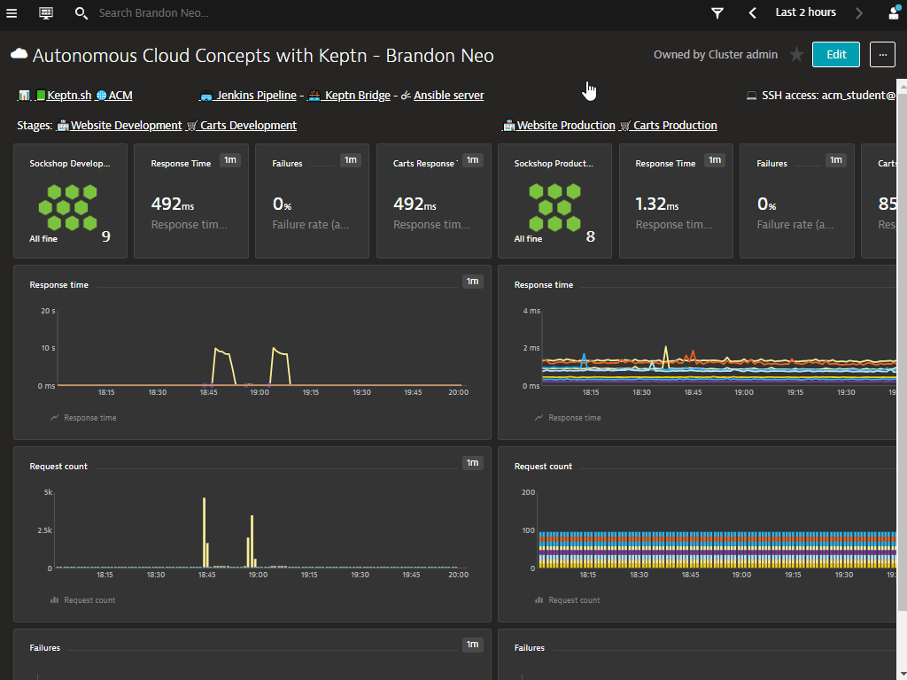

### Adjusting Anomaly Detection

Both problem and anomaly detection in Dynatrace leverage our DAVIS AI technology. This means that DAVIS learns how each and every microservice behaves and baselines them. Therefore, in a demo scenario like we have right now, we have to override the AI engine with user-defined values to allow the creation of problems due to an artificial increase of a failure rate. (Please note: if we would have the application running and simulate end-user traffic for a couple of hours/days there would be no need for this step.)

In your Dynatrace tenant, navigate to “<b>Transaction & services</b>” and filter by tag "<b>[Kubernetes]stage:prod</b>" and select ItemsController Service<br>
Within the ItemsController Service page, click on on the <b>three dots ( … )</b> next to the service name. Click on <b>Edit</b><br>
On the next screen, edit the <b>anomaly detection settings</b> as per below<br>
- Disable <b>Global anomaly detection</b>
- Detect increases in failure rate using <b>fixed thresholds</b> 
- Alert if <b>0 %</b> custom failure rate threshold is exceed during any 5-minute period. 
- Set Sensitivity to <b>High</b> and change less than the value to <b>1 request/min</b>.


### Launch remediation playbook

Navigate back to the Ansible Tower UI. From the side menu, navigate to <b>Resources -> Templates</b>.<br>
Click on the <b>rocket icon</b> to launch the start-campaign playbook. <br>
Hit <b>Next</b> on the prompt popup window and then <b>Launch</b>. <br>
As the playbook runs, validate that status is successful.

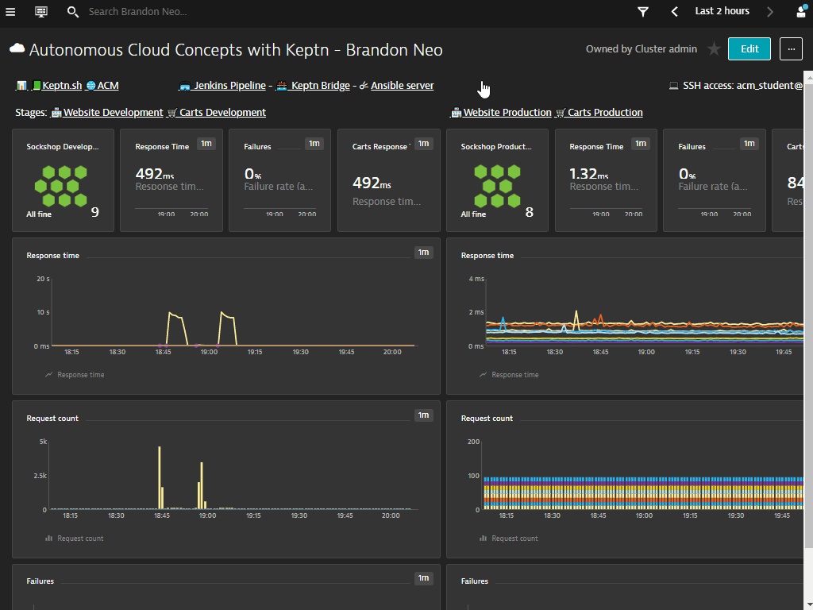

### Observe remediation

Back in ItemsController, look at the service events. The playbook have notified Dynatrace when the promotional rate was changed to 50%.

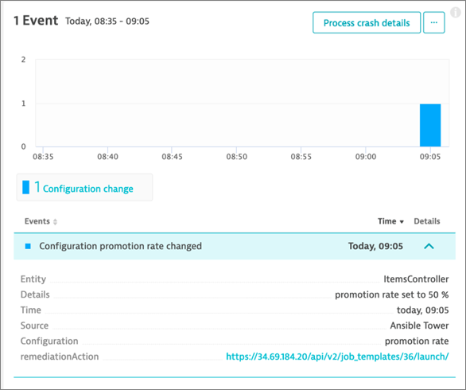

You should see the Failure Rate increasing, eventually leading to Dynatrace detecting a Problem
You might need to refresh your browser a few times

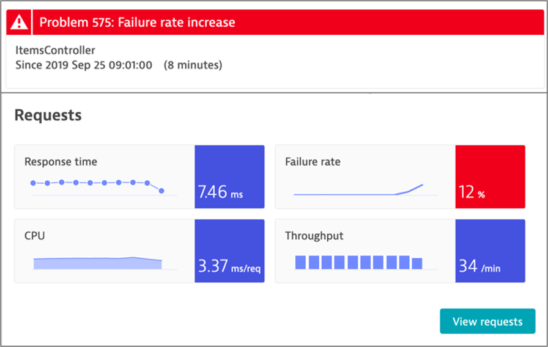

Observe the new problem appearing. The comments section will show the remediation actions taken by Ansible Tower


Drill-down in the Problem.
You will see a new configuration change event reported by Ansible Tower
The promotional rate has been set back to 0% to remediate to the transaction failures


Jobs executed in Ansible Tower
 - start-campaign (set rate to 50%)
 - remediation
   - push comment to Dynatrace Problem
   - retrieve problem details
   - launch remediation action related to problem context
   - update Dynatrace Problem
stop-campaign (set rate to 0%)

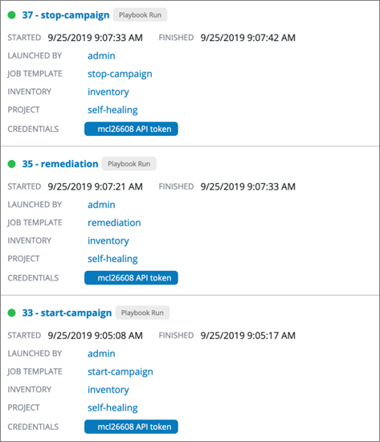

** Problem Resolution - Problem was resolved automatically


