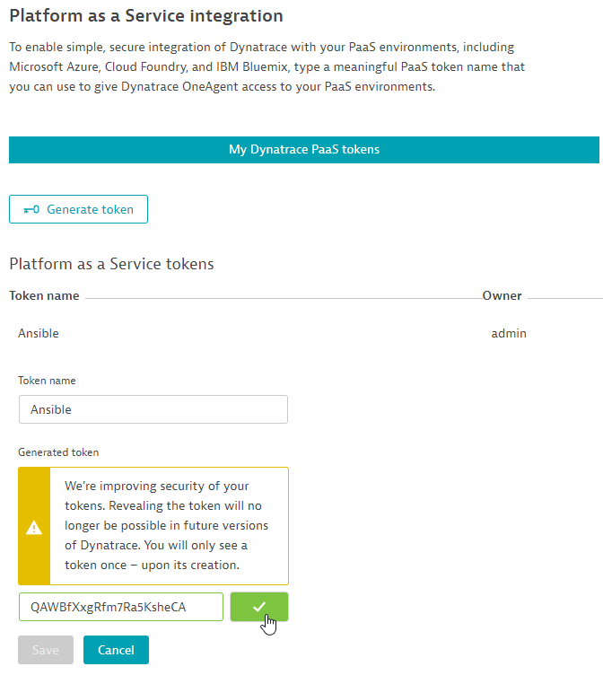
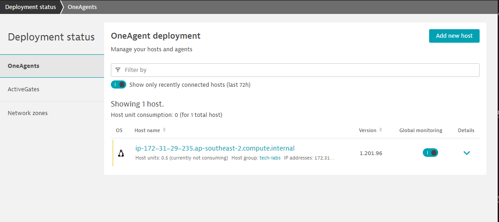
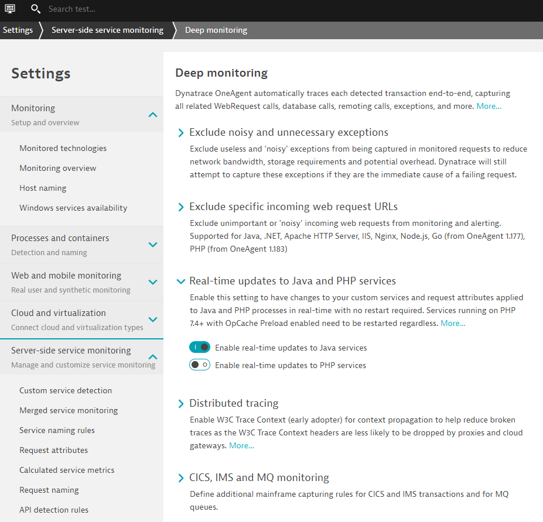
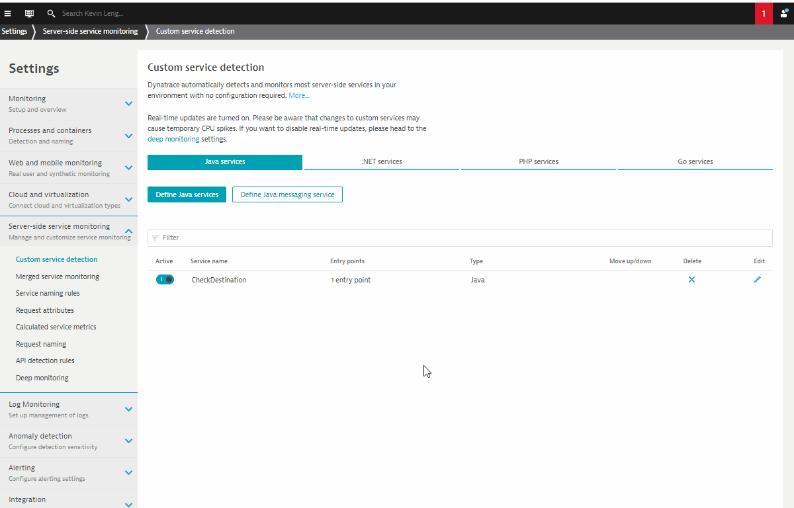
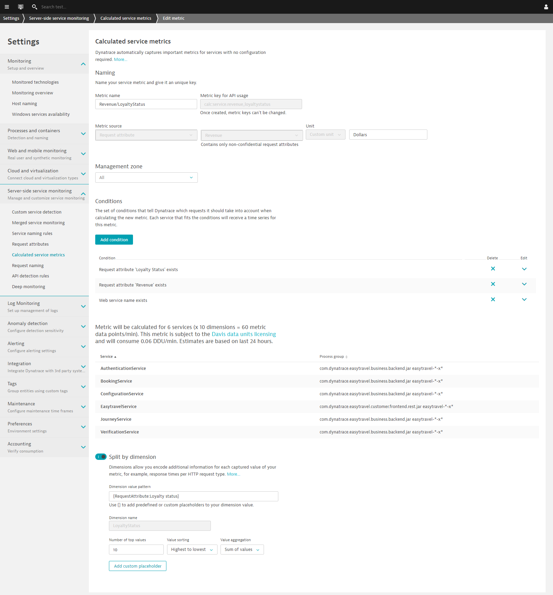
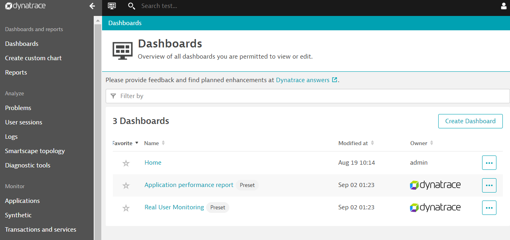
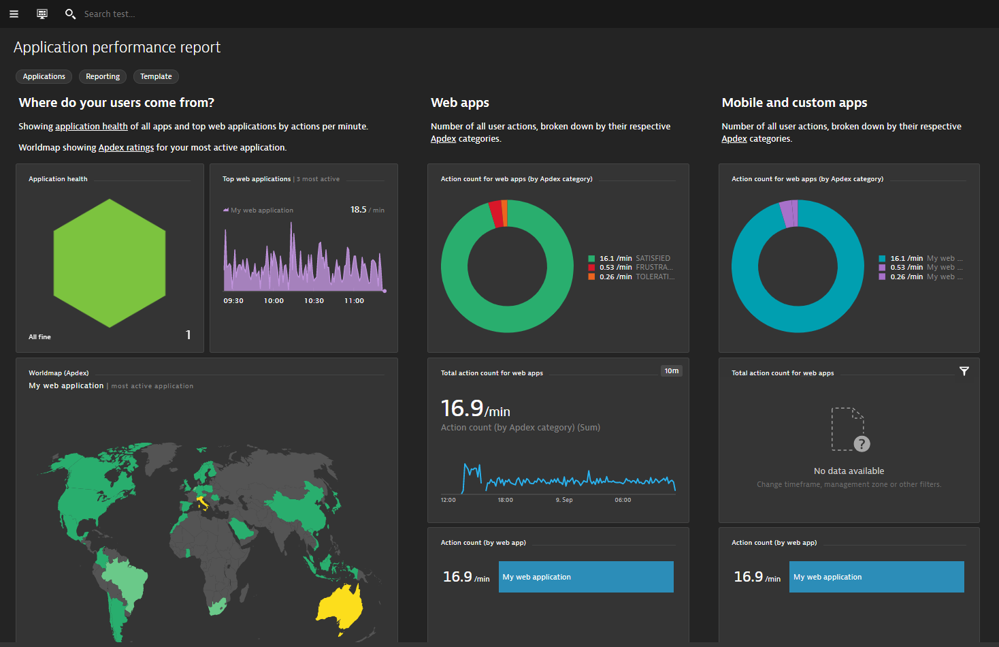

summary: Advanced Observability with Dynatrace
id: advanced-observability
categories: adv-Obs
tags: adv-Obs
status: Published 
authors: Brandon Neo
Feedback Link: mailto:APAC-SE-Central@dynatrace.com
Analytics Account: UA-175467274-1

# Advanced Observability with Dynatrace
<!-- ------------------------ -->
## Introduction
Duration: 1

This repository contains the hands on for the Advanced Observability Workshop.

### Prerequisites

* Dynatrace SaaS/Managed Account. Get your free SaaS trial [here](https://www.dynatrace.com/trial/).
* AWS account, with the ability to create an EC2 instance from a public AMI. Signup to a free trial [here](https://aws.amazon.com/free/).
* Chrome Browser
* SSH client such as [mobaxterm](https://mobaxterm.mobatek.net/).

### Lab Setup
The following steps are used for this lab:
- Sample Application 
    * Sample App is based on [easyTravel](https://community.dynatrace.com/community/display/DL/easyTravel)

### What You’ll Learn
- Install OneAgent using Ansible CLI 
- Learn Request Attributes for deep code level capture
- Learn Session Properties for advanced dashboarding
- Learn Metric Ingestion for automated baselines across all entities

<!-- ------------------------ -->
## Automate Agent Rollout
Duration: 15

In this exercise, we will deploy the OneAgent to a Linux instance via Ansible.

Based off our [Dynatrace Ansible Github](https://github.com/Dynatrace/Dynatrace-OneAgent-Ansible), you can rollout Dynatrace Oneagent easily across on Linux and Windows Operating Systems with different available configurations and ensures the OneAgent service maintains a running state. It also provides the tasks to interact with the various OneAgent configuration files.

Adapting from an [Ansible example](https://github.com/popecruzdt/dt-ansible), we will be installing that on our host.
Other Ansible playbooks examples can be seen [here](https://github.com/popecruzdt/dt-ansible/blob/popecruzdt/dt-oneagent-install-linux.yml)

### Installing Ansible

Use the command below to setup Ansible in your Linux host

`wget -O- https://raw.githubusercontent.com/Dynatrace-APAC/Workshop-Advanced-Observability/master/setup_ansible.sh | bash`

Positive:
: Once it's finished, run the following command to check the status of ansible 
`ansible --version`

You should see that it's successfully installed along with it's dependencies

```bash
ansible 2.9.13
config file = /etc/ansible/ansible.cfg
configured module search path = [u'/home/advanced-observability-workshop/.ansible/plugins/modules', u'/usr/share/ansible/plugins/modules']
ansible python module location = /usr/lib/python2.7/dist-packages/ansible
executable location = /usr/bin/ansible
python version = 2.7.17 (default, Jul 20 2020, 15:37:01) [GCC 7.5.0]
```

### Download the Ansible playbook

Use the command below to setup Ansible in your Linux host

`wget https://raw.githubusercontent.com/Dynatrace-APAC/Workshop-Advanced-Observability/master/dt-oneagent-install-linux.yml`

Using the command`more dt-oneagent-install-linux.yml`, we can explore the file to preview the necessary variables that we need to provide. For the purposes of the lab, we will use only be using Ansible to rollout on a host. But in a real world context, you can run the playbook across multiple hosts or environments. 

```bash
# dynatrace oneagent install on linux
# hosts_group -> inventory group of hosts to execute playbook on
# dt_api_endpoint -> dynatrace environment api endpoint (include trailing /)
# dt_api_token -> dynatrace api install token
# dt_host_group -> dynatrace host group name
# dt_app_log_content_access -> flag to enable or disable log analytics on host (0 or 1)
# dt_infra_only -> flag to set cloud infrastructure monitoring mode on host (0 or 1)
---
-
  hosts: localhost
  name: "dynatrace oneagent install on linux"
  tasks:
    -
      name: "validate ansible execution on linux with sudo access"
      shell:
        cmd: ls /opt
      become: yes
      changed_when: False
    # Check the latest available OneAgent version
    -
```
### Creating the PaaS Token

Go to **Settings > Integration > Platform as a Service** 

Click on **Generate token** and give a token name eg. **Ansible**

Click on **Generate** and **copy** the token by selecting **Reveal token** to use for the next step.



###  Running the playbook

Using the command below, make changes to the **dt_api_token** and **dt_api_endpoint** variables. You can tweak the command with a text editor eg. Notepad++

**EXAMPLE**

```bash
ansible-playbook \
-e dt_api_token=<PAAS-TOKEN> \
-e dt_host_group=tech-labs \
-e dt_app_log_content_access=1 \
-e dt_infra_only=0 \
-e dt_api_endpoint=https://mou612.managed-sprint.dynalabs.io/e/<DT-ENV>/api/v1/ \
dt-oneagent-install-linux.yml
```
**Paste** the command into your terminal window and tweak the **dt_api_token** and **dt_api_endpoint** variables. Replace <PAAS-TOKEN> from token you copied earlier. You can get your <DT-ENV> from within the Dynatrace environment from the browser. 


**OUTPUT EXAMPLE**

```bash
PLAY [dynatrace oneagent install on linux] ********************************************************************************************************************

TASK [Gathering Facts] ****************************************************************************************************************************************
ok: [localhost]

TASK [validate ansible execution on linux with sudo access] ***************************************************************************************************
ok: [localhost]

TASK [get latest oneagent version from dynatrace environment api] *********************************************************************************************
ok: [localhost]

TASK [set oneagent latest version fact (dt_latest_version)] ***************************************************************************************************
ok: [localhost]

TASK [check if oneagent is already installed] *****************************************************************************************************************
ok: [localhost]

TASK [check installed oneagent version] ***********************************************************************************************************************
skipping: [localhost]

TASK [set oneagent current version fact (dt_current_version)] *************************************************************************************************
skipping: [localhost]

TASK [debug output current version] ***************************************************************************************************************************
skipping: [localhost]

TASK [debug output latest version] ****************************************************************************************************************************
ok: [localhost] => {
    "dt_latest_version": "1.201.96.20200911-082031"
}

TASK [download oneagent install file] *************************************************************************************************************************
[DEPRECATION WARNING]: Supplying `headers` as a string is deprecated. Please use dict/hash format for `headers`. This feature will be removed in version 2.10.
 Deprecation warnings can be disabled by setting deprecation_warnings=False in ansible.cfg.
ok: [localhost]

TASK [install: execute oneagent install file with root privileges] ********************************************************************************************
changed: [localhost]

TASK [update: execute oneagent install file with root privileges] *********************************************************************************************
skipping: [localhost]

TASK [validate oneagent installation] *************************************************************************************************************************
ok: [localhost]

TASK [check host group is correct] ****************************************************************************************************************************
ok: [localhost]

TASK [set current host group fact (dt_current_host_group)] ****************************************************************************************************
ok: [localhost]

TASK [update/correct host group setting if not correct] *******************************************************************************************************
skipping: [localhost]

PLAY RECAP ****************************************************************************************************************************************************
localhost                  : ok=11   changed=1    unreachable=0    failed=0    skipped=5    rescued=0    ignored=0
```

### Validate the installation

Go to **Deployment status** on the left navigation. You should see OneAgent installed on the current host.



##  Automatic Discovery & Instrumentation

Like most real world examples, you will find Dynatrace already automatically instrumenting your applications. But for deep code level visibility, you will need to restart those services. 

### Restart Sample Application

Run the command below to restart the Sample Application Easytravel.

`./restart_easyTravel.sh`

### Explore the Smartscape

While waiting for Easy Travel to start, you can explore Dynatrace and using the Smartscape, Dynatrace will automatically discover the processes and dependencies that comprises the Easy Travel application! 

[4 things](https://www.dynatrace.com/support/help/get-started/4-things-youll-absolutely-love-about-dynatrace/) that you will love about Dynatrace!


<!-- ------------------------ -->
## Custom Services
Duration: 10

In this exercise, we will be creating a custom Java service. This is a typical scenerio for 3rd party apps or proprietary software that Dynatrace monitors but doesn't instrument automatically. 

### Enable Real time updates for Java

Go to **Settings > Server-side service monitoring > Deep Monitoring > Real-time updates**.



Go to **Settings > Server-side service monitoring > custom service detection**

Click on **Define Java services** and use the following:

* Name - **Credit Card Verification**
* Click on **Find entry point**
* Select **com.dynatrace.easytravel.business.backend.jar**
* Search for **ipc.SocketNativeApplication**
* Use selected class
* Select **sendAndReceive** method
* Select **Finish**
* Click on **Save**



<!-- ------------------------ -->
## Request Attributes
Duration: 10

In this exercise, we will cover the setting up Request Attributes. These leveraged for deep visibility into all the details of your users’ interactions with your application. 

### Creating Request Attributes

Go to **Settings > Server-side service monitoring > Request Attributes**

Click on **Define a new request attribute** and use the following:

* Request attribute source – **Java method parameter(s)**
* Click on **Select method sources**
* Select **business.backend**
* Search for **BookingService**
* Select **Use the selected class**
* Search for **checkLoyaltyStatus**
* Choose **2:java.lang.String** on Capture Drop down 
* Click on **Save**


NEGATIVE
: Note that examples of **Request Attributes** have also been created for you and we are doing these for the purposes of running through the request attribute creation process.

### Validate of Loyalty Status Request Attribute

Go to **Transactions and services** and filter on **AuthenticationService**. 

Click on **View requests** and validate the key-value pairs of Loyalty Status under the **Request Attribute** tab. 


<!-- ------------------------ -->
## Calculated Service Metrics Properties
Duration: 10

In this exercise, we will cover the setting up **Calulated Service Metrics** with Request Attributes. These leveraged for deep visibility into all the details of your users’ interactions with your application. 

NEGATIVE
: Note that examples of **Request Attributes** have also been created for you and we are doing these for the purposes of running through the request attribute creation process.

### Define Calculated Service Metric

Go to **Settings > Server-side service monitoring > Calculated service metrics**

Click on **Create new metric** and use the following:

* Metric name – **Revenue/LoyaltyStatus**
* Metric source – **Request Attribute**
* Request Attribute – **Revenue**
* Unit - **Custom unit**
* Text field - **Dollars**
* Conditions - **Request Attribute 'Loyalty Status' exists**
* Conditions - **Request Attribute 'Revenue' exists**
* Conditions - **Web service name exists**
* **Toggle** - Spilt by dimension
* Dimension value pattern - **{RequestAttribute:LoyaltyStatus}**
* Dimension name - **LoyaltyStatus**

You'll be able to preview the various dimensions across defined services



<!-- ------------------------ -->
## Dashboards
Duration: 15

Refer to the left navigation bar and go to Dashboards. Dynatrace has now prebuilt dashboard templates such as **Application performance report** and **Real User Monitoring** dashboards.



Drill down into each of these dashboards and explore the various dashboard widgets for App Owners and Business Users.



<!-- ------------------------ -->

## Feedback
Duration: 3

We hope you enjoyed this lab and found it useful. We would love your feedback!
<form>
  <name>How was your overall experience with this lab?</name>
  <input value="Excellent" />
  <input value="Good" />
  <input value="Average" />
  <input value="Fair" />
  <input value="Poor" />
</form>

<form>
  <name>What did you benefit most from this lab?</name>
  <input value="Understanding Real User Monitoring setup" />
  <input value="Learning Synthetic" />
  <input value="Learning Session Replay" />
  <input value="Learning User Session Query Language" />
</form>

<form>
  <name>How likely are you to recommend this lab to a friend or colleague?</name>
  <input value="Very Likely" />
  <input value="Moderately Likely" />
  <input value="Neither Likely nor unlikely" />
  <input value="Moderately Unlikely" />
  <input value="Very Unlikely" />
</form>

Positive
: 💡 For other ideas and suggestions, please **[reach out via email](mailto:APAC-SE-Central@dynatrace.com?subject=Kubernetes Workshop - Ideas and Suggestions")**.