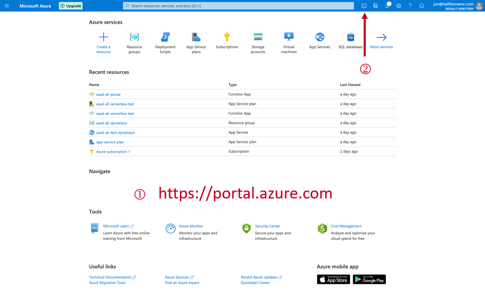
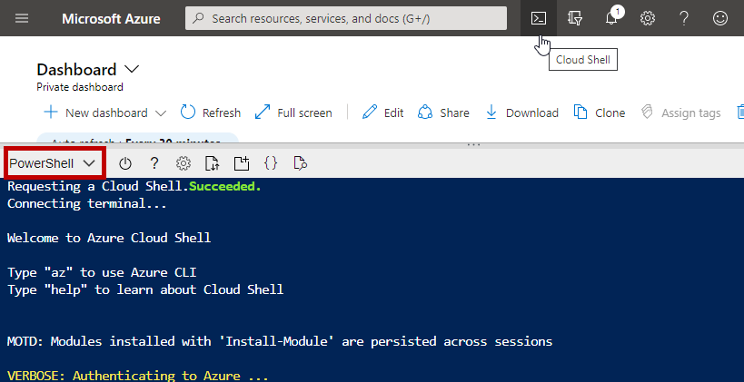
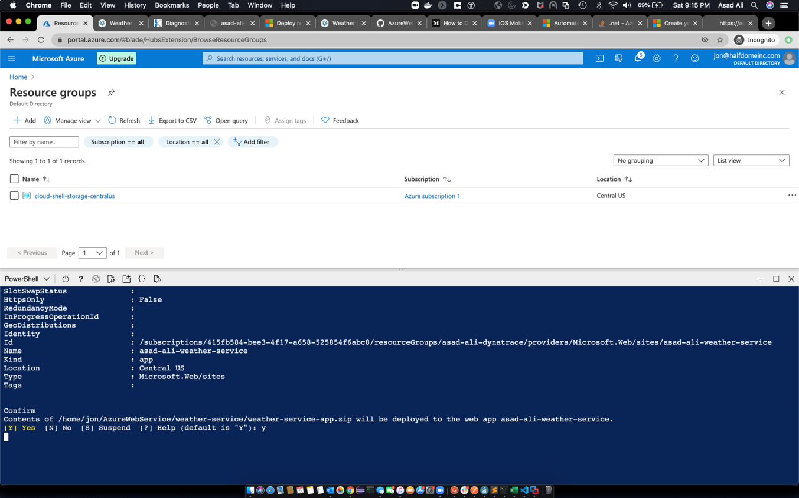
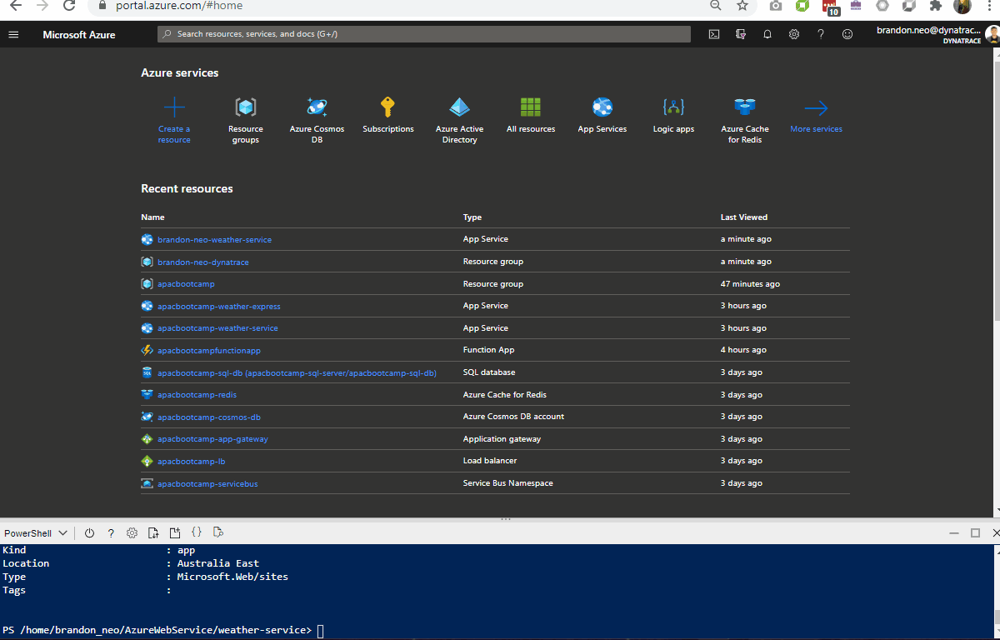
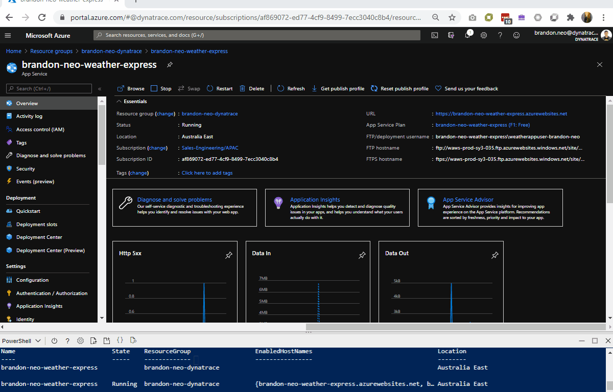
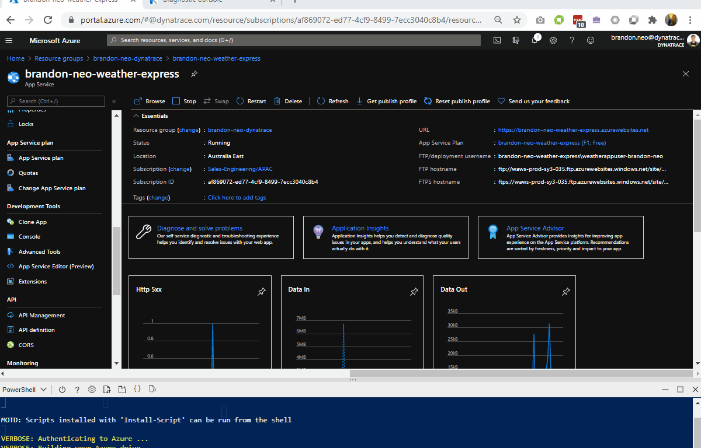
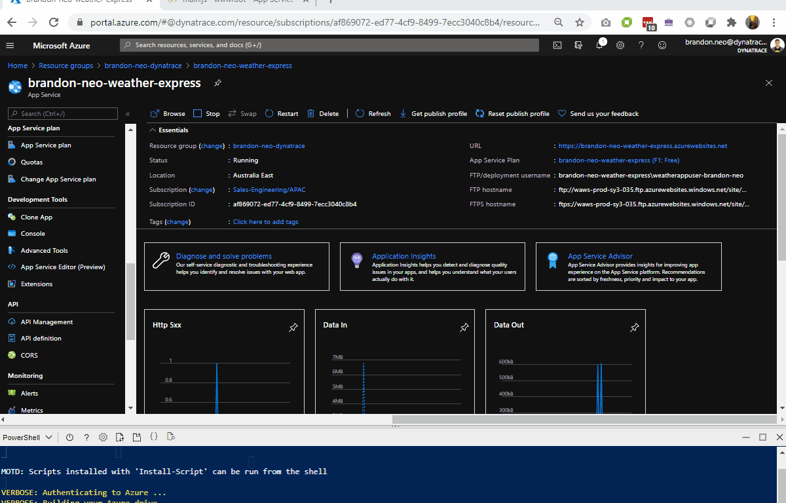
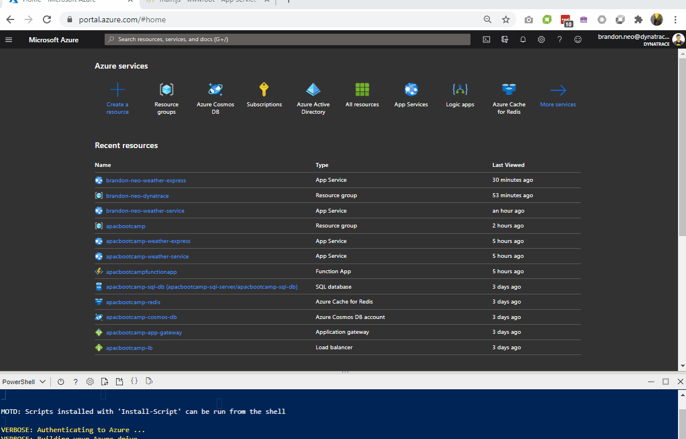
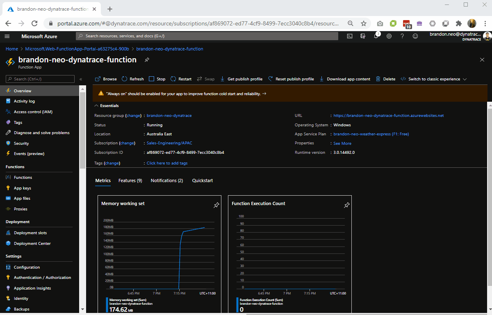
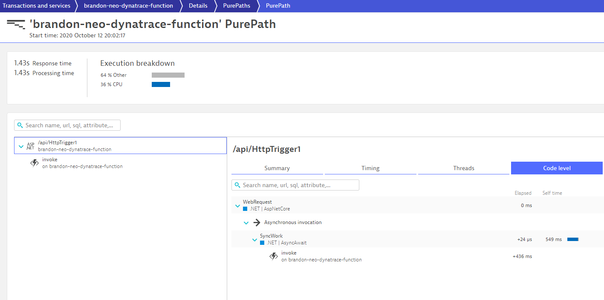

summary: Azure Hands-On
id: azure
categories: azure
tags: bootcamp
status: Published 
authors: Brandon Neo
Feedback Link: mailto:APAC-SE-Central@dynatrace.com
Analytics Account: UA-175467274-1

# Dynatrace with Azure
<!-- ------------------------ -->
## Introduction 
Duration: 1

This repository contains labs for the Azure Hands-On Session. 

### Prerequisites
- Azure Portal Account access. Use **ANY** of the following:
  - Access via Microsoft Visual Studio Subscription
  - Access via Sales-Engineering/APAC Subscription (via GOTC)
  - Access from [Free Trial](https://azure.microsoft.com/en-gb/offers/ms-azr-0044p/) 

### What You’ll Learn 
- How to deploy Web App on Azure
- Learn how to use deploy Dynatrace with Azure with **Site Extensions**
- How to deploy Azure Function

<!-- ------------------------ -->
## Deploy Weather Service Web App
Duration: 15

### Clone Repo to Azure Cloud shell

Login to [Azure Portal](https://portal.azure.com/) with your designated email.

Click on **Cloud Shell icon** on the top navigation bar.



Make sure that you have selected **PowerShell** in the left drop-down within Cloud shell.



Within the Cloudshell terminal, type in the below.

```bash
git clone https://github.com/Nodnarboen/AzureWebService.git
cd AzureWebService/weather-service
```

The above command will download the git from the repo into your Cloud bastion host. This is setup based on your **Storage Account** location.

### Deploy Weather Service WebApp

Negative
:Depending on your cloud shell location, you may change the **$location** value within the **publish.p1** to fit your region. Full list of regions are [here](https://azure.microsoft.com/en-au/global-infrastructure/geographies/#geographies)

```bash  
$resourceGroupName=$args[0]
$webappname=$args[1]
$location="Australia East"
```

Replace the **firstname-lastname** from the below command and adapt that to your own.

`./publish.ps1 firstname-lastname-dynatrace firstname-lastname-weather-service`

**Example**

**./publish.ps1 brandon-neo-dynatrace brandon-neo-weather-service**

Enter **Y** when prompted to deploy the content of the Weather Service app (**AzureWebService/weather-service/weather-service-app.zip**)



### Verify Resource Group creation

Now that your app has been deployed, verify that the resource group has been deployed as well. 



Append `/weather/current/Linz` to your URL from your **firstname-lastname-weather-service** App Service

**Example**

**https://brandon-neo-weather-service.azurewebsites.net/weather/current/Linz**

You should get a page reflecting JSON results.


<!-- ------------------------ -->
## Deploy Weather Express Web App
Duration: 15

### Deploy Weather Express WebApp

Navigate to weather-express folder with `cd ../weather-express` command

Negative
: Similar to the previous step, you may change the **$location** value within the **publish.p1** to fit your region. Full list of regions are [here](https://azure.microsoft.com/en-au/global-infrastructure/geographies/#geographies)

```bash  
$resourceGroupName=$args[0]
$webappname=$args[1]
$location="Australia East"
```

Replace the **firstname-lastname** from the below command and adapt that to your own.

`./publish.ps1 firstname-lastname-dynatrace firstname-lastname-weather-express`

**Example**

**./publish.ps1 brandon-neo-dynatrace brandon-neo-weather-express**

Enter **Y** when prompted to deploy the content of the Weather Service app (**AzureWebService/weather-service/weather-express-app.zip**)

### Verify Resource Group creation

Similar to the **Weather Service App** verfication, check on the **Weather Express App** App Service URL. Is it working?

### Debugging 

Within the **Weather Express** App Service, go to the **Advanced Tools** under Deployment Tools.

Within the Kudu page, dropdown Debug Console to **CMD** and go to `site/LogFiles/Application`

Edit `logging-errors.txt` and you can find the error message with the problem



### Resolution and Verification

Go to **App Service Editor (Preview)** and under `WWWROOT/config/main.js`, resolve the following based on the GIF

- Removing "-" at the last line
- Renaming your Uri to your **firstname-lastname**-weather-service.azurewebsites.net/weather



Once you have resolved the issue, you should be able to access your **Weather Express Portal** 

<!-- ------------------------ -->
## Instrumenting Web Apps
Duration: 15

### Leveraging Site Extensions

Deployment the OneAgents cross both **Weather Express App** and **Weather Service Apps**



Full Documentation [here](https://www.dynatrace.com/support/help/technology-support/cloud-platforms/microsoft-azure-services/oneagent-integration/integrate-oneagent-on-azure-app-service/)

<!-- ------------------------ -->
## Function setup
Duration: 15

### Creating Function App

Create a Azure App based on the following:

- Create a resource
- Search for **Function App**
- Click on **Create**
- Chooce your Resource Group - **Firstname-Lastname-dynatrace** (eg. Brandon-Neo-dynatrace )
- Name your Function App - **Firstname-Lastname-dynatrace-function** (eg. Brandon-Neo-dynatrace-function )
- Runtime Stack - **.NET Core**
- Version - **3.1**
- Region - **Your Choosen Region** (eg. Australia East)
- **Next**
- Operating Systems - **Windows**
- Plan type - **App service plan**
- Windows Plan - **Firstname-Lastname-weather-express** (eg. Brandon-Neo-weather-express )
- **Next**
- **No** to AppInsights
- **Create**
- Once created, **Go to Resource**



### Adding A Function

Create a Azure Function based on the following:

- Select **Function** on the left Nav, Click on **+ Add**
- Choose **HTTP trigger**
- Authorization type - Anonymous
- Code + Test
- Test/Run, Run 



### Leveraging Site Extensions

Deploy and instrument the Function App with Site Extension



<!-- ------------------------ -->

## Feedback
Duration: 3

We hope you enjoyed this lab and found it useful. We would love your feedback!
<form>
  <name>How was your overall experience with this lab?</name>
  <input value="Excellent" />
  <input value="Good" />
  <input value="Average" />
  <input value="Fair" />
  <input value="Poor" />
</form>

<form>
  <name>What did you benefit most from this lab?</name>
  <input value="How to deploy Azure Web Apps" />
  <input value="How to instrument Web Apps" />
  <input value="How to Debug instrumenting Web Apps" />
  <input value="How to deploy and instrument Azure Function" />
</form>

Positive
: 💡 For other ideas and suggestions, please **[reach out via email](mailto:APAC-SE-Central@dynatrace.com?subject=Kubernetes Workshop - Ideas and Suggestions")**.