summary: Digital Experience Management with Dynatrace
id: dem
categories: dem
tags: dem
status: Published 
authors: Brandon Neo
Feedback Link: mailto:APAC-SE-Central@dynatrace.com

# Digital Experience Management with Dynatrace
<!-- ------------------------ -->
## Introduction
Duration: 1

This repository contains the hands on for the Dynatrace Digital Experience Management (DEM) Workshop.

### Prerequisites

* Dynatrace SaaS/Managed Account. Get your free SaaS trial [here](https://www.dynatrace.com/trial/).
* AWS account, with the ability to create an EC2 instance from a public AMI. Signup to a free trial [here](https://aws.amazon.com/free/).
* Chrome Browser
* SSH client such as [mobaxterm](https://mobaxterm.mobatek.net/).

### Lab Setup
The following steps are used for this lab:
- Sample Application 
    * Sample App is based on [easyTravel Docker](https://github.com/Dynatrace/easyTravel-Docker)
    * Follow the [Prerequisite Actions](https://github.com/Dynatrace-APAC/Workshop-DEM/tree/master/Prerequisite%20Actions) to create the application that will be used throughout this workshop.

### What You’ll Learn
- Understand Real User Monitoring setup with easyTravel App 
- Learn Synthetic in Dynatrace
- Learn Session Replay in Dynatrace
- Learn User Session Query Language (USQL)

<!-- ------------------------ -->
## Basic Setup
Duration: 15

In this exercise, we will deploy the OneAgent to a Linux instance and let the OneAgent discover what is running in that instance.

### Download the OneAgent

Use PuTTy (Windows) or Terminal (Mac), ssh into the instance (IP address using the your PEM Key)

Open your browser and access the Dynatrace URL.

Select Deploy Dynatrace from the navigation menu.

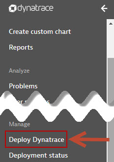

Click the Start installation button and select Linux.

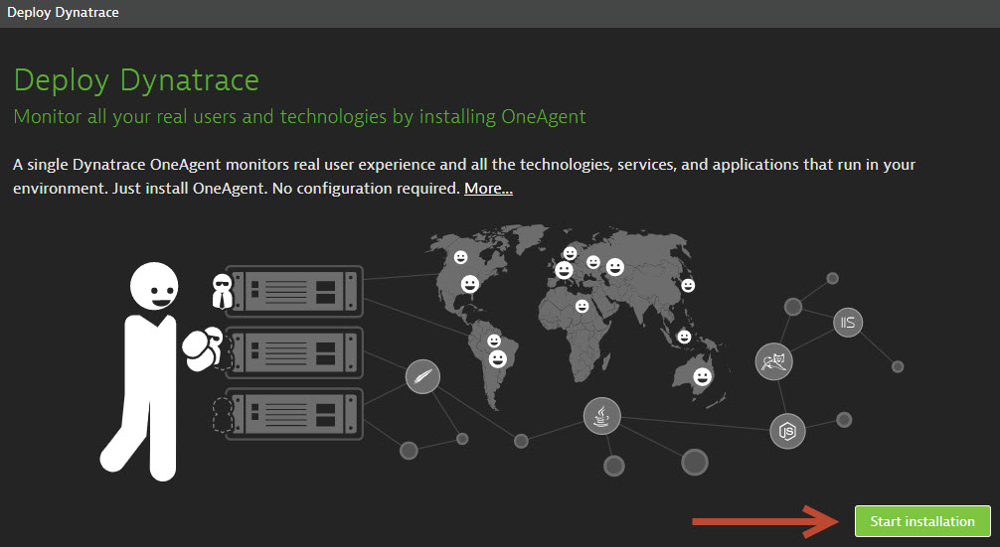


Choose the installer type from the drop-down list (we'll use the default x86/64). 
Use the Linux shell script installer on any Linux system that's supported by Dynatrace, regardless of the packaging system your distribution depends on.

**Copy** the command provided in the "Use this command on the target host" text field. **Paste** the command into your terminal window and execute it.


Example: 

```bash
$  wget  -O Dynatrace-OneAgent-Linux-1.171.252.sh <follow screen shot above>
--2019-08-07 10:17:45--  https://<URL>
Resolving <URL>... <IP>
Connecting to <URL> | <IP>|:443... connected.
HTTP request sent, awaiting response... 200 OK
Length: 139134801 (133M) [application/octet-stream]
Saving to: ‘Dynatrace-OneAgent-Linux-1.171.252.sh’

100%[======================================>] 139,134,801 84.3MB/s   in 1.6s

2019-08-07 10:17:47 (84.3 MB/s) - ‘Dynatrace-OneAgent-Linux-1.171.252.sh’ saved [139134801/139134801]

$
```

### Execute the installation script

(Optional) Once the download is complete, you can verify the signature by copying the command from the "Verify signature" text field, then pasting the command into your terminal window and executing it. Make sure your system is up to date, especially SSL and related certificate libraries.

**Copy** the command that's provided in the text box "And run the installer with root rights" text field.


**Paste** the command into your terminal window and execute it. You’ll need to make the script executable before you can run it.

**Note that you’ll need root access.**  You can use sudo to run the installation script. To do this, type the following command into the directory where you downloaded the installation script.

Example:

```bash
$ sudo /bin/sh Dynatrace-OneAgent-Linux-1.171.252.sh
10:21:42 Checking root privileges...
10:21:42 OK
10:21:42 Installation started ...
...
10:22:14 Starting agents...
10:22:14 oneagent service started
10:22:14 Checking if agent is connected to the server...
10:22:16 Dynatrace OneAgent has successfully connected to Dynatrace Cluster Node. After completing Dynatrace OneAgent installation on this machine, please return to your browser to complete the remainder of the installation.
$

```

### Validate the installation in Deployment status

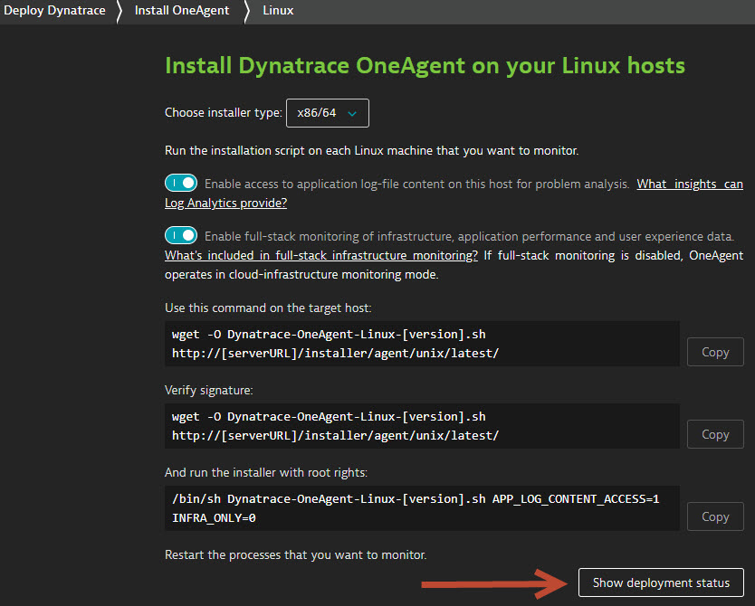

Reference: https://www.dynatrace.com/support/help/technology-support/operating-systems/linux/

### Start Easy Travel application

To start Easy Travel execute the following command:

```
$ cd ~
$ ./restart_easyTravel.sh
Stopping loadgen  ... done
Stopping www      ... done
Stopping frontend ... done
Stopping backend  ... done
Stopping mongodb  ... done
Removing loadgen  ... done
Removing www      ... done
Removing frontend ... done
Removing backend  ... done
Removing mongodb  ... done
ip-172-31-7-147
APM
Creating mongodb ... done
Creating backend ... done
Creating frontend ... done
Creating www      ... done
Creating loadgen  ... done
$

```

Easy Travel will take about 5 minutes to complete starting up. If you would like to check the status, you can enter this command:

```bash
$ sudo docker ps
CONTAINER ID        IMAGE                           COMMAND                  CREATED             STATUS              PORTS                                                NAMES
0f9cb477bcf0        dynatrace/easytravel-loadgen    "/bin/sh -c /run-pro…"   19 minutes ago      Up 19 minutes                                                            loadgen
a3d241d88ecf        dynatrace/easytravel-nginx      "/bin/sh -c /run-pro…"   19 minutes ago      Up 19 minutes       443/tcp, 0.0.0.0:80->80/tcp, 8080/tcp                www
82300947a19a        dynatrace/easytravel-frontend   "/bin/sh -c /run-pro…"   19 minutes ago      Up 19 minutes       0.0.0.0:32771->8080/tcp                              frontend
3dc6e8e3f468        dynatrace/easytravel-backend    "/bin/sh -c /run-pro…"   19 minutes ago      Up 19 minutes       0.0.0.0:32770->8080/tcp                              backend
f88098f89e90        dynatrace/easytravel-mongodb    "/bin/sh -c ${SCRIPT…"   19 minutes ago      Up 19 minutes       0.0.0.0:32769->27017/tcp, 0.0.0.0:32768->28017/tcp   mongodb

```

If you see the above 5 containers, it would mean that Easy Travel containers have started. If you do not see the 5 conatiners, it means that Easy Travel is still starting and you might want to wait a few minutes more. 

To access the Easy Travel portal, use the Public DNS of your instance. Copy / paste the Public DNS into your browser.

Get the Public DNS for your instance from the AWS Console or execute this command:

```bash
$ curl http://169.254.169.254/latest/meta-data/public-hostname
ec2-xxx-xxx-xxx-xxx.ap-southeast-2.compute.amazonaws.com
```

### Explore the Smartscape

While waiting for Easy Travel to start, you can explore Dynatrace and using the Smartscape, Dynatrace will automatically discover the processes and dependencies that comprises the Easy Travel application! 

[4 things](https://www.dynatrace.com/support/help/get-started/4-things-youll-absolutely-love-about-dynatrace/) that you will love about Dynatrace!

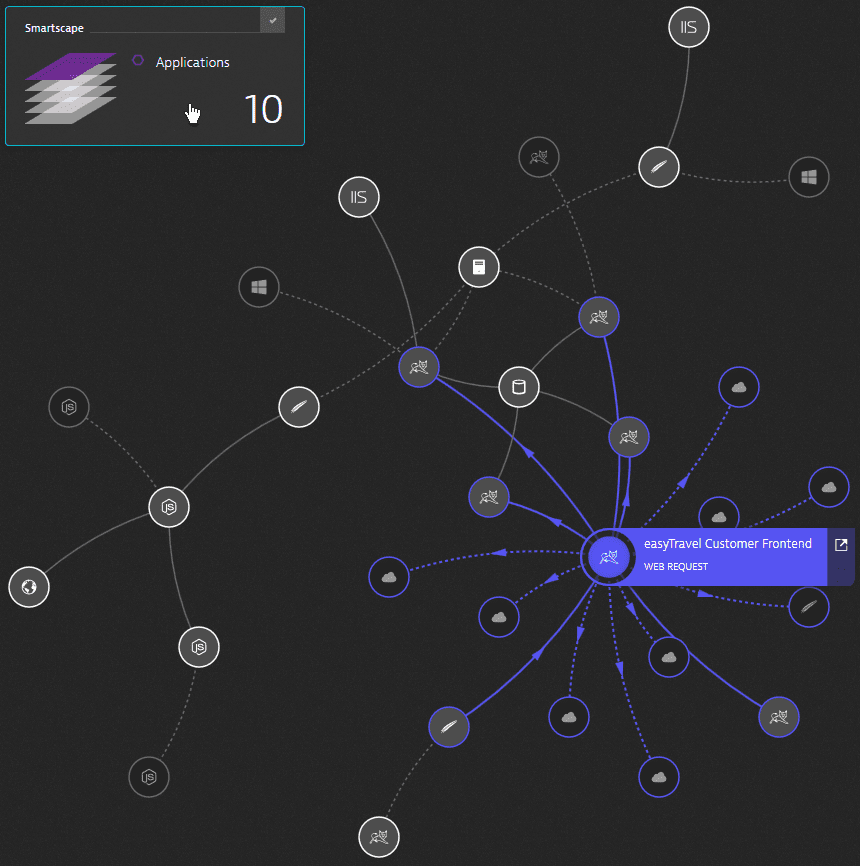

<!-- ------------------------ -->
## Configure Real User Monitoring
Duration: 15

In this exercise, we will cover the basics of configuring Real User Monitoring. These are some of the best practices that should be followed every time the Dynatrace JavaScript agent is deployed, be it an automated or manual injection. 

More information can be found here: [How to use Dynatrace > Real User Monitoring > Setup and configuration > Web applications](https://www.dynatrace.com/support/help/how-to-use-dynatrace/real-user-monitoring/setup-and-configuration/web-applications/)

There are 3 tasks in this exercise:
- [ ] Task 1: Defining an application
- [ ] Task 2: Selecting the appropriate JavaScript frameworks
- [ ] Task 3: Tagging a user session

### Task 1. Defining an application

Reference: https://www.dynatrace.com/support/help/how-to-use-dynatrace/real-user-monitoring/setup-and-configuration/web-applications/initial-configuration/define-your-applications-via-the-my-web-application-placeholder

1. Select **Applications** from the navigation menu.
2. Click the **My web application** placeholder application.
3. Scroll down to find the Top 3 included domains panel. This panel includes the domains that contain the largest number of actions that have been automatically detected by OneAgent in your environment.
4. Click **View full details**.

   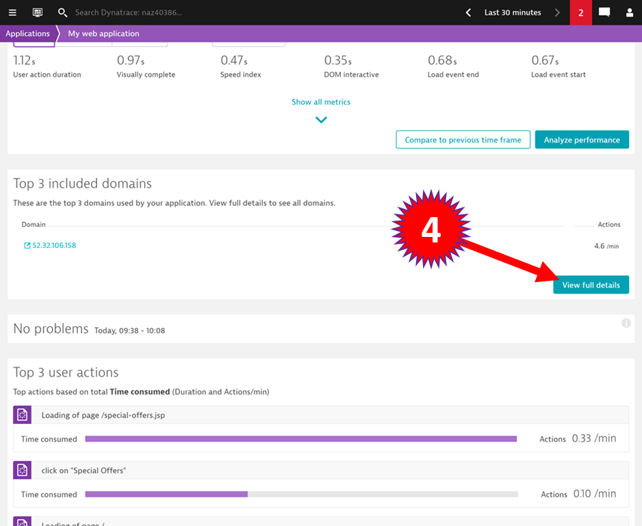

5. Select a domain from the list appearing under Top domains and expand it by clicking the **arrow under Transfer domain**.
6. Click **Create new application**. 
Your application will be created and listed on the Applications page. From now on, all user actions that are monitored on this domain will be mapped onto the newly created application. Alternatively, you may want to add the domain to an existing application, in case some applications have already been created. To do this, expand the list box, select an application and click Transfer.

   

As you may want to use a more intuitive name for your application, you can easily rename it. To rename an application:
1. Select **Applications** from the navigation menu.
2. Click your newly created application to access the application's overview page.
3. Click the Browse button (...) and select **Edit**.
4. Type in the name you prefer in the text box appearing on top of the page. For this workshop please use **easyTravel** as the application name. Note that application names must be unique.

### Task 2. Selecting the appropriate JavaScript frameworks

1. Select **Applications** from the navigation menu.
2. Select the newly created application (the entry in your Dynatrace console will be different from the screen shot)

   

3. Click the Browse button (...) and select **Edit**.
4. Select **Async requests and single page apps**
5. Enable the following frameworks as shown in the screen below
6. Click on **Save**

   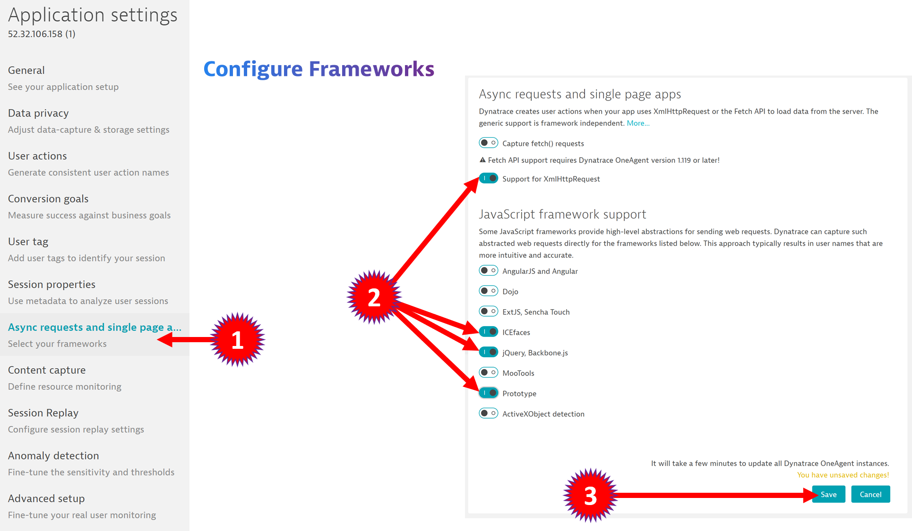

### Task 3. Tagging a user session

Reference: https://www.dynatrace.com/support/help/how-to-use-dynatrace/real-user-monitoring/how-to-use-real-user-monitoring/cross-application-user-session-analytics/identify-individual-users-for-session-analysis/

We will be tagging users based on page metadata.

This approach to user tagging works by capturing available data in your application’s page source. If you take a close look at your application’s page source, you’ll likely find that usernames are already included somewhere. Usernames may be included in the text of a DOM element, a meta tag, a JavaScript variable, or even a cookie attribute. For example, easyTravel, the Dynatrace demo application, includes the user name in a welcome message in the upper-right corner of the home page (see image below). Using the development tools that are built into most browsers, you can generate a unique CSS selector for this particular element.

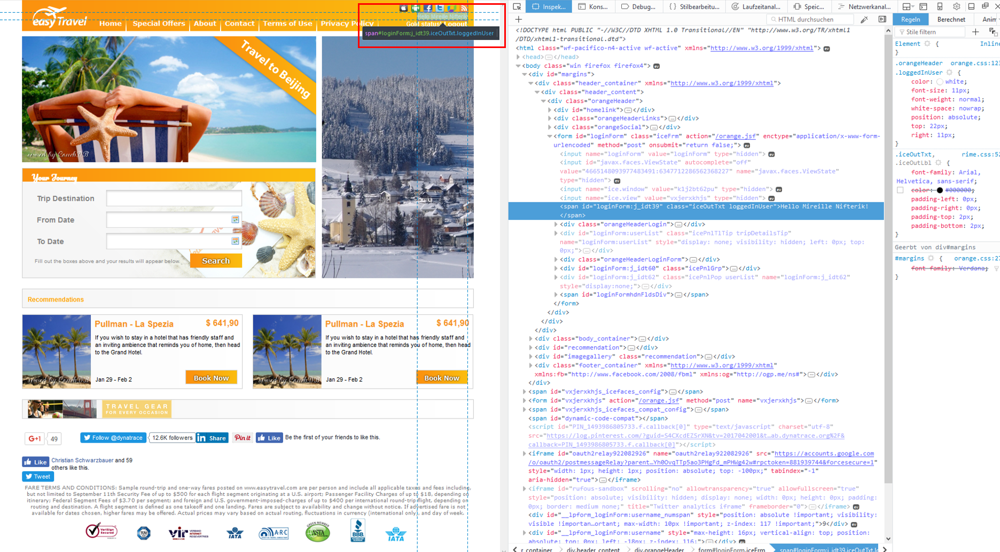

Once you’ve identified where usernames are located in your page source, you can create user tags based on the usernames. To do this, return to Dynatrace and execute the following steps:

1. Select **User tag**
2. Click on **Add tag (identifier) rule**
3. Select the drop down **CSS Selector**
4. Paste the CSS Selector which you copied earlier from your browser's Developer Tool. Since the CSS Selector also picks up some additional text, we can apply a clean up rule.
5. Click **Add tag (identifier) rule**
5. Click on **Save**

   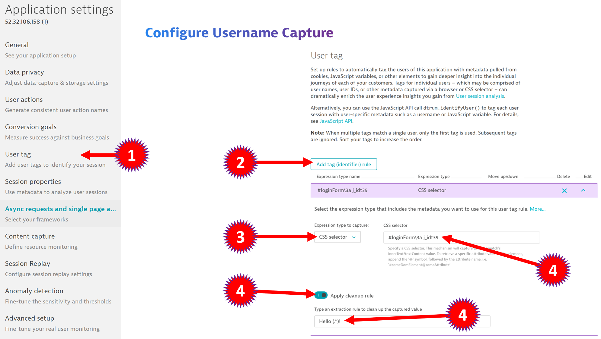

**Hint:**
 * CSS Selector
 
```bash
#loginForm\:j_idt39
```
 
 * Clean up rule
 
```bash 
Hello (.*)!
```

<!-- ------------------------ -->
## Configure Synthetic Test
Duration: 15

In this exercise, we will cover creating a single URL synthetic test in Dynatrace. Dynatrace offers three types of synthetic monitoring: single-URL browser monitors, browser clickpaths, and HTTP monitors.

More information can be found here: [How to use Dynatrace > Syntheic Monitoring](https://www.dynatrace.com/support/help/how-to-use-dynatrace/synthetic-monitoring)

### 1. Create a simple browser monitors for Easy Travel

1. Select **Synthetic** from the navigation menu.
2. Click the **Create a synthetic monitor** button at top right.
3. Click **Create a browser monitor**.


4. On the Configure a synthetic monitor page, type in the URL (Public DNS) of your Easy Travel application and name the monitor **easyTravel Homepage**.
5. For Device profile, leave it as the default (i.e. Desktop)

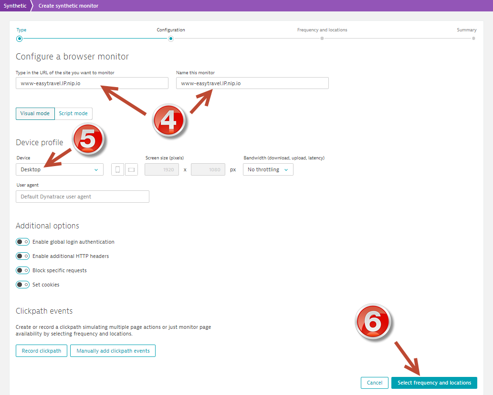

6. Click on **Select Frequency & Locations**. For Frequency, select **5** mins
7. Use the following 2 locations
   * Sydney
   * Canbarra

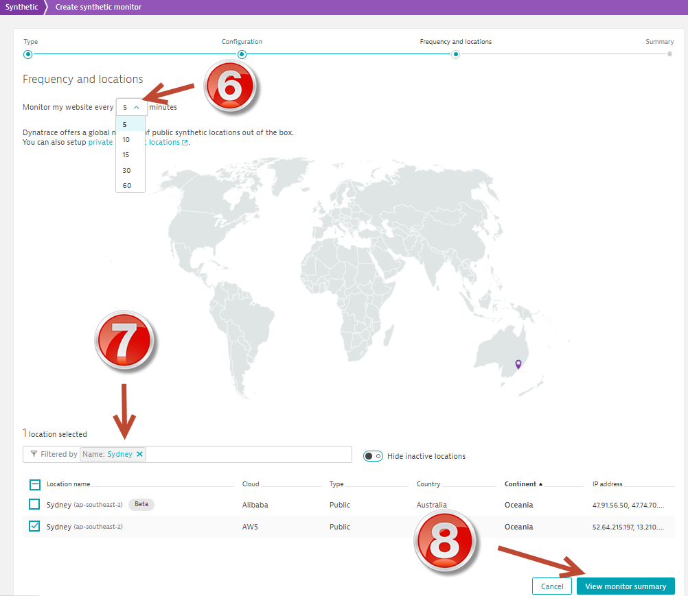

8. Click on **View monitor summary** to advance in the wizard
9. Click on **Create browser monitor** to complete the creation of the synthetic monitor

Reference: https://www.dynatrace.com/support/help/how-to-use-dynatrace/synthetic-monitoring/browser-monitors/create-a-single-url-browser-monitor/

### 2. (Optional) Create a browser clickpath synthetic monitor for Easy Travel

 * You will need to install the **Dynatrace recorder (chrome plugin)**
 * Only **Chrome** is supported due to the requirement to run a plugin

1. Select **Synthetic** from the navigation menu.
2. Click **Create a synthetic monitor** > **Create a browser monitor**.
3. First-time users are asked to install the Chrome plugin. Click **Install Dynatrace Synthetic Recorder** at the bottom of the page.
4. On the extension page, click Add to Chrome > Add Extension.

Reference: https://www.dynatrace.com/support/help/how-to-use-dynatrace/synthetic-monitoring/browser-monitors/record-a-browser-clickpath/

### 3. DISABLE or DELETE all tests when done!

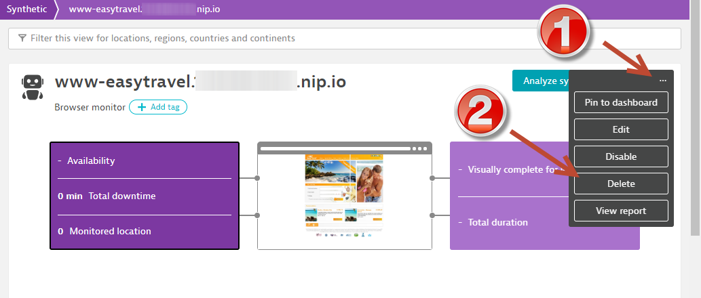

<!-- ------------------------ -->
## Configure Session Replay
Duration: 15

This exercise covers configuring Session Replay in Dynatrace.

Read about Session Replay here: [How to use Dynatrace > Real User Monitoring > Basic RUM concepts > Session Replay](https://www.dynatrace.com/support/help/how-to-use-dynatrace/real-user-monitoring/basic-concepts/session-replay/)

### 1. Enable Session Replay

1. Select **Applications** from the navigation menu.
2. Select the application you want to configure.
3. Click the Browse \[...\] menu button and select **Edit**.
4. From the Application settings menu, select **Session Replay**.
5. Turn the **Enable Session Replay** button on.

   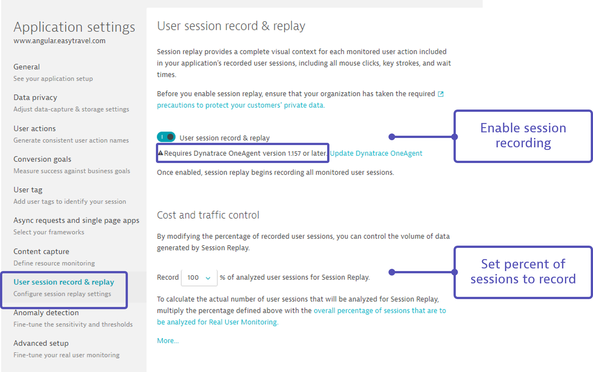

6. Click on **Save** and then access the Easy Travel application using your browser and navigate around the application.
7. After a couple minutes, find your session under **User Sessions**
   * Hint: You can filter for sessions that have Replay enabled

   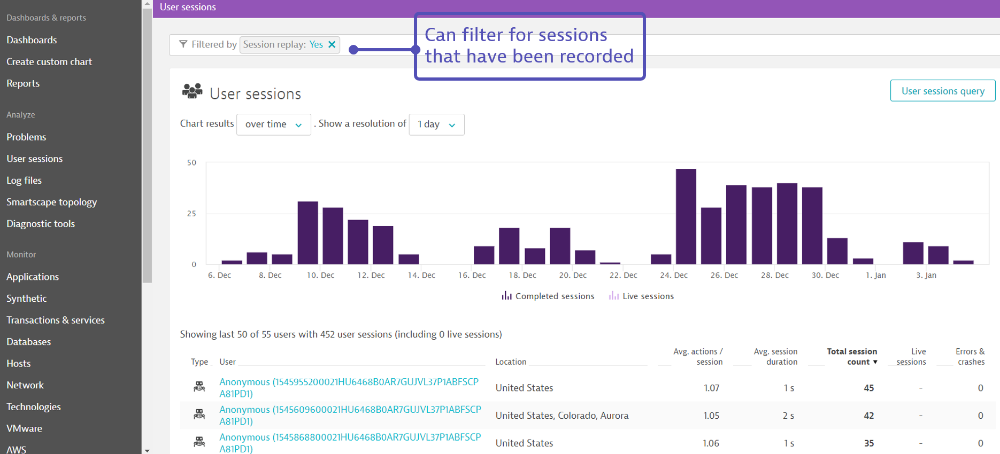

8. Replay your session

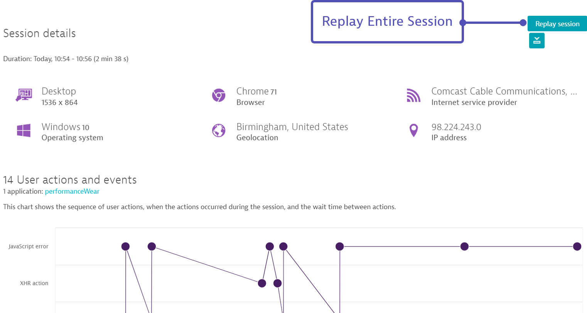

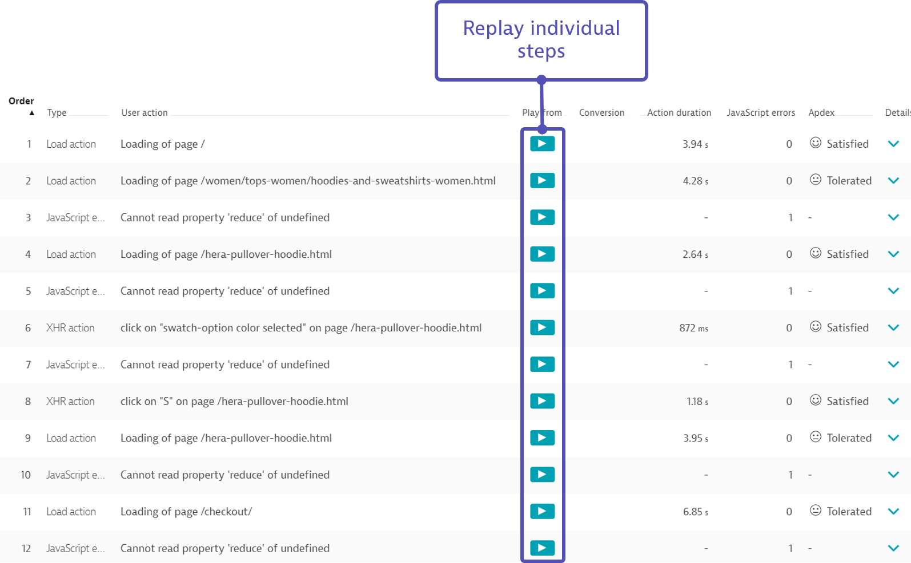


### 2. Additional configuration for for personal data protection

Reference: https://www.dynatrace.com/support/help/how-to-use-dynatrace/real-user-monitoring/setup-and-configuration/web-applications/additional-configuration/configure-session-replay-for-personal-data-protection/


<!-- ------------------------ -->
## Introduction to USQL
Duration: 15

Dynatrace captures detailed user session data each time a user interacts with your monitored application. This data includes all user actions and high level performance data. Using either the Dynatrace API or Dynatrace User Sessions Query Language (USQL), you can easily run powerful queries, segmentations, and aggregations on this captured data. 

User Sessions Query Language isn't SQL and Dynatrace doesn't store user session data in a relational database. User Sessions Query Language is a Dynatrace-specific query language, though it does rely on some SQL concepts and the syntax is similar, which makes it easy to get started.

A typical use case for using USQL is to build dashboards to visualize business metrics.

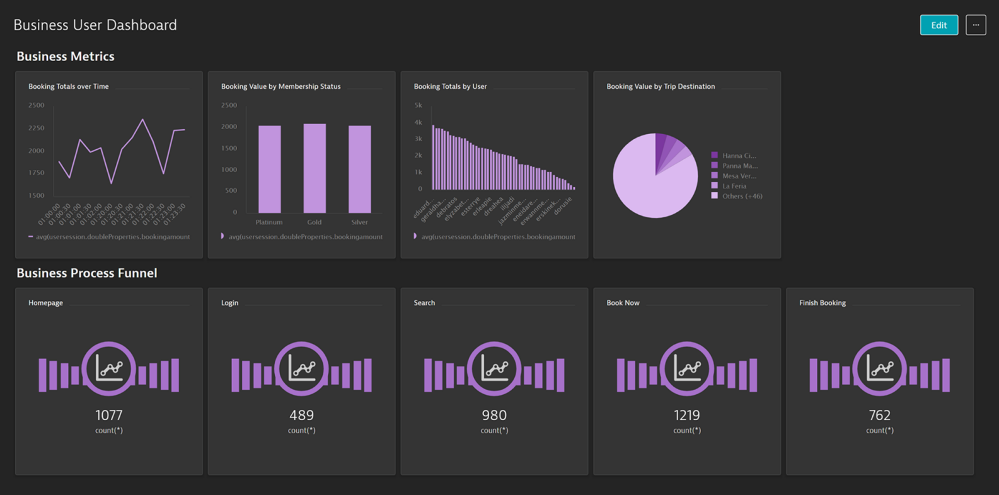

Reference: https://www.dynatrace.com/support/help/how-to-use-dynatrace/real-user-monitoring/how-to-use-real-user-monitoring/cross-application-user-session-analytics/custom-queries-segmentation-and-aggregation-of-session-data/

### 1. Explore USQL

1. Select User Sessions from the navigation menu
2. Use the Filter at the top bar, select your application's name 
3. Click on "User Session queries"

   

4. A default USQL query is automatically created for you based on the application you selected

   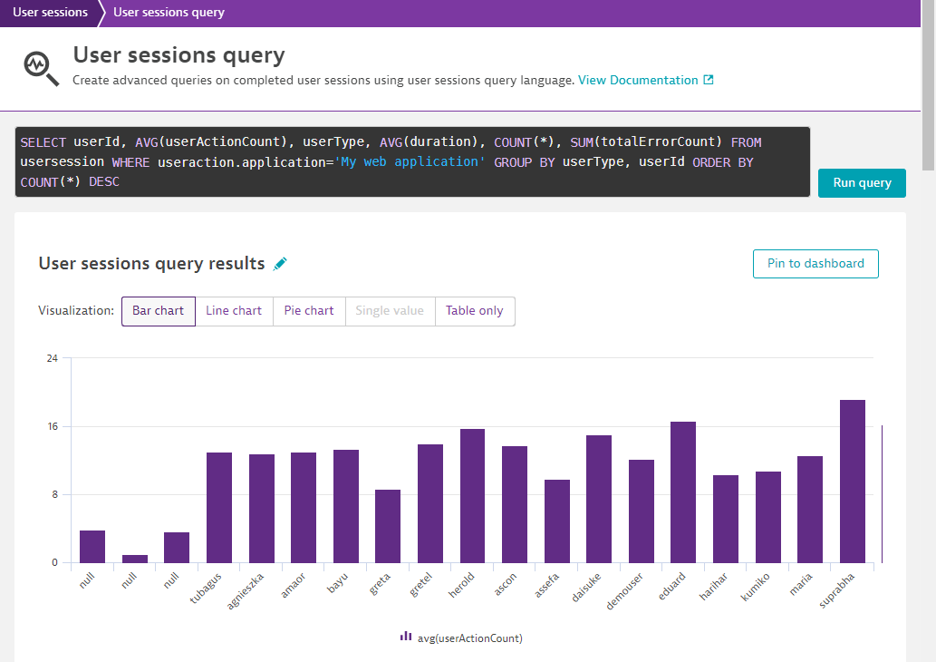

**Sample queries**

Sample 1
```
SELECT DATETIME(starttime, 'MM/dd/yyyy hh:mm', '30m'),AVG(useraction.visuallyCompleteTime)
FROM usersession
WHERE country IS "United States" GROUP BY DATETIME(starttime, 'MM/dd/yyyy hh:mm', '30m')
```

Sample 2
```
SELECT userId, SUM(totalErrorCount) FROM usersession
WHERE totalErrorCount IS NOT NULL
GROUP BY userId ORDER BY SUM(totalErrorCount) DESC
```

Sample 3
```
SELECT COUNT(*) FROM usersession WHERE useraction.name = "Loading of page /orange.jsf"
```

Are you able to describe what each sample query is trying to visualize?
