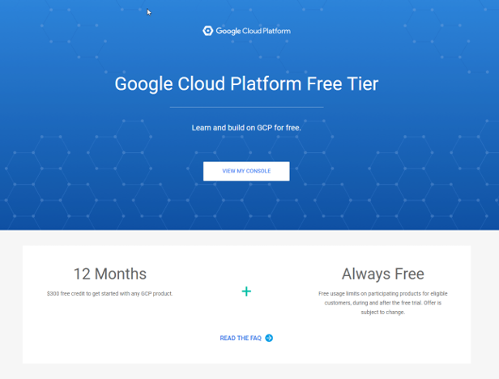
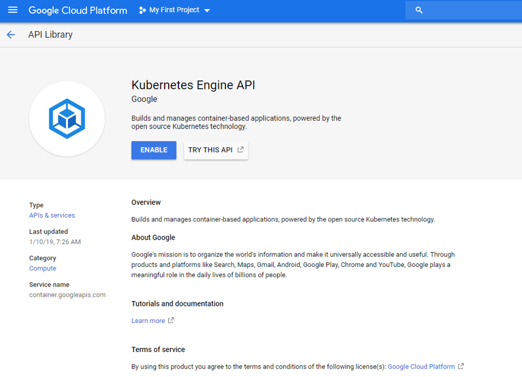
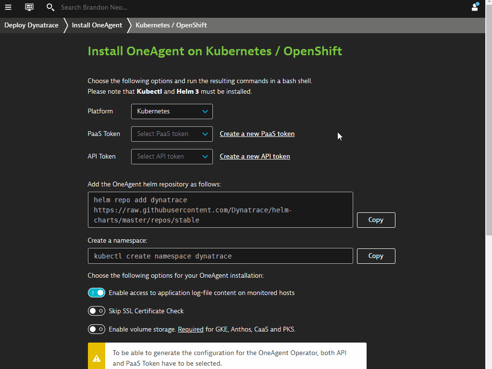
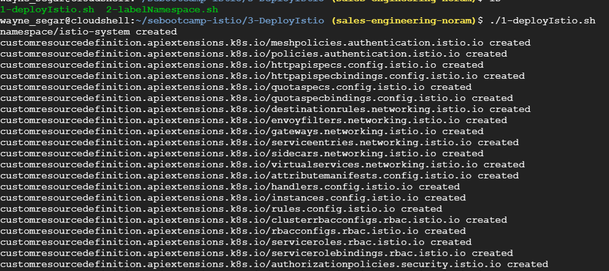
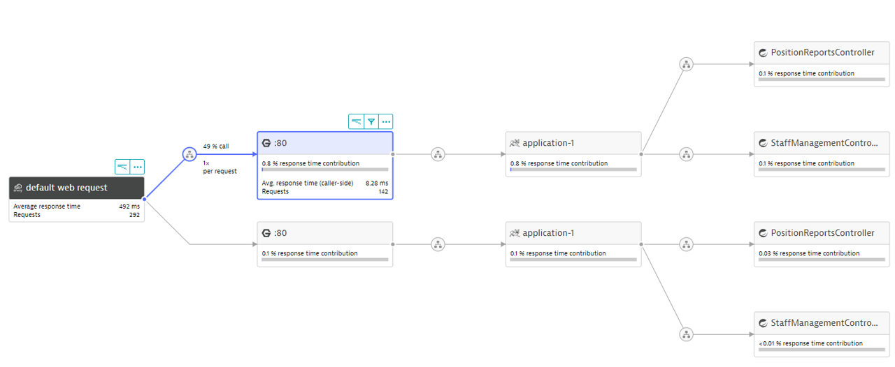
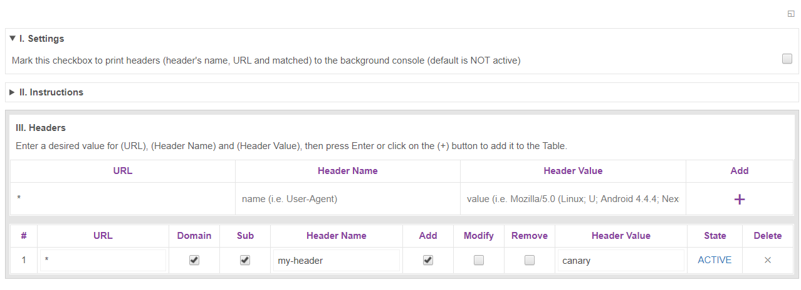

summary: Istio Hands-On
id: istio
categories: istio
tags: bootcamp
status: Published 
authors: Brandon Neo
Feedback Link: mailto:APAC-SE-Central@dynatrace.com
Analytics Account: UA-175467274-1

# Dynatrace with Istio
<!-- ------------------------ -->
## Introduction 
Duration: 1

This repository contains labs for the Istio Hands-On Session. We will be using Google Kubernetes Engine (GKE) for this hands-on but for China participants, you will be using a Microk8s on AWS. You can use [Keptn in a box](https://github.com/keptn-sandbox/keptn-in-a-box) to easily spin up a Istio based K8s instance 

### Prerequisites
- Google Cloud account with access to GKE. Use **ANY** of the following:
  - Corporate account via #team-gotc on Slack (eg. brandon.neo@dynatrace.com on **ACM Workshops APAC** project)
  - Free trial access [here](https://cloud.google.com/free/).
- Chrome Browser with [browser extension](https://chrome.google.com/webstore/detail/modify-header-value-http/cbdibdfhahmknbkkojljfncpnhmacdek)
- Enable Envoy Tracing in your Dynatrace Environment 
   - **Settings > Monitored Technologies > Envoy**

### What You’ll Learn 
- Understand Istio / Envoy principles
- Learn Kiali and its difference with Dynatrace
- Deployment strategies and weightage distribution
- How to instrument Envoy in Dynatrace

<!-- ------------------------ -->
## Setting up your GKE
Duration: 10

Negative
: For 🌏 **China participants**, log into to your designated EC2 instances. You already have a Microk8s instance running so you will only need to follow along later. **Skip to the next step.**

### Login to Google Cloud Platform Account

Either login to your corporate account or signup with Google Cloud Platform free [here](https://cloud.google.com/free/)

You can login to your GCP console [here](https://console.cloud.google.com/home/).



### Enable Kubernetes Engine API 

You will also need to **Enable your API Billing** with Kubernetes Engine API. 



You should be prompted to the billing page while setting up your GKE instance. 

If not, you can follow the steps [here](https://support.google.com/googleapi/answer/6158867?hl=en)

### Activate Cloud Shell


Click on the Terminal Icon on the top right

A Cloud based Terminal lookalike will appear at the bottom of the page

We will start setting up our GKE Cluster 

### Download the Istio Hands-on Repo

Run the following command to download from our Github Repo

`git clone https://github.com/Nodnarboen/istio-handson.git`

The above will create a folder call **istio-handson**. This will contain the scripts we will use for the remainder of the workshop 


### Setup your GKE Cluster

Run the command to create the cluster

`cd istio-handson/1-CreateCluster; ./setupenv.sh`

Positive
: This step will take about a couple of minutes 

<!-- ------------------------ -->
## Installing OneAgent Operator via Helm
Duration: 10

Go to **Deploy Dynatrace > Start Installation > Kubernetes** and follow the instructions on screen

### Dynatrace Tokens

In order to install OneAgent via Operator, we need to create the API and PaaS Tokens

### Get API and PaaS Tokens in Dynatrace
Follow the steps on screen to create your API and PaaS tokens. 
You will find the API token automatically configured with the necessary permissions. 
Once created, select the **newly created tokens** from both of the **drop-down fields**.
Other commands will also be pre-populated with the necessary steps.



### Add the OneAgent Helm Repo
Follow the setup steps and run the following commands. 

```bash
helm repo add dynatrace https://raw.githubusercontent.com/Dynatrace/helm-charts/master/repos/stable
kubectl create namespace dynatrace
```
### Create a and apply values.yaml

Run the below command to create new file called **values.yaml**

`nano values.yaml`

Copy and paste in content in your Dyntrace tenant and save the file with **Ctrl-X** followed by **Y** and **Enter** 

**EXAMPLE**

```yaml
platform: "kubernetes"

oneagent:
  name: "oneagent"
  apiUrl: "https://mou612.managed-sprint.dynalabs.io/e/<ENVIRONMENT ID>/api"
  args:
    - --set-app-log-content-access=true
  skipCertCheck: false
  enableIstio: true

secret:
  apiToken: "<API KEY>"
  paasToken: "<PAAS KEY>"
```
Copy the next command to **apply the values.yaml** and **deploy OneAgent on Kubernetes**.

```bash
helm install dynatrace-oneagent-operator \
dynatrace/dynatrace-oneagent-operator -n\
dynatrace --values values.yaml
```
If successful, you should get a positive output with **STATUS: deployed** as per below.

```bash
NAME: dynatrace-oneagent-operator
LAST DEPLOYED: Thu Aug 13 01:25:26 2020
NAMESPACE: dynatrace
STATUS: deployed
REVISION: 1
TEST SUITE: None
NOTES:
Thank you for installing dynatrace-oneagent-operator.

Your release is named dynatrace-oneagent-operator.
```

Negative
: For GKE environments, remember to enable Toggle for **Enable Volume Storage.**

<!-- ------------------------ -->
## Istio Setup
Duration: 5

### Istio Installation

Navigate to the directory **2-DeployIstio**, where there will be two scripts:

Execute the script **./1-deployIstio.sh**



After the script runs, you will be presented with a URL to the **Kiali web interface** along with the username and password:


### Define Istio Namespace

Now that we have Istio and Kiali installed, we need to tell it which namespaces can use it.  

We do this by adding the following label to any namespace where we plan to use Istio:
`istio-enabled=enabled`
In our case we are going to label the default namespace by running the script **./2-labelNamespace.sh**


<!-- ------------------------ -->
## Traffic Routing
Duration: 20

### Traffic Routing Setup

First let’s deploy our application:

Navigate to the folder **3-TrafficRouting** and execute the script **./1-trafficroutingapplication.sh**

This will deploy our sample application and output the URL where the application can be accessed via a browser

This is plain Kubernetes, nothing Istio related is deployed yet


Once the deployment complete, navigate to the output URL to view the application:


### Explore Sample App Fleet

Clicking the different truck names on the left you will notice that the driver picture changes to either a placeholder photo or a real photo


If you take a look at the running pods, you will see that we have two different pods running the staff service


Explore Service Flow in Dynatrace and you should see the below


### Explore Kiali

In the Kiali UI, navigate to the **Graph view** on the left navigation menu.

Find **fleetman-staff-service**, **right-click** and select **Show Details**


Near the top right, Select **Actions** and **Create Weighted Routing**

Set the **“Risky”** service to 10% Traffic Weight


You will now see that a **Virtual Service** and **Destination Rule** was create and we can view the YAML


You will also see this in the console via kubectl


In the UI we should now see the traffic weighting take affect and we should see the actual person image ~10% of the time and the placeholder image **~90% of the time**

We can also see in the in the command line via cURL.  In the folder **3-TrafficRouting**, execute the command `./curlOutput.sh`


Run the script **./2-cleanUp.sh** to remove the application and make sure you deleted the VirtualService and DestinationRules

<!-- ------------------------ -->
## Ingress
Duration: 20

First let’s deploy our application, navigate to the folder **4-Ingress** and execute the script 
`./1-ingressapplication.sh`

When the script completes you will end up with URL for the application

There is NO Istio specific configuration for this application (yet)

### Blue Green versions of Fleet Manager

You will notice if you refresh the page a few times, there are two different versions of the application:


Since there is no Istio involved, traffic is currently weighted at **50/50**
We can also see this via cURL, by running the script `./curlOutput.sh` in the folder **4-Ingress**


### Explore Kiali

Now let’s create a traffic weighting so 90% of the traffic goes to the stable version and 10% of the traffic goes to the experimental version in Kiali


However, when running the cURL script again, we still see a ~50/50 traffic weighting?


Istio already provides us with an Ingress Service, we just need to configure it:


Run the script `./2-createIstioGateway.sh` in the folder **4-Ingress** which will create our Gateway, Virtual Service and Destination Rules. 

This will also output the URL for accessing the application through the Gateway


We should now see that we are getting about a 90/10 traffic weighting in the browser

If we check Kiali we will also see the Gateway Service created, along with the Virtual Service and Destination Rules


We should also be able to see this in Dynatrace's Service Flow



Run the script ./cleanUp.sh to remove the Gateway Service, Virtual Service and Destination Rules
The application will remain deployed


<!-- ------------------------ -->
## Dark Releases
Duration: 15

What are Dark Releases? 

- Deploying a “dormant” version of an application/service
- Control the exposed use base
- Based on Feature Flags, IP Address, Header, URL, etc…

### Deploy Dark Releases (Optional)

Let’s deploy our Dark Release configuration:

Navigate to the folder **5-DarkReleases** and execute the script `./1-createRoutingRules.sh`

When you out the application in the output URL, the application should appear WITHOUT the red banner


If we take a look at the yaml file with the routing rules we see how the traffic is routing:


If we access the application with the **HTTP Header my-header:canary**, we should see the experimental version, with the red banner displayed. 

We can add this header via a browser extension:


- Selection **Open options page**
- Click on **+** Under Add
- Type * for URL
- Type **my-header** for Header Name
- Type **canary** for Header Value



We can determine what traffic is canary and which is not in Dynatrace with a Request Attribute:


<!-- ------------------------ -->

## Feedback
Duration: 3

We hope you enjoyed this lab and found it useful. We would love your feedback!
<form>
  <name>How was your overall experience with this lab?</name>
  <input value="Excellent" />
  <input value="Good" />
  <input value="Average" />
  <input value="Fair" />
  <input value="Poor" />
</form>

<form>
  <name>What did you benefit most from this lab?</name>
  <input value="Using OneAgent Operator to deploy in Kubernetes" />
  <input value="Setting up Kubernetes integation" />
  <input value="Enabling early access feature flags" />
  <input value="Learning Kubernetes View in Dynatrace" />
</form>

<form>
  <name>How likely are you to recommend this lab to a friend or colleague?</name>
  <input value="Very Likely" />
  <input value="Moderately Likely" />
  <input value="Neither Likely nor unlikely" />
  <input value="Moderately Unlikely" />
  <input value="Very Unlikely" />
</form>

Positive
: 💡 For other ideas and suggestions, please **[reach out via email](mailto:APAC-SE-Central@dynatrace.com?subject=Kubernetes Workshop - Ideas and Suggestions")**.