summary: Dynatrace with Kubernetes
id: kubernetes
categories: kubernetes
tags: kubernetes
status: Published 
authors: Brandon Neo
Feedback Link: mailto:APAC-SE-Central@dynatrace.com

# Dynatrace with Kubernetes
<!-- ------------------------ -->
## Introduction 
Duration: 1

This repository contains labs for the Hands-On Kubernetes Session. We will be using Google Kubernetes Engine (GKE) for this hands-on but this will work on other platforms as well.

For the purposes of the Hands-On, we will automate and make the steps seamless for the participants

### Prerequisites
- Dynatrace SaaS/Managed Account. Get your free SaaS trial here.
- Google Cloud account with access to GKE. Get your free trial access here.
- Chrome Browser

### What You’ll Learn 
- Deploying Dynatrace Operator via Helm Chart on Kubernetes
- Setup Kubernetes integration on Dynatrace
- Enabling early access feature flags in Dynatrace
- Discover Kubernetes View on Dynatace

<!-- ------------------------ -->
## Setting up your Google Kubernetes Environment (GKE)
Duration: 5

### Sign up for a Google Cloud Platform Account

Head over to https://cloud.google.com/free/ and sign up for a free GCP account with your existing Google account. 

You can also signup for a new Google Account if you don't have one

Upon signup, you will have free credits tied to your GCP account. (12 months + 400AUD)

You can login to your GCP console [here](https://console.cloud.google.com/home/).


### Enable Kubernetes Engine API 

You will also need to **Enable your API Billing** with Kubernetes Engine API. 


You should be prompted to the billing page while setting up your GKE instance. 

If not, you can follow the steps [here](https://support.google.com/googleapi/answer/6158867?hl=en)

### Activate Cloud Shell


Click on the Terminal Icon on the top right

A Cloud based Terminal lookalike will appear at the bottom of the page

We will start setting up our GKE Cluster 

### 3. Create your GKE Cluster


Create your GKE cluster named **k8sworkshop** running Ubuntu in GKE with the following command.
We will also be creating a compute VM for a Dynatrace Activegate. We will use the Dynatrace Activegate for Kubernetes integration.

```bash
gcloud container clusters create k8sworkshop --image-type=ubuntu --zone australia-southeast1-a
gcloud compute instances create dynatrace-activegate --image-family ubuntu-1604-lts --image-project ubuntu-os-cloud --zone australia-southeast1-a
```

Once completed, you will have a running GKE Cluster!


Running **kubectl get nodes** will reveal number of nodes 

<!-- ------------------------ -->
## Setting up your Kubernetes Integration
Duration: 5

As per the official instructions [here](https://www.dynatrace.com/support/help/technology-support/cloud-platforms/kubernetes/monitoring/connect-kubernetes-clusters-to-dynatrace/) for the Kubernetes integration, you will need to setup an Environment Activegate first.

### SSH into Dynatrace-Activegate terminal and install Activegate


1. On the left navigation bar in Google Cloud, go to **Compute Engine** -> **VM instances**


2. Click on the SSH button on the **dynatrace-activegate** row and SSH into the instance


2. Within Dynatrace, click on Deploy Dynatrace on the left menu
3. Click on "Install Activegate" at the bottom of the page
4. Click on "Linux"
5. Copy Step 2 and paste into your terminal.
6. Copy Step 4 and append "sudo" (installing as root) onto terminal
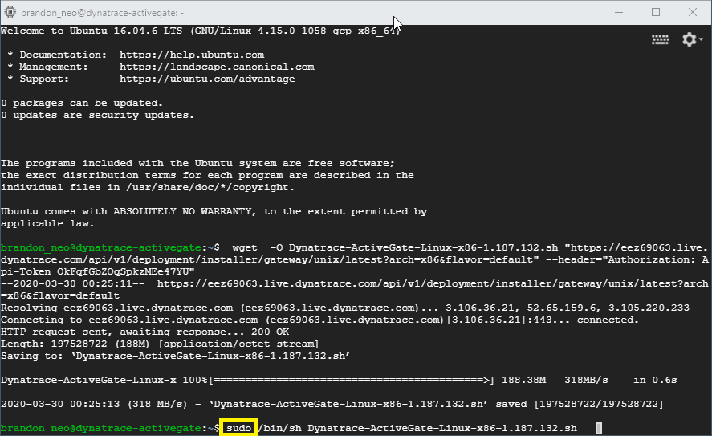

Once completed, you should see Activegate under Deployment Status.

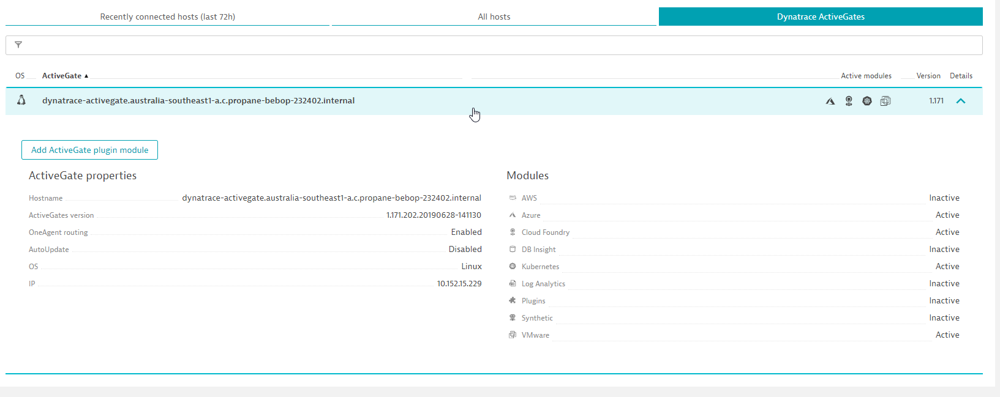

### Setup the K8S Overview Dashboard

Go to Settings -> Process and Containers -> Process group detection -> Enable Cloud Application and workload detection

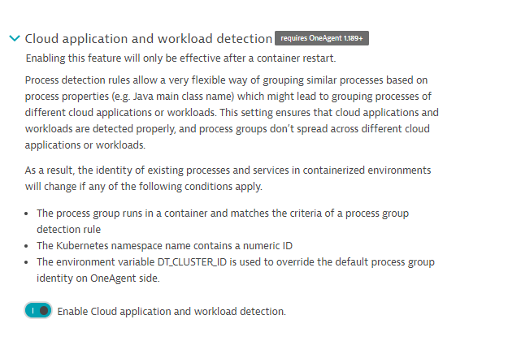

Automating the steps from our offical [documentation page](https://www.dynatrace.com/support/help/technology-support/cloud-platforms/kubernetes/installation-and-operation/further-integrations/connect-your-kubernetes-clusters-to-dynatrace/), we provided the API URL and bearer token automatically via API. Back in your main Cloud Shell terminal, enter the below

``` bash
wget -O- https://raw.githubusercontent.com/Dynatrace-APAC/Workshop-Kubernetes/master/setup-k8s-ui.sh | bash
```
With the above results, enter the values to **Settings** -> **Cloud and Virtualization** -> **Kubernetes**

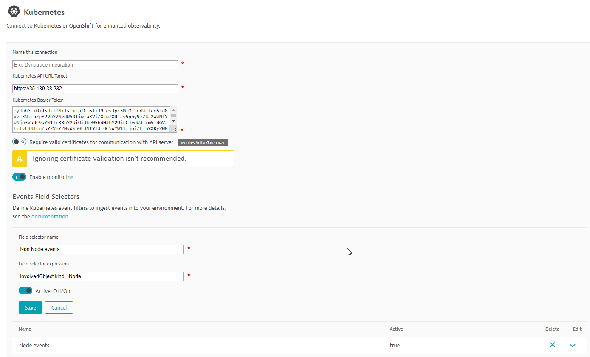
1. Give a name for the connection eg. GKE K8S
2. Enter in your Kubernetes API URL Target 
   - Copy the Kubernetes API URL from the SSH terminal
3. Enter in the Kubernetes Bearer Token
   - Copy the Bearer Token from the SSH terminal
4. Disable "Require valid certificates for communication with API server"
5. Add another event field selector
6. User the below for the field selector name
`Hipster shop`
7. User the below for the Field selector expression
`metadata.namespace=hipster-shop`
8. Save and Click on Connect

Once successfully connected, click on Kubernetes on the left menu and explore the Kubernetes UI. 


<!-- ------------------------ -->
## Install Dynatrace OneAgent Operator for Kubernetes
Duration: 5

1. On your Google Cloud Console, on the left navigational bar, go to Kubernetes Engine -> Applications
2. Click on "Deploy From Marketplace"
3. Search for Dynatrace in the search field above
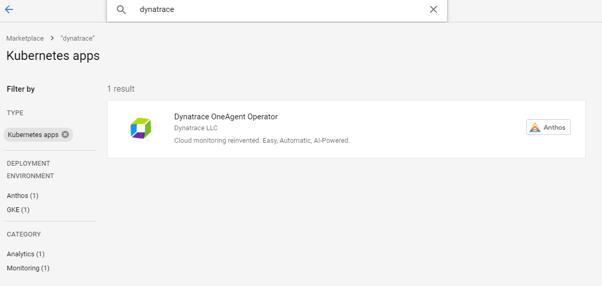
4. Click on Dynatrace OneAgent Operator and click on Configure
5. Fill in the following fields<br>
- API URL <br>
Copy your Dynatrace URL and append **"/api"** to the end<br>
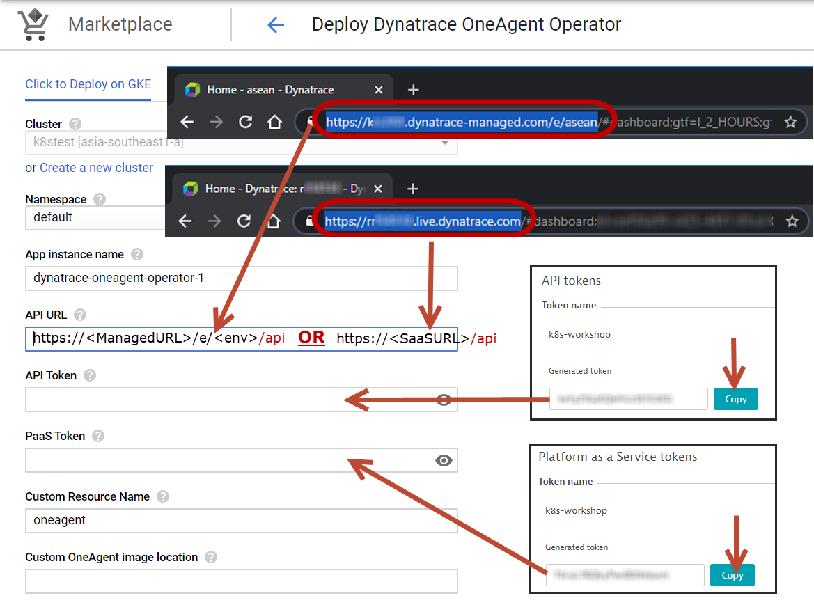

- API Token <br>
Create one from Settings -> Integration -> Dynatrace API
  - Enable Access problem and event feed, metrics, and topology toggle
  - Enable Write Configuration toggle (needed for Activegate setup for the next step)<br>
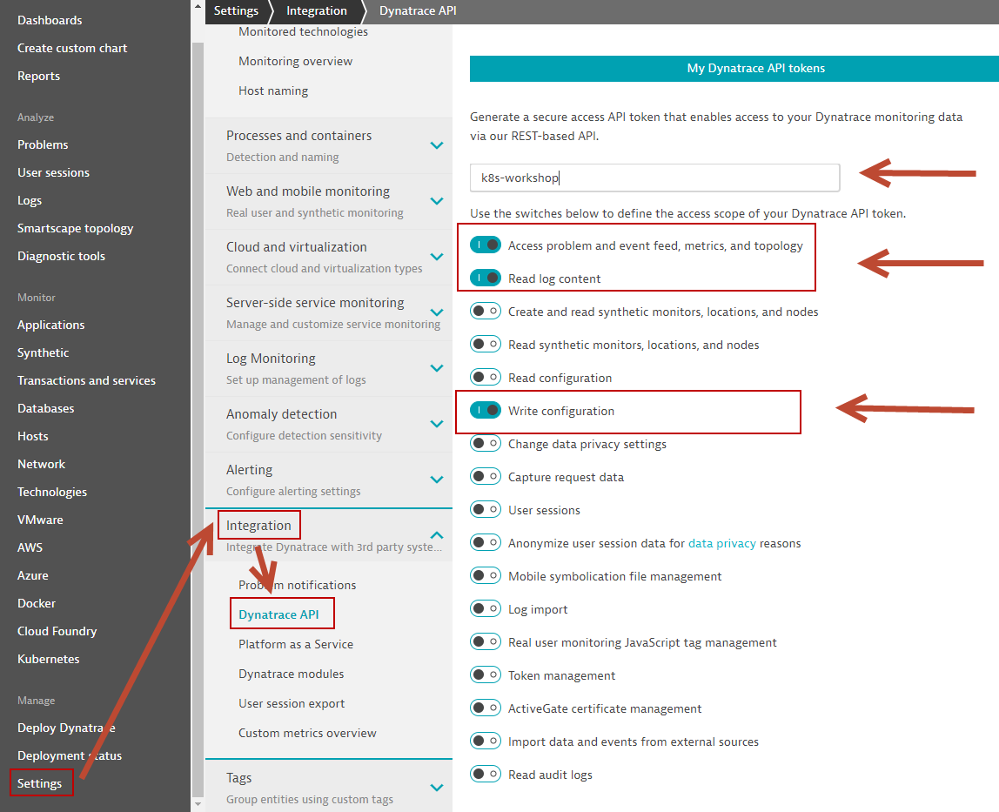

- PaaS token <br>
Create one from Settings -> Integration -> Platform as a Service
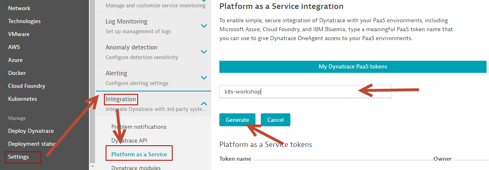

Copy the values into your GCP console
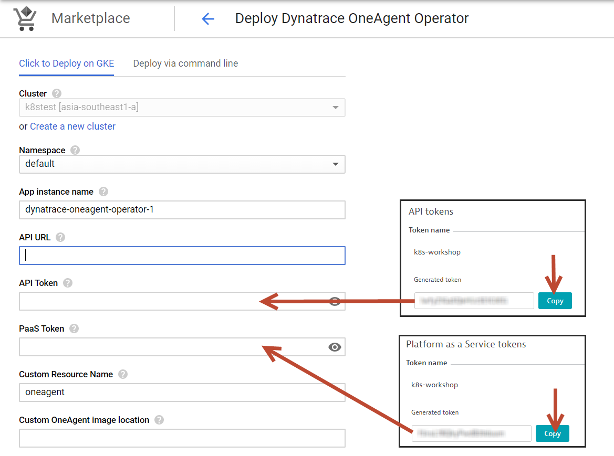

6. Click on Deploy<br>
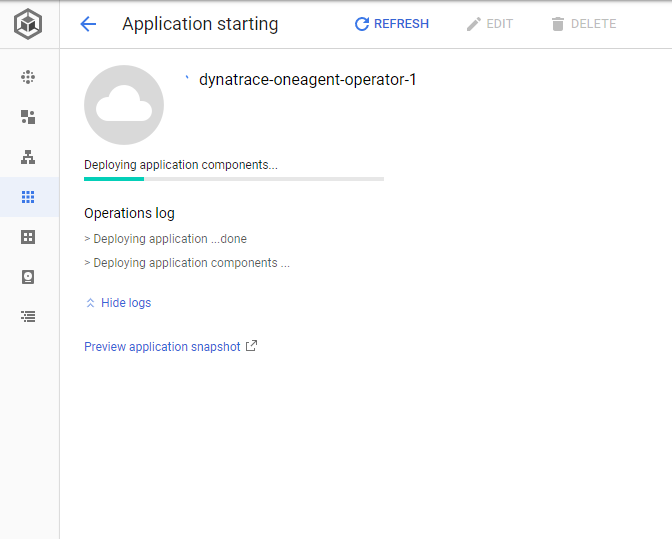<br>

Once completed, you can click on Hosts on the left panel to see your connected K8S nodes (3 nodes)  

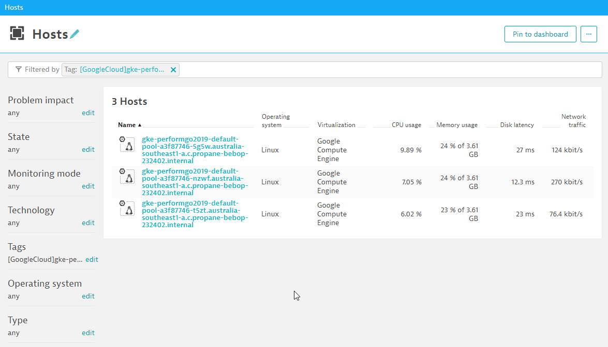
<!-- ------------------------ -->
## Setting up Hipster Shop
Duration: 5

For our Hands-On, you will need to run <a href="https://github.com/GoogleCloudPlatform/microservices-demo">Hipster Shop</a> which is a Google sample application.

### Run the Hipster Shop

```bash
wget -O- https://raw.githubusercontent.com/Dynatrace-APAC/Workshop-Kubernetes/master/deploy.sh | bash
```

Once deployed, you can locate the front-end endpoint from GCP (**Kubernetes Engine -> Services & Ingress**)

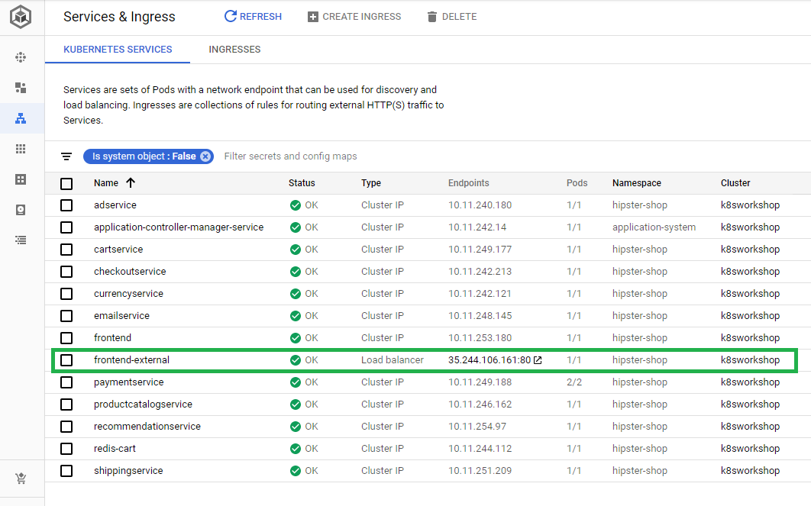

Once running, you can go to the exposed frontend-external IP to go to Hipster Shop.

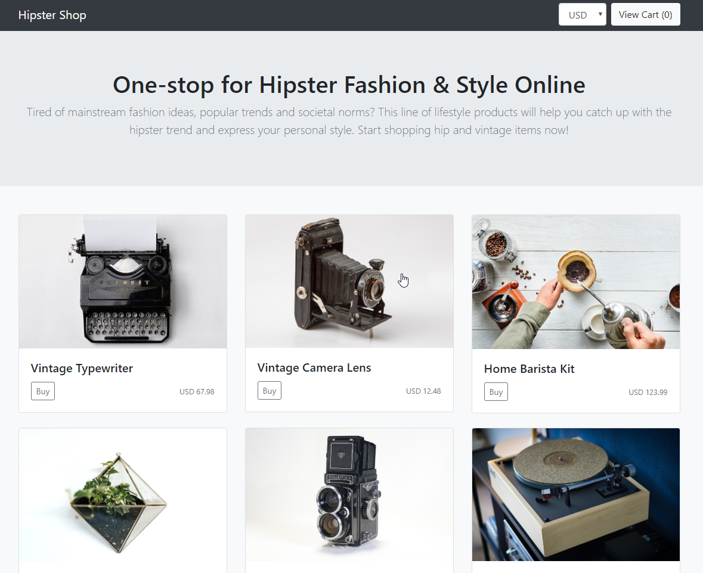

<!-- ------------------------ -->
## Exploring Dynatrace
Duration: 5

### Automatic Discovery of services

In Dynatrace, go to Transactions and Services to see the automatic 5 discovered services.
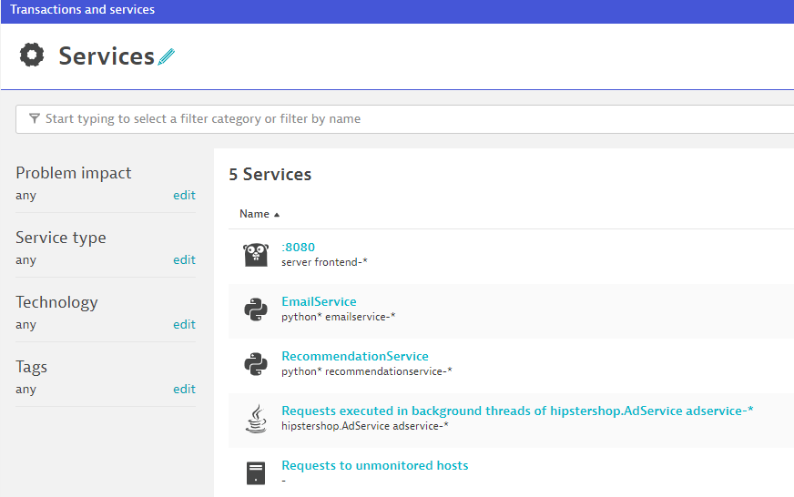

You will realized that some services are discovered but some might not match <a href="https://github.com/GoogleCloudPlatform/microservices-demo#service-architecture">Hipster Shop's Service architecture</a>.
Hipster Shop uses cutting edge technologies (such as GPRC) which Dynatrace supports with the constant evolution in the cloud.


### Enabling additional features within OneAgent

Because of the rapid rate of change coming to OneAgent, features that are in Early Access aren't automatically enabled by default. 
This is to prevent unforseen circumstances which might impact your production environments. For the purposes of workshop, we can enable these features. Go to **Settings -> Service-side service monitoring -> Deep Monitoring -> New Oneagent Features**

Under Global Settings, enable the following feature flags. They are on different pages so you would need to toggle through the pages.

You can use the search filter bar to search for **"GRPC"**
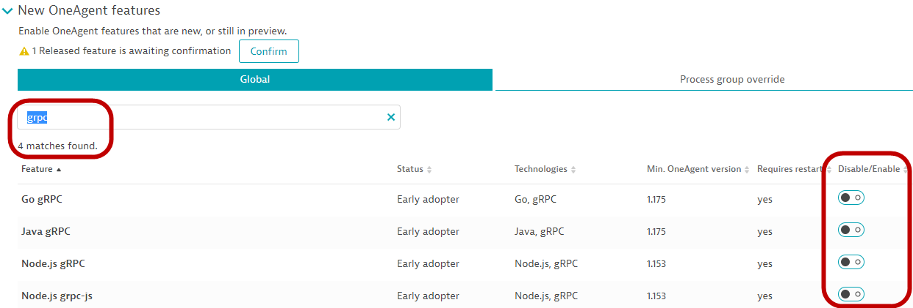


Make sure all the below features all enabled, including the 2 additional NodeJS feature flags.


Enabling OneAgents features requires a restart of the pods. Run the following command to restart the pods.

```bash
kubectl delete pods --all -n hipster-shop
```
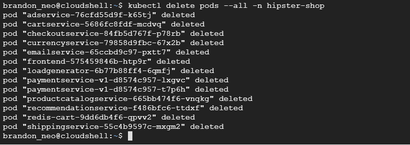

Back in Dynatrace, go to and Transactions and Services to see the updated list of services.
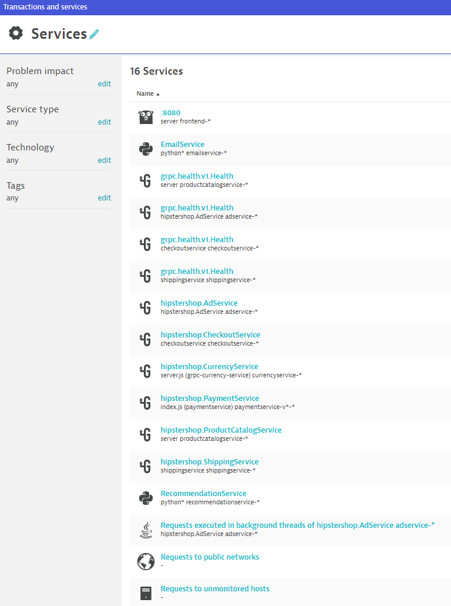

Clicking on Go Service ":8080" followed by Service Flow, you can see that the service are automatically detected and matches the architecture diagram above.


<!-- ------------------------ -->
## Exploring Kubernetes View
Duration: 5

Explore the various functionalities within the Kubernetes View such as Cluster Utilization, Cluster Workloads, K8S Events


### Analyze the Kubernetes Cluster utilization
   -  Mouseover and note the CPU and Memory usage with the Min / Max
   -  Click on Analyze Nodes to drill deeper into each node
   
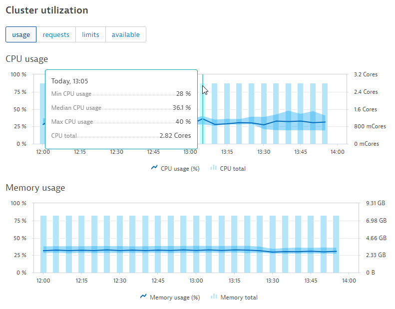

### Analyze the Kubernetes Cluster Workloads 
   -  Notice the Workloads and Pods running spilt between Kubernetes controllers


### Analyze the Kubernetes Events
   -  Notice the different types of events BackOff, Unhealthy

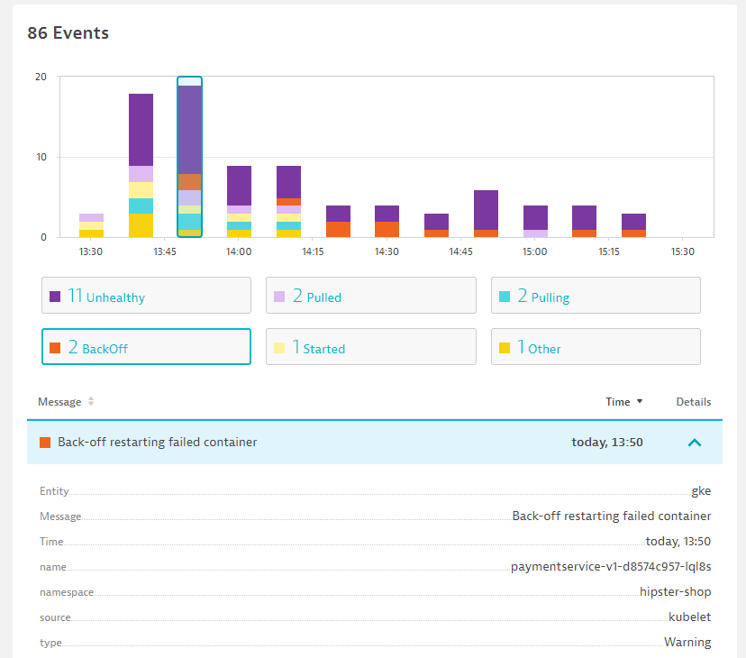

### Analyze the Kubernetes Namespace
   -  Click on **hipster-shop** and drill down into various kubernetes services (Cloud applications)


### Explore Cloud Applications by clicking onto them
   - Click onto each of them and discover their supporting technologies
   
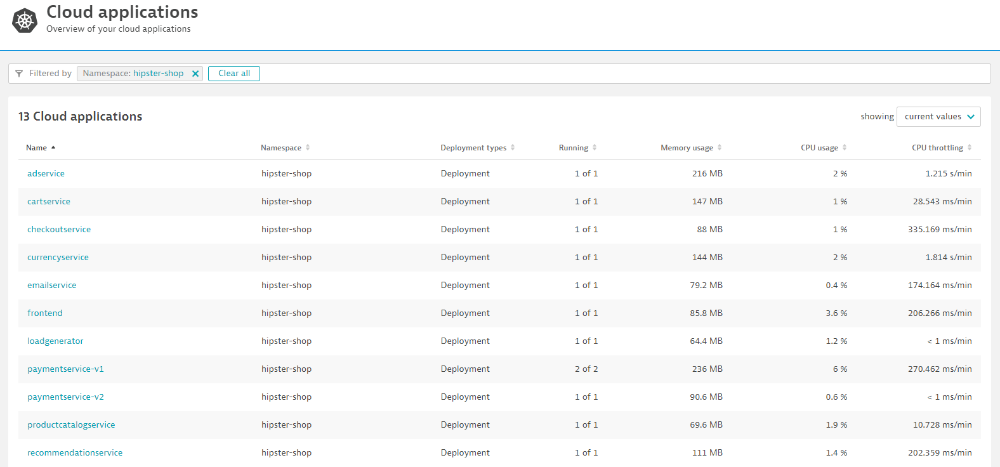

