summary: Dynatrace with Kubernetes
id: kubernetes
categories: kubernetes
tags: kubernetes
status: Published 
authors: Brandon Neo
Feedback Link: mailto:APAC-SE-Central@dynatrace.com

# Dynatrace with Kubernetes
<!-- ------------------------ -->
## Introduction 
Duration: 1

This repository contains labs for the Hands-On Kubernetes Session. We will be using Kubernetes instance running in AWS for this hands-on but this will work on other platforms as well.

For the purposes of the Hands-On, we will automate and make the steps seamless for the participants

### Prerequisites
- Dynatrace SaaS/Managed Account. Get your free SaaS trial here.
- * SSH client such as [mobaxterm](https://mobaxterm.mobatek.net/).
- Chrome Browser

### What You’ll Learn 
- Deploying Dynatrace Operator via Helm Chart on Kubernetes
- Setup Kubernetes integration on Dynatrace
- Explore Automatic Kubernetes Dashboards
- Kubernetes Labels & Annotations
- Process Group Naming & Service Naming for Kubernetes
- Discover Kubernetes View on Dynatrace

<!-- ------------------------ -->
##  Install Dynatrace OneAgent Operator
Duration: 15

Locate the link in the email to login to your allocated Dynatrace tenant. 

Go to **Deploy Dynatrace -> Start installation -> Kubernetes** 

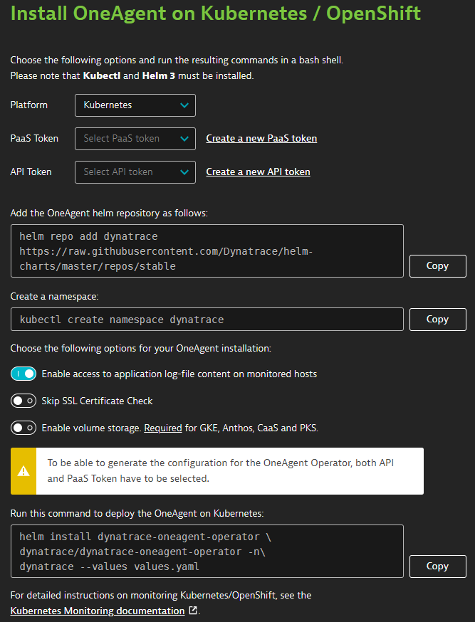

### Install Helm 3 and above

OneAgent Operator could be installed via various kubernetes deployment strategies. Following instructions from the UI, we will first setup Helm 3.  

Use the following command to install Helm 3. When prompted, enter your **admin password** which is found in the welcome email. 

`sudo snap install helm --classic`

### Get API and PaaS Tokens in Dynatrace
Follow the steps on screen to create your API and PaaS tokens. 
You will find the API token automatically configured with the necessary permissions. 
Once created, select the **newly created tokens** from both of the **drop-down fields**.
Other commands will also be pre-populated with the necessary steps.


### Add the OneAgent Helm Repo
Follow the setup steps and run the following commands. 

```bash
helm repo add dynatrace https://raw.githubusercontent.com/Dynatrace/helm-charts/master/repos/stable
kubectl create namespace dynatrace
```
### Create a and apply values.yaml

Run the below command to create new file called **values.yaml**

`nano values.yaml`

Copy and paste to the terminal and save the file with **Ctrl-X** followed by **Y** and **Enter** 

**EXAMPLE**

```bash
platform: "kubernetes"

oneagent:
  name: "oneagent"
  apiUrl: "https://mou612.managed-sprint.dynalabs.io/e/ef121dc4-3995-4231-9e3a-0e3050db9e7f/api"
  args:
    - --set-app-log-content-access=true
  skipCertCheck: false
  enableIstio: true

secret:
  apiToken: "S0pO-hppT0q8Xu1WMrpf9"
  paasToken: "TO3WtWrcQnqZJrb4WHncP"
```
Copy the next command to **apply the values.yaml** and **deploy OneAgent on Kubernetes**.

```bash
helm install dynatrace-oneagent-operator \
dynatrace/dynatrace-oneagent-operator -n\
dynatrace --values values.yaml
```
If successful, you should get a positive output with **STATUS: deployed** as per below.

```bash
NAME: dynatrace-oneagent-operator
LAST DEPLOYED: Thu Aug 13 01:25:26 2020
NAMESPACE: dynatrace
STATUS: deployed
REVISION: 1
TEST SUITE: None
NOTES:
Thank you for installing dynatrace-oneagent-operator.

Your release is named dynatrace-oneagent-operator.
```

POSITIVE
: You can also check out other means of installation at our [official documentation page](https://www.dynatrace.com/support/help/technology-support/cloud-platforms/google-cloud-platform/google-kubernetes-engine/deploy-oneagent-on-google-kubernetes-engine-clusters/)

### ⚠️ Troubleshooting steps

Negative
: To **check status of pods**, run command below. You should get a **Running** as a return.<br>
`kubectl get pods -n dynatrace`

Negative
: To **check the logs**, run command below.<br>
`kubectl logs -f deployment/dynatrace-oneagent-operator -n dynatrace`

Negative
: To **delete all pods**, run command below. This will cycle through the pods and you will have new pod instances.<br>
`kubectl delete --all pods -n dynatrace`

Negative
: Official troubleshooting page could be found [here](https://www.dynatrace.com/support/help/technology-support/cloud-platforms/google-cloud-platform/google-kubernetes-engine/installation-and-operation/full-stack/troubleshoot-oneagent-on-google-kubernetes-engine/)

If everything is working, you will see the host appearing when you click on **Show Deployment status**

### Restart Sockshop Sample App

You can see the various processes automatically detected but Dynatrace prompts you to restart them. This is required for us to automatically instrument them without code changes.

Run the below command to cycle through your services for **Dev** and **Production**.

```bash
kubectl delete pods --all -n dev
kubectl delete pods --all -n production
```

<!-- ------------------------ -->
## Setting up your Kubernetes Integration
Duration: 15

Positive
: As per the official instructions [here](https://www.dynatrace.com/support/help/technology-support/cloud-platforms/kubernetes/monitoring/connect-kubernetes-clusters-to-dynatrace/) for the Kubernetes integration, you will need to setup an **Environment Activegate** first.

### Setup Activegate 
- Within Dynatrace, click on **Deploy Dynatrace** on the left menu
- Click on **Install Activegate** at the bottom of the page
- Click on **Linux**
- Copy **Step 2** and paste into your shell terminal.
- Copy **Step 4** and append "**sudo**" (installing as root) onto shell terminal. 
When prompted, enter your **admin password** which is found in the welcome email. 


Once completed, you should see Activegate under **Deployment Status**.


### Setup the K8S Overview Dashboard

Go to **Settings -> Process and Containers -> Process group detection -> Enable Cloud Application and workload detection**


### Create a Service Account and Cluster role

Create a service account and cluster role for accessing the Kubernetes API. This creates the bearer token necessary to authenticate in the Kubernetes API. Use the following snippet in your shell terminal.

```bash
kubectl apply -f https://www.dynatrace.com/support/help/codefiles/kubernetes/kubernetes-monitoring-service-account.yaml
```
### Setup your Kubernetes Integration

Go to **Settings -> Cloud and Virtualization -> Kubernetes -> Connect new cluster**

### Get the Kubernetes API URL

Enter the below command and copy it for the **Kubernetes API URL**.

```bash
kubectl get ing k8-api-ingress | grep -oP 'api.kubernetes[^[:blank:]]*'
```

### Get the Bearer Token

Enter the below command and copy it for the **Kubernetes Bearer Token**.

```bash
kubectl get secret $(kubectl get sa dynatrace-monitoring -o jsonpath='{.secrets[0].name}' -n dynatrace) -o jsonpath='{.data.token}' -n dynatrace | base64 --decode
```


- Give a name for the connection eg. **Kubernetes**
- Enter in your **Kubernetes API URL Target**
   - Append **https://** before your API URL
- Enter in the **Kubernetes Bearer Token**
- **Disable** "Require valid certificates for communication with API server"
- **Add** another event field selector
- Use `Non-node` for the field selector name
- Use `involvedObject.kind!=Node` for the Field selector expression and **Save**
- Toggle ON **Monitor Events**
- Click on **Connect**

Once successfully connected, click on Kubernetes on the left menu and explore the Kubernetes UI. 

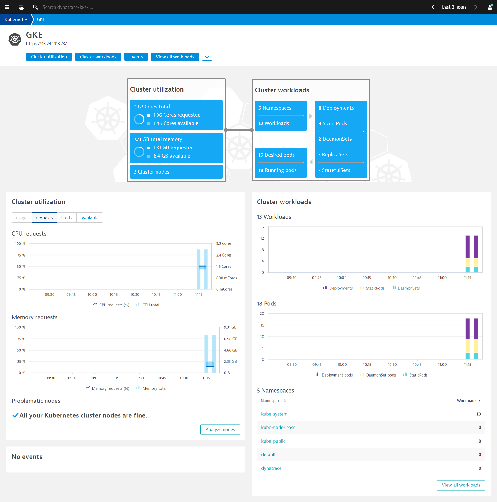

Positive
: The above steps are taken from our [offical documentation page](https://www.dynatrace.com/support/help/technology-support/cloud-platforms/kubernetes/installation-and-operation/further-integrations/connect-your-kubernetes-clusters-to-dynatrace/). We have adapted the API command for lab purposes.

<!-- ------------------------ -->
## Kubernetes Dashboards
Duration: 10

### Dashboard Setup via BizOps Configurator

We will be using automatically creating Kubernetes Dashboards via [BizOps Configurator](https://dynatrace.github.io/BizOpsConfigurator/)

Setup the token with the **permissions** as per below

- **Access problem and event feed, metrics and topology**
- **Read configuration**
- **Write configuration**
- **User sessions**

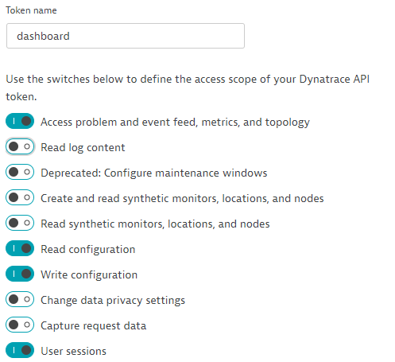

Follow the preloaded setup at <button>
[BizOps Configurator](https://dynatrace.github.io/BizOpsConfigurator/#deploy/persona/Ops/Platform%20Overview/K8s%20Overview)
</button>

- Enter in your **tenantUrl** and **API-Token**
- Click **Next**. <em>(The persona, usecase and workflow is already selected for you.)</em>
- Click **Done**.

Explore your **new Kubernetes Dashboards.**

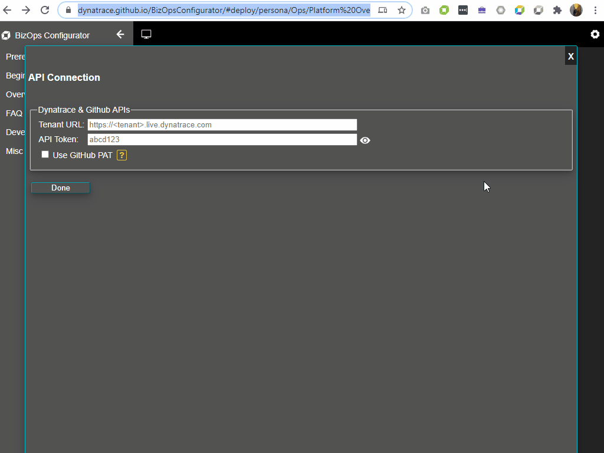

Positive
: ⚠️ In order for the entities to be filtered properly, you'll need to add a tag **[Kubernetes]namespace** to your services/pods, so this could be filtered properly in the Performance Engineering Dashboard. This will be later OOTB in the product.

Positive
: ⚠️ Works with Dynatrace 196+

### Kubernetes Overview


### Cluster utilization
_____________________
See the Kubernetes cluster utilization. CPU and Memory Request and limits over time for all nodes and splitted by namespaces.

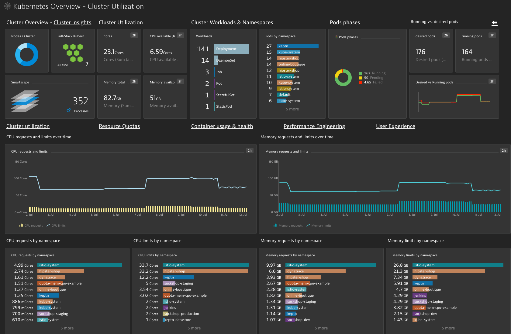


### Resource Quotas
_____________________
Get an overview and understanding of the Kubernetes resource quotas (Memory and CPU) assigned to your namespaces and its usage. 


### Container usage & health
_____________________
Understand the health and phases of your Pods in your clusters. Their memory and cpu usage, which pods are throttled, have failed or are pending to be scheduled. Also check if you have Out-of-memory killed containers.

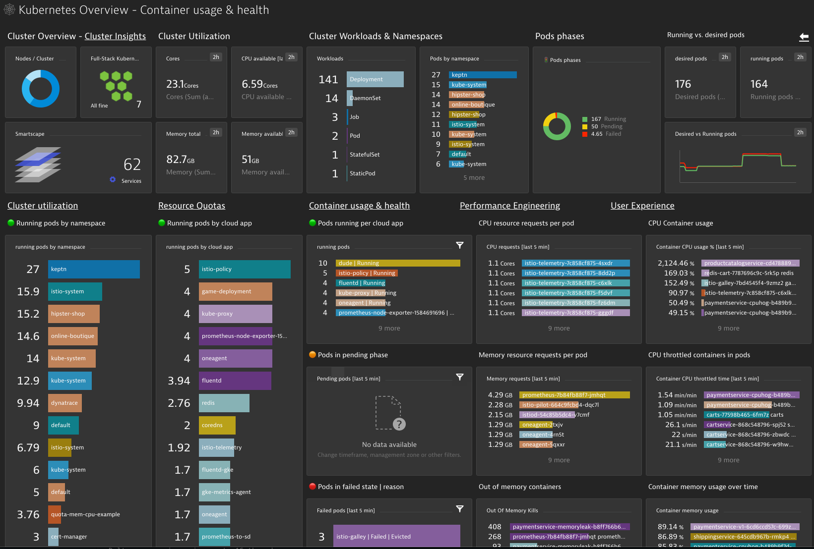


### Performance Engineering
_____________________
Give your developers and SRE engineers all they need to understand and improve the performance of each app, pod and each transaction on your clusters. View the response time percentiles, slow transactions, database executions per microservice, its network usage and more. Filter the transactions by App label, namespace and much more.  


### User Experience
_____________________
Are your endusers satisfied? how is the engagement, experience and user behaviour of your applications? Get the insights of all your applications and users in an instance.


<!-- ------------------------ -->
## Kubernetes Labels and Annotations
Duration: 5

With the Sockshop app restarted, you should be able to see services in Dynatrace.

Referring to `~/dtacmworkshop/manifests/sockshop-app/production/front-end.yml`, we will want to setup Dynatrace to automatically pick up the annotations and labels

```bash
apiVersion: extensions/v1beta1
kind: Deployment
metadata:
  name: front-end.stable
  namespace: production
spec:
  replicas: 1
  template:
    metadata:
      annotations:
        sidecar.istio.io/inject: "false"
        dynatrace/instrument: "true"
        pipeline.stage: prod-stable
        pipeline.build: 1.4.0.7424
        pipeline.project: sockshop
        support.contact: "jane.smith@sockshop.com"
        support.channel: "#support-sockshop-frontend"
      labels:
        app: front-end.stable
        stage: prod
        release: stable
        version: "1.4"
        tier: "frontend"
        product: "sockshop"
```
### Viewership role for service accounts

The OneAgent will use a pod service account to query for its metadata via the Kubernetes REST API.
The service accounts must be granted **viewer role** in order to have access
In the CLI, execute the following command for the **production project**

```bash
kubectl create rolebinding serviceaccounts-view --clusterrole=view --group=system:serviceaccounts:production --namespace=production
```

You can repeat the procedure for the **dev project**

```bash
kubectl create rolebinding serviceaccounts-view --clusterrole=view --group=system:serviceaccounts:dev --namespace=dev
```

Wait for the Dynatrace to pickup the change. 

Negative
: ⚠️ To manually recycle the apps, run command below.
`wget -O- https://raw.githubusercontent.com/Dynatrace-APAC/Workshop-Kubernetes-AWS/master/recycle-sockshop-frontend.sh | bash`

### Validate

Once working, you can validate the change in Dynatrace

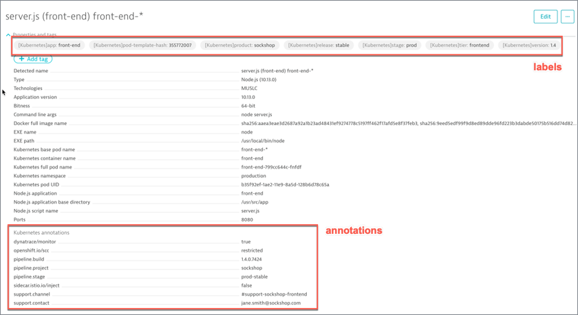

Positive
: The above steps are taken from [our official documentation page](https://www.dynatrace.com/support/help/technology-support/cloud-platforms/kubernetes/other-deployments-and-configurations/leverage-tags-defined-in-kubernetes-deployments/)

<!-- ------------------------ -->
## Container Environment Variables
Duration: 5

### Adding Environment variables

In shell terminal, add some Environment Variables with the following command

`nano ~/dtacmworkshop/manifests/sockshop-app/production/front-end.yml`

**Make sure that the indentation is correct and that they aren't any error promptings**

```bash
        env:
        - name: DT_TAGS
          value: "product=sockshop"
        - name: DT_CUSTOM_PROP
          value: "SERVICE_TYPE=FRONTEND"
```
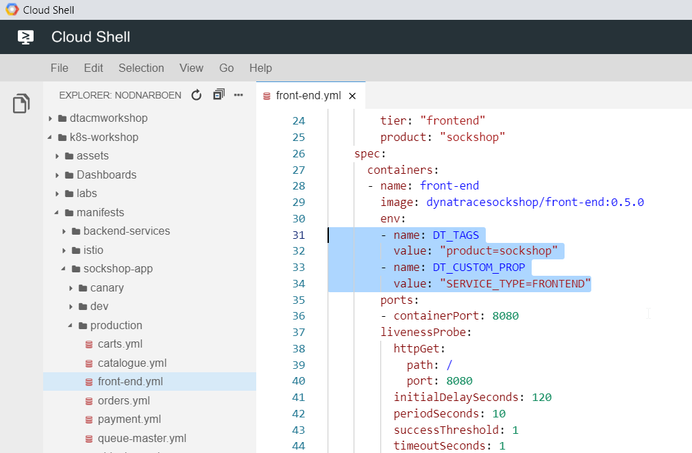

Save the amended file with **Ctrl-X**, followed by **Y** and **Enter** and run the below command to re-apply the change.

```bash
kubectl apply -f ~/dtacmworkshop/manifests/sockshop-app/production/front-end.yml
wget -O- https://raw.githubusercontent.com/Dynatrace-APAC/Workshop-Kubernetes-AWS/master/recycle-sockshop-frontend.sh | bash
```

### Validate

Once working, you can validate the change in Dynatrace

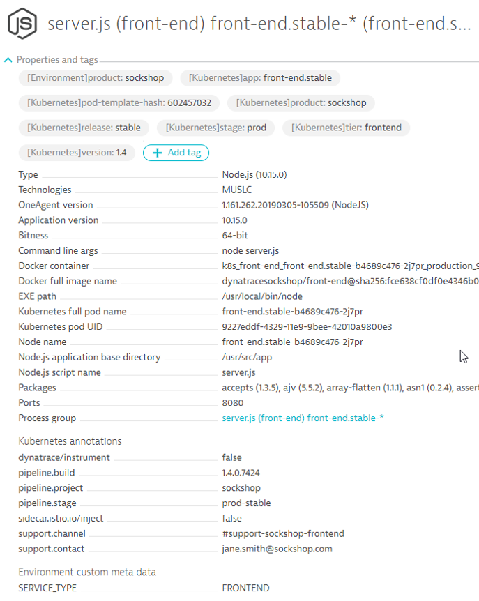

<!-- ------------------------ -->
## Process Group & Service Naming Rules for K8s
Duration: 10

### Process Group Naming Rules

Go to **Settings -> Processes and containers -> Process group naming** and click **Add a new rule**

Provide a name to the rule, for example : **Kubernetes Project.Namespace.Container**

Enter this format : `k8s-{ProcessGroup:Kubernetes:pipeline.project}.{ProcessGroup:KubernetesNamespace}.{ProcessGroup:KubernetesContainerName}`

In the conditions drop-down, select the property **Kubernetes namespace** and the condition **exists**

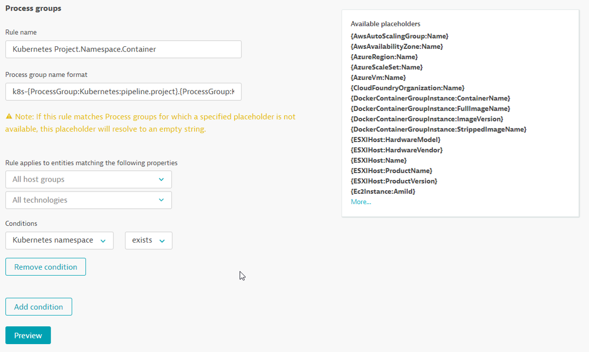

Click on **Preview** to view the matching entities 


Click on **Create Rule** and **Save Changes** in the pop-up.

### Validate

Once working, you can validate the change in Dynatrace

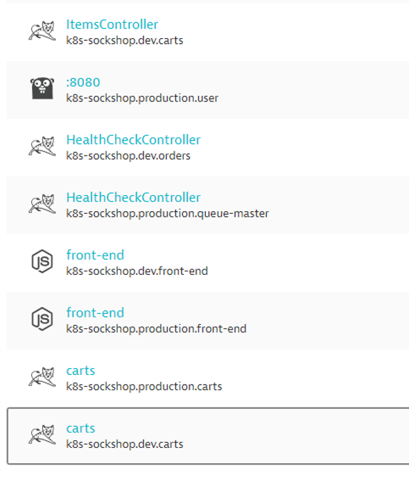

### Service Naming Rules

Go in **Settings -> Server-side service monitoring -> Service naming rules** and click **Add a new rule**

Provide a name to the rule, for example : **Kubernetes Project.Namespace.Container**

Enter this format : `{Service:DetectedName}.{ProcessGroup:KubernetesNamespace}`

In the conditions drop-down, select the property **Kubernetes namespace** and the condition **exists**

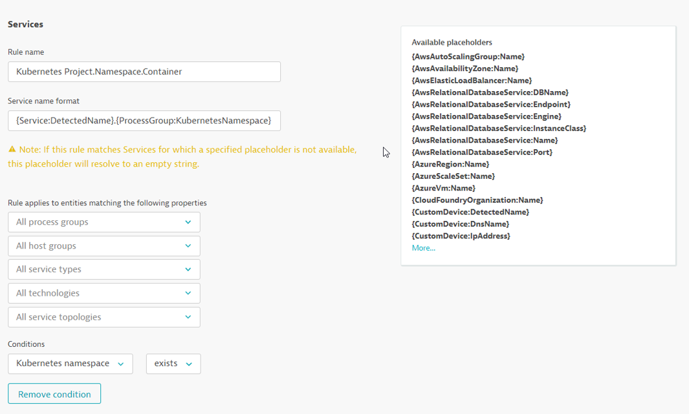

Click on **Preview** to view the matching entities 

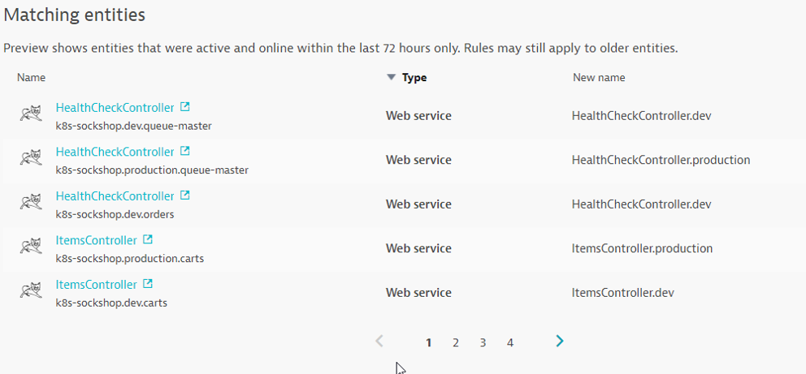

Click on **Create Rule** and **Save Changes** in the pop-up.

### Validate

Once working, you can validate the change in Dynatrace

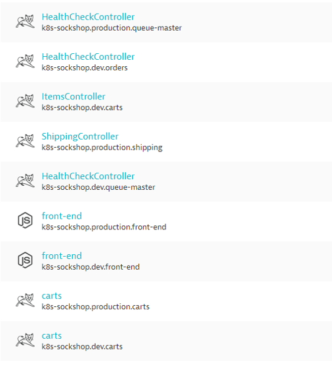

<!-- ------------------------ -->

## Process Detection for Canary Deployment
Duration: 15

### Deploy the Canary Release 

Run the command below to trigger the canary release
```bash
kubectl apply -f https://raw.githubusercontent.com/Dynatrace-APAC/Workshop-Kubernetes-AWS/master/manifests/sockshop-app/canary/front-end-canary.yml
```

Execute `kubectl get pods -n production -o wide` and you will see you now have both **stable and canary releases running for the front-end service**

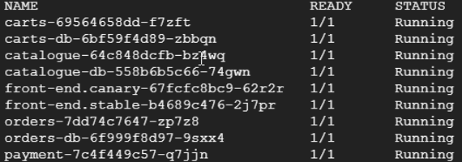

Wait 1-2 minutes then look the Services in Dynatrace. You have **2 services in production**, one for **stable** and one for **canary** release.
For monitoring purposes, it should be the same service

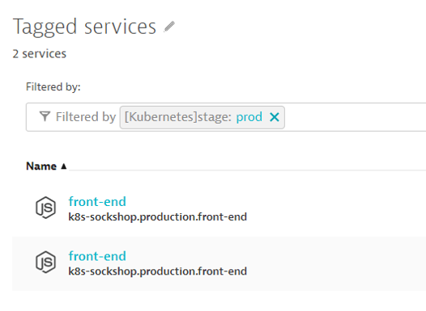

### Process Detection Rule Config

In the Dynatrace console, go in **Settings -> Processes and containers -> Process group detection**.

Expand the **Process group detection rules** section. 

Click **Add detection** rule.

Select Use a **process property** to seperate processes


We want to apply this rule for pods running in **production only (namespace=production)**

Also, extract the identifier after the **"."** in the pod name. 
Remember the pod names have **".stable "or ".canary"** in their name to distinguish them

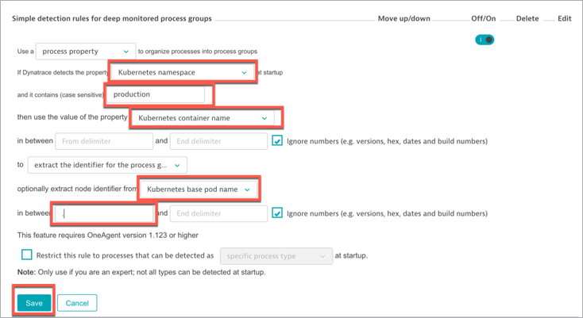

Run the below command to **recycle both stable and canary frontend pods**. The process detection rules are applied on process startup.

```bash
wget -O- https://raw.githubusercontent.com/Dynatrace-APAC/Workshop-Kubernetes-AWS/master/recycle-sockshop-frontend.sh | bash
```

Within Dynatrace, you can see that the Process Groups have been merged.

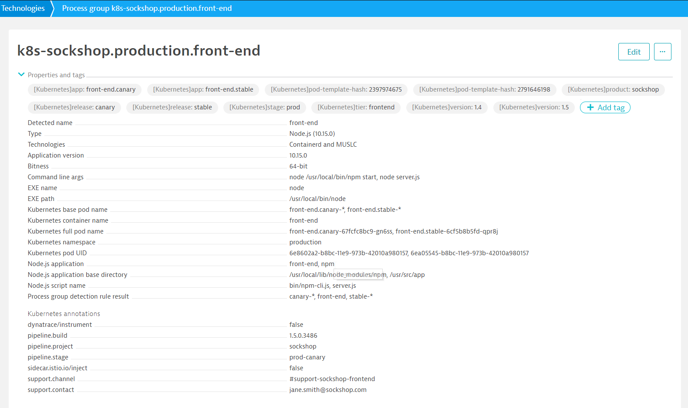

The services are still detected as individual services and can be merged as well.

Go to **Settings -> Merge Service monitoring -> Create merged service**

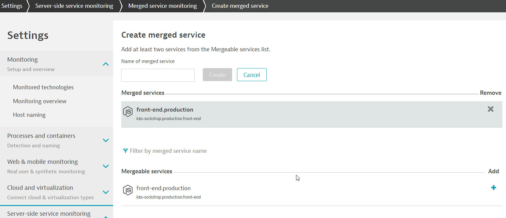

### Validate

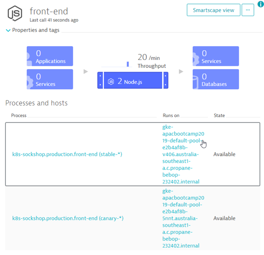

With the services merged as one, you can now view monitor Stable vs Canary response

Create Multi-dimensional Analysis view by selecting **Create Chart**

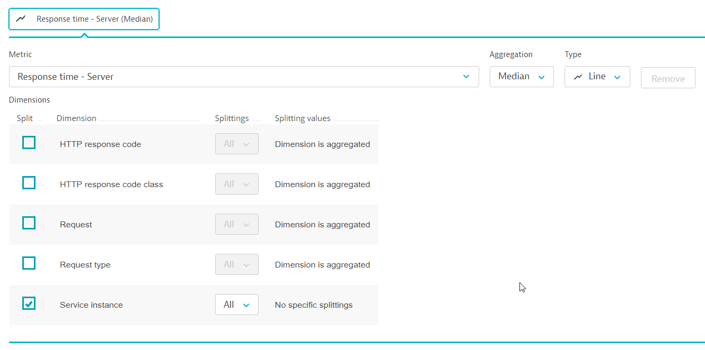

Choose **Response Time - Server** and select **Service Instance** as Dimension Splitting

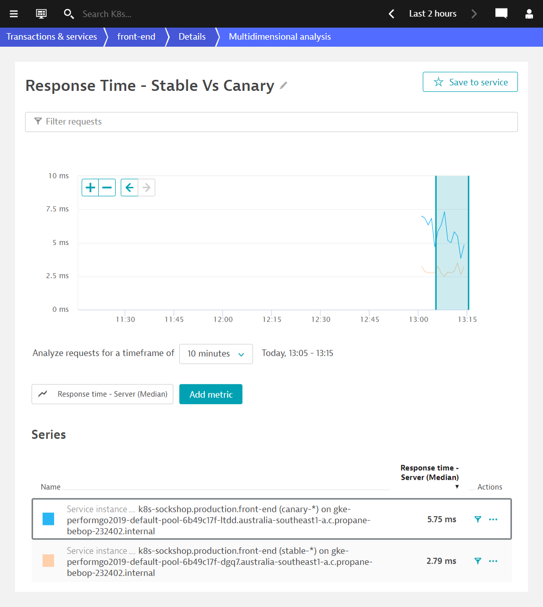

<!-- ------------------------ -->
## Exploring Dynatrace
Duration: 5

### Automatic Discovery of services

In Dynatrace, go to Transactions and Services to see the automatic 5 discovered services.


You will realized that some services are discovered but some might not match <a href="https://github.com/GoogleCloudPlatform/microservices-demo#service-architecture">Hipster Shop's Service architecture</a>.
Hipster Shop uses cutting edge technologies (such as GPRC) which Dynatrace supports with the constant evolution in the cloud.


### Enabling additional features within OneAgent

Because of the rapid rate of change coming to OneAgent, features that are in Early Access aren't automatically enabled by default. 
This is to prevent unforseen circumstances which might impact your production environments. For the purposes of workshop, we can enable these features. Go to **Settings -> Service-side service monitoring -> Deep Monitoring -> New Oneagent Features**

Under Global Settings, enable the following feature flags. They are on different pages so you would need to toggle through the pages.

You can use the search filter bar to search for **"GRPC"**


Make sure all the below features all enabled, including the 2 additional NodeJS feature flags.


Enabling OneAgents features requires a restart of the pods. Run the following command to restart the pods.

```bash
kubectl delete pods --all -n hipster-shop
```


Back in Dynatrace, go to and Transactions and Services to see the updated list of services.


Clicking on Go Service ":8080" followed by Service Flow, you can see that the service are automatically detected and matches the architecture diagram above.

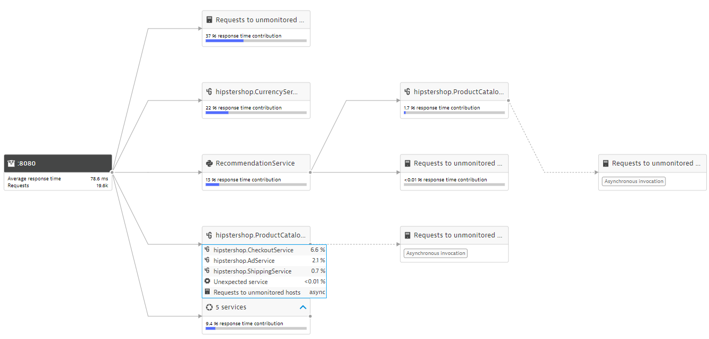

<!-- ------------------------ -->
## Exploring Kubernetes View
Duration: 5

Explore the various functionalities within the Kubernetes View such as Cluster Utilization, Cluster Workloads, K8S Events


### Analyze the Kubernetes Cluster utilization
   -  Mouseover and note the CPU and Memory usage with the Min / Max
   -  Click on Analyze Nodes to drill deeper into each node
   


### Analyze the Kubernetes Cluster Workloads 
   -  Notice the Workloads and Pods running spilt between Kubernetes controllers

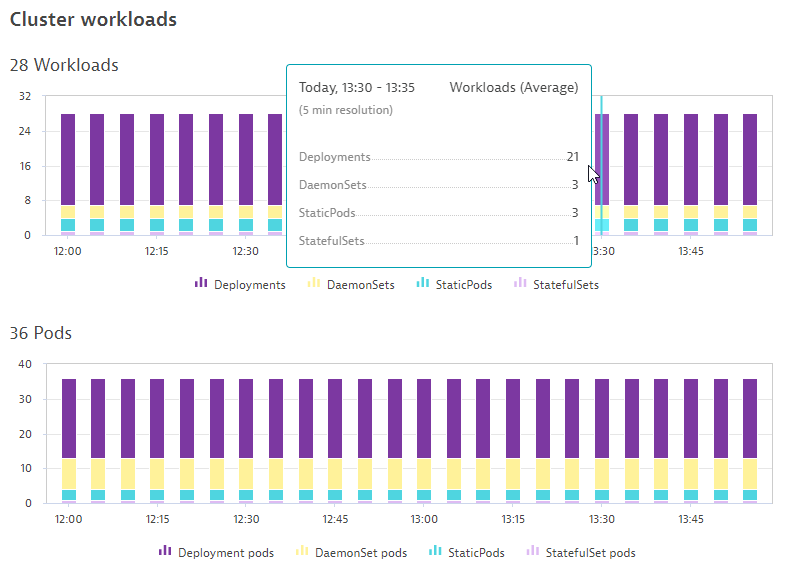

### Analyze the Kubernetes Events
   -  Notice the different types of events BackOff, Unhealthy


### Analyze the Kubernetes Namespace
   -  Click on **hipster-shop** and drill down into various kubernetes services (Cloud applications)

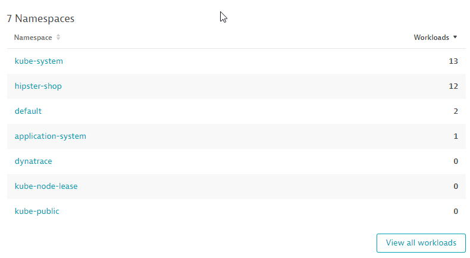

### Explore Cloud Applications by clicking onto them
   - Click onto each of them and discover their supporting technologies
   


