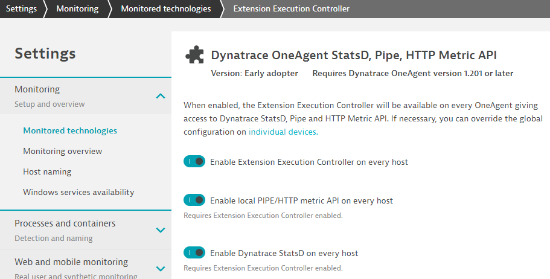
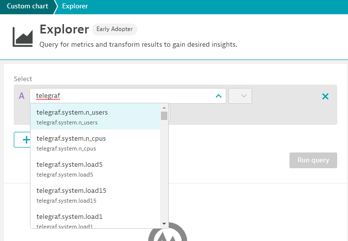
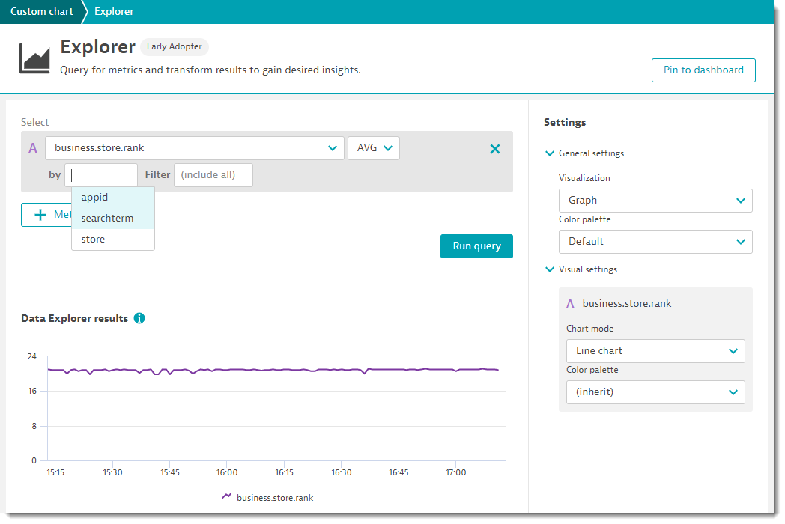
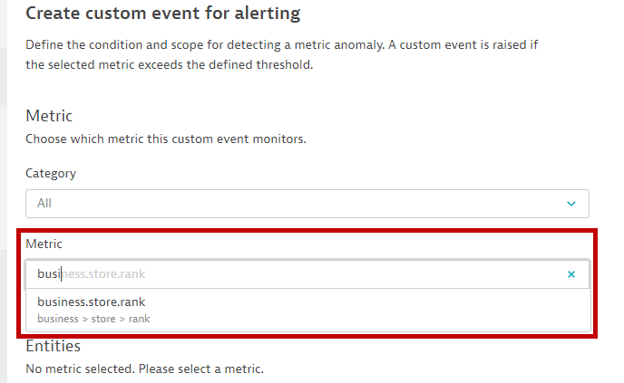
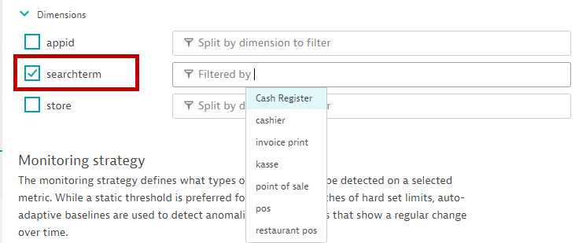
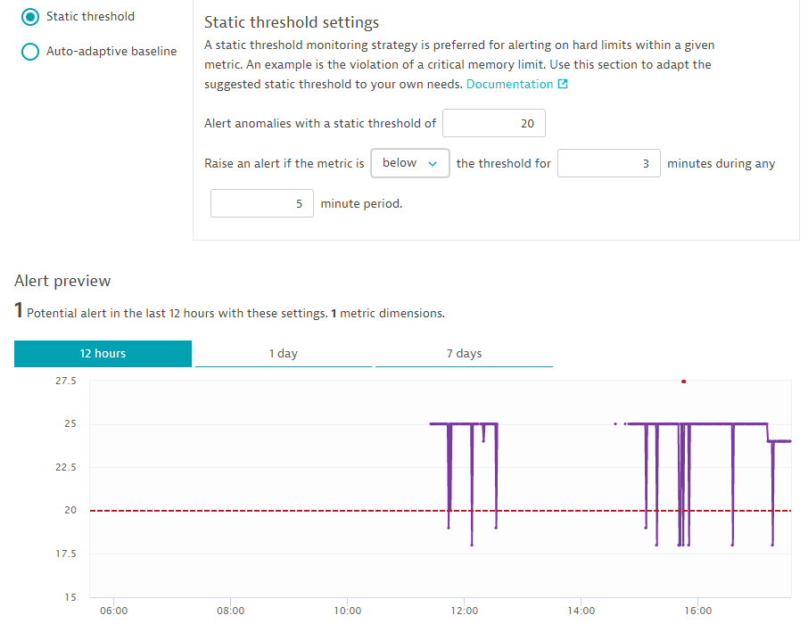
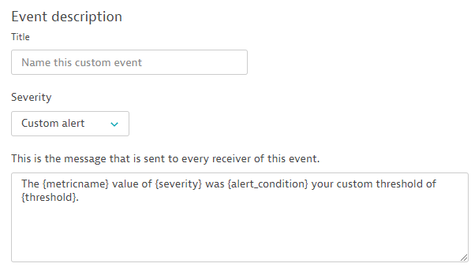

summary: The new Metric Ingestion Interface
id: mint
categories: infra
tags: bootcamp
authors: Myrvin Yap
Feedback Link: mailto:APAC-SE-Central@dynatrace.com

# Metric Ingestion
<!-- ------------------------ -->
## Introduction 

This repository contains the exercises for the Metric Ingestion. 

### Prerequisites
- A cloud compute instance from GCP/Azure/AWS/Alicloud/Tencent Cloud
- PuTTy/Terminal/web-based terminal from the cloud providers

### What You’ll Learn 
- How to use the new metric ingestion interface via command line, API, telegraf
- How to slice and dice the metric via the new Explorer
- Setting alerts and monitoring strategy

<!-- ------------------------ -->
## Ingest - Hands-on #1: Command line
Duration: 10

### dynatrace_ingest command line
- SSH into yesterday's DevOps EC2 instance or use any cloud compute instance of your choice
  - ssh dynatrace@1-2-3-4.nip.io
  - password: secr3t

- As part of agent 1.201 there is a new command tool available called dynatrace_ingest located in the following directory: `/opt/dynatrace/oneagent/agent/tools`. This provides the capability to PIPE in metrics.

- Execute the `dynatrace_ingest` command:
```bash
$ /opt/dynatrace/oneagent/agent/tools/dynatrace_ingest -v
```
You will get a response: `dynatrace_ingest disabled in tenant configuration, will not validate metrics.`

- Login to [Bootcamp Managed Cluster](https://mou612.managed-sprint.dynalabs.io)
  - userid: your email address

- Enable OneAgent: Settings > Monitored technologies > Supported technologies> Dynatrace OneAgent StatsD, Pipe, HTTP Metric API



- You will see additional Dynatrace processes started


- Execute the `dynatrace_ingest` help command:
```bash
$ /opt/dynatrace/oneagent/agent/tools/dynatrace_ingest -h
```
And you will now see a response like this:
```bash
Usage: dynatrace_ingest [Options] [Metrics]
When metrics are ommitted, dynatrace_ingest expects them to be passed via standard input. Each line is treated as one metric ...
...
```

### Ingesting your first set of metrics
- Clone the repo + setup the environment:
```bash
$ git clone https://github.com/Dynatrace-APAC/Workshop-mint.git
$ cd Workshop-mint
$ ./setupEnvironment.sh
Hit:1 http://ap-southeast-1.ec2.archive.ubuntu.com/ubuntu focal InRelease
Get:2 http://ap-southeast-1.ec2.archive.ubuntu.com/ubuntu focal-updates InRelease [111 kB]
Get:3 http://ap-southeast-1.ec2.archive.ubuntu.com/ubuntu focal-backports InRelease [98.3 kB]
...
./telegraf-1.16.0/var/log/
./telegraf-1.16.0/var/log/telegraf/
$
```
If you look into the `setupEnvironment.sh`, you will see that the script does 3 things
1. Install `sysstat`
2. Install `telegraf`
3. Setup the `telegraf.conf ` file

- Execute the script `cpuUsagePerCore.sh`
```bash
$ cd ~/Workshop-mint
$ ./cpuUsagePerCore.sh
Sending metric: host.cpu.usr,core=coreall 3.05
Sending metric succedded
Sending metric: host.cpu.idle,core=coreall 96.45
Sending metric succedded
Sending metric: host.cpu.usr,core=core0 0.00
Sending metric succedded
Sending metric: host.cpu.idle,core=core0 100.00
Sending metric succedded
Sending metric: host.cpu.usr,core=core1 6.06
Sending metric succedded
Sending metric: host.cpu.idle,core=core1 92.93
Sending metric succedded
...
```
If you look into the script `cpuUsagePerCore.sh`, it loops through the command `mpstat` and piping the output to `/opt/dynatrace/oneagent/agent/tools/dynatrace_ingest -v`.
We create two metrics `host.cpu.usr` and `host.cpu.idle` each split by the individual cpu core.

### Exploring the metric
If we If we go to the new metrics Explorer we can find our metrics


<!-- ------------------------ -->
## Ingest - Hands-on #2: API
Duration: 5

### Setting up the script
- Edit the file `playstore.py` and input the Token and Tenant URL
  - YOUR_DT_API_URL = **Copy from your own browser**
  
  **Example**
  `https://mou612.managed-sprint.dynalabs.io/e/8325964d-f0ea-4c20-824b-6969f1ba11cc`
  - YOUR_DT_API_TOKEN = **Copy from Dynatrace->Settings->DynatraceAPI**

```bash
$ cd ~/Workshop-mint
$ vi playstore.py
or
$ nano playstore.py
```


- Save the file

### Deploying script and validating
- Deploy cronjob
```bash
$ (echo "* * * * 2 python3 /home/dynatrace/Workshop-mint/playstore.py > /tmp/playstore.log") | crontab -
```
- Validate cronjob running
```bash
$ cat /tmp/playstore.log
business.store.rank,store=playstore,appid=at.smartlab.tshop,searchterm="pos" 19
business.store.rank,store=playstore,appid=at.smartlab.tshop,searchterm="point of sale" 10
business.store.rank,store=playstore,appid=at.smartlab.tshop,searchterm="kasse" 3
business.store.rank,store=playstore,appid=at.smartlab.tshop,searchterm="restaurant pos" 23
business.store.rank,store=playstore,appid=at.smartlab.tshop,searchterm="invoice print" 50
business.store.rank,store=playstore,appid=at.smartlab.tshop,searchterm="cashier" 25
business.store.rank,store=playstore,appid=at.smartlab.tshop,searchterm="Cash Register" 16

{"linesOk":7,"linesInvalid":0,"error":null} 
```
If you look into the script `playstore.py`, it activates `/api/v2/metrics/ingest` and uses the same "schema-less" format and collects information from the query parameter of  `https://play.google.com/store/search?q=` and spilts it according to the various `searchterm`

**Data ingestion format**

`business.store.rank,store=playstore,appid=" + YOUR_APP_ID + ",searchterm=\"" + kw + "\" " + str(checkAppPosition(YOUR_APP_ID, kw)) + "\n"`

<!-- ------------------------ -->
## Ingest - Hands-on #3: Telegraf (OPTIONAL)
Duration: 5

### Where to get telegraf from
- Github URL: https://github.com/influxdata/telegraf
  - Installation
  - how to use
  - Full documentation
- 4 distinct plugin types:
  - Input Plugins collect metrics from the system, services, or 3rd party APIs
  - Processor Plugins transform, decorate, and/or filter metrics
  - Aggregator Plugins create aggregate metrics (e.g. mean, min, max, quantiles, etc.)
  - Output Plugins write metrics to various destinations
  - Dynatrace [output plugin](https://github.com/influxdata/telegraf/tree/master/plugins/outputs/dynatrace)
  
### Setup
- Part of the setupEnvironment.sh script already downloaded and installed Telegraf, you will find it in `/opt/telegraf`
- The configuration file was already modified to add the Dynatrace output

```bash
$ vi /etc/telegraf/telegraf.conf
```
Search for `dynatrace`
```
###############################################################################
#                            OUTPUT PLUGINS                                   #
###############################################################################
# Configuration for sending metrics to InfluxDB
[[outputs.dynatrace]]
   prefix = "telegraf."
```
### Starting Telegraf
- Navigate to `/opt/telegraf/usr/bin` and execute `./telegraf`
```bash
$ cd /opt/telegraf/usr/bin
$ ./telegraf
2020-10-19T09:05:40Z I! Starting Telegraf
2020-10-19T09:05:40Z I! Using config file: /etc/telegraf/telegraf.conf
2020-10-19T09:05:40Z I! Loaded inputs: cpu disk diskio kernel mem processes swap system
2020-10-19T09:05:40Z I! Loaded aggregators:
2020-10-19T09:05:40Z I! Loaded processors:
2020-10-19T09:05:40Z I! Loaded outputs: dynatrace
2020-10-19T09:05:40Z I! Tags enabled: host=ip-172-31-9-86
2020-10-19T09:05:40Z I! [agent] Config: Interval:10s, Quiet:false, Hostname:"ip-172-31-9-86", Flush Interval:10s
2020-10-19T09:05:40Z I! [outputs.dynatrace] Dynatrace URL is empty, defaulting to OneAgent metrics interface

```

### Exploring the metric
Navigate to the metrics Explorer and search for `telegraf`



<!-- ------------------------ -->
## Explore - Hands-on #4: The new Metric Explorer

Full documentation can be found [here](https://www.dynatrace.com/support/help/how-to-use-dynatrace/dashboards-and-charts/explorer)

An **example** of how to query, filter, etc.


Let's **explore** the metrics we ingested via the API!



### Important to know
- Default query provides rollup of 120 data points in specified time frame, using metric‘s default time aggregation
- Rollup is allways performed, even if not explicitly applied
- Default query "groups" all dimensions, using metric's default space aggregation

<!-- ------------------------ -->
## Detect - Hands-on #5: Setting up alerts

- Go to Settings -> Anomaly detection -> Custom events for alerting


- Search for the metric you want to alert, for example `business.store.rank`



- Abilty to select dimensions/filter is powerful!



- Set the Monitoring stratgy `Static` or `Auto-adaptive baseline`



- Complete the event descrption and click on `create`



<!-- ------------------------ -->
## Advanced hands on (OPTIONAL)

### Associate a metric to any entitiy in Dynatrace
- Use service as an example: `simplenodeservice`
- Use bookstore

### Trigger an incident
- Test

<!-- ------------------------ -->

## Feedback
Duration: 3

We hope you enjoyed this lab and found it useful. We would love your feedback!
<form>
  <name>How was your overall experience with this lab?</name>
  <input value="Excellent" />
  <input value="Good" />
  <input value="Average" />
  <input value="Fair" />
  <input value="Poor" />
</form>

<form>
  <name>What did you benefit most from this lab?</name>
  <input value="Ingesting the metric via command line" />
  <input value="Ingesting the metric via API" />
  <input value="Ingesting the metric via Telegraf" />
  <input value="Exploring metrics" />
  <input value="Creating alerts and setting monitoring strategy" />
</form>


Positive
: 💡 For other ideas and suggestions, please **[reach out via email](mailto:APAC-SE-Central@dynatrace.com?subject=MINT)**.