summary: How to use USQL in your POCs
id: usql
categories: DEM, BizOps
tags: bootcamp
status: Published 
authors: Myrvin Yap
Feedback Link: mailto:APAC-SE-Central@dynatrace.com
Analytics Account: UA-175467274-1

# Advanced USQL
<!-- ------------------------ -->
## Introduction 

This repository contains the exercises for the Advanced USQL session. 

### Prerequisites
- Access to [Demo Environment](https://demo.live.dynatrace.com)
- Microsoft Excel

### What You’ll Learn 
- Intricacies/Gotchas of USQL
- USQL Tips and tricks in the field
- Extracting and manupulating the data in Excel
- Some advanced USQL for BizOps use cases

<!-- ------------------------ -->
## Intricacies/Gotchas of USQL


### Warm up

What does each of the query do?

Go ahead to run this in [Demo Environment](https://demo.live.dynatrace.com) -> User sessions

**Query 1**

```SQL
select distinct hour(usersession.starttime), count(*)
from usersession
order by count(*) DESC
```

**Query 2**

```SQL
select distinct hour(usersession.starttime), count(useraction.name)
from usersession
order by count(useraction.name) DESC
```

**Query 3**

```SQL
select distinct hour(usersession.starttime), count(useraction.name)
from useraction
order by count(useraction.name) DESC
```

### Challenge

- What does each of the query do?
- What are we actually querying for?

Negative
: **Hint**: Focus on the table name, and condition ` useraction.name like "%rest%" `


**Query 1**

```SQL
SELECT useraction.name as "Page Name", COUNT(*) as "Page Views", COUNT(DISTINCT usersession.internalUserId) AS "Unique Page Views", AVG(useraction.duration) As "Average Session" FROM usersession WHERE useraction.name like "%rest%" GROUP BY useraction.name
```

**Case in point:** `select useraction.name from usersession LIMIT 10`

**Query 2**

```SQL
SELECT useraction.name as "Page Name", COUNT(*) as "Page Views", COUNT(DISTINCT usersession.internalUserId) AS "Unique Page Views", AVG(useraction.duration) As "Average Session" FROM useraction WHERE useraction.name like "%rest%" GROUP BY useraction.name
```
<!-- ------------------------ -->
## Hands on exercise
Duration: 15

### Setting up the query
- Access: [Bootcamp Managed Cluster](https://mou612.managed-sprint.dynalabs.io)
  - userid: `usql`
  - password: will be supplied
- Launch **API V1**

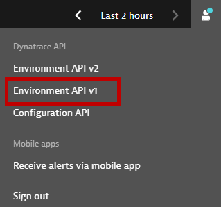

- Authenticate
  - Token: will be supplied

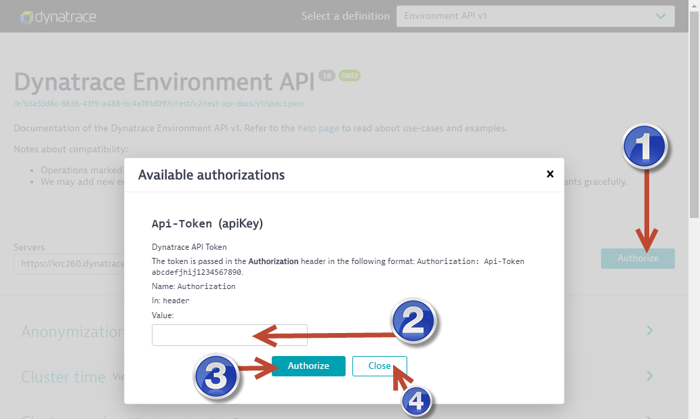

- Go to **User Sessions**
- Expand **/userSessionQueryLanguage/tree** (DO NOT USE TABLE)
- Click **try it out**
- Enter in your query

```SQL
select useraction.name from usersession
```

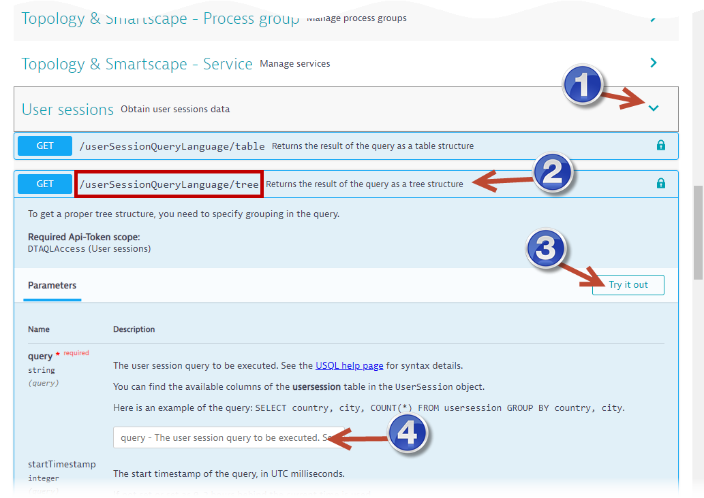

- Execute
- Copy Request URL

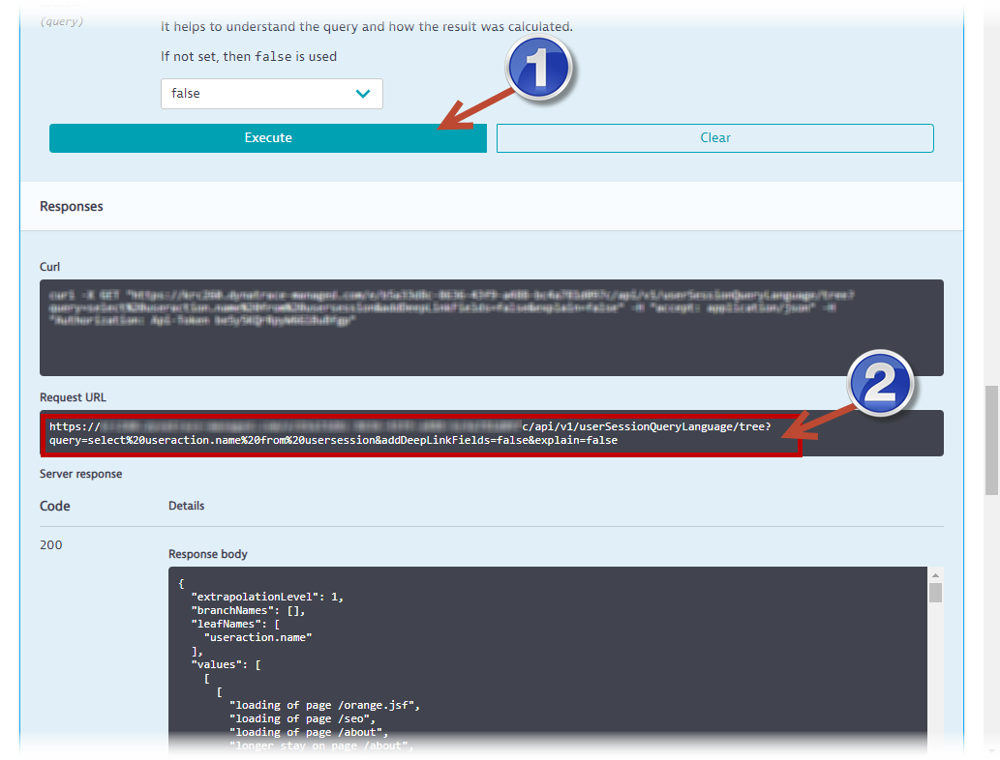

### Using Excel to slice and dice the data
- Open new spreadsheet, select **Data** and then **select From Web**


- Insert **Request URL w/ token** as a query parameter (use &pageSize=[N] to expand result set)

`&pageSize=50000&api-token=[YourToken]`

**Example:**

https://mou612.managed-sprint.dynalabs.io/e/4d5310f8-91e7-46f2-b2d5-2ceb0979f2bd/api/v1/userSessionQueryLanguage/tree?query=select%20useraction.name%20from%20usersession&addDeepLinkFields=false&explain=false&pageSize=50000&api-token=**[YourToken]**


- Click **OK**
- Select **List (next to values)**

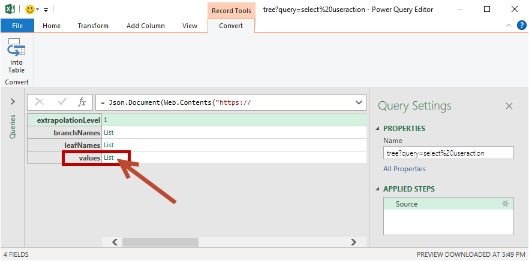

- Select **List** again

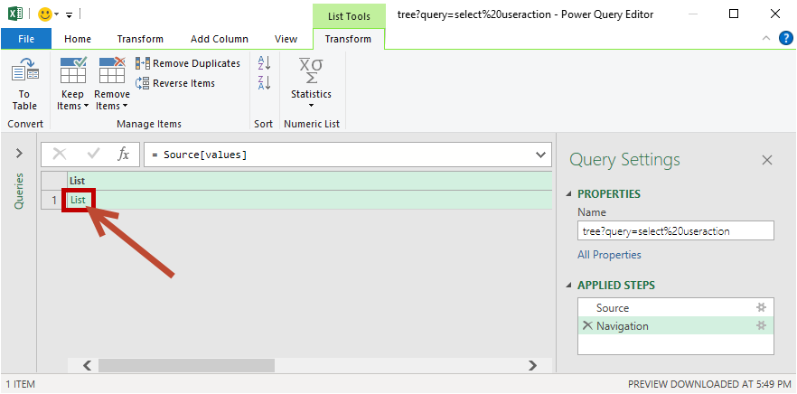

- Select To Table Convert (Delimiter None)

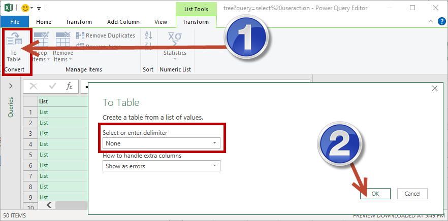

- Click **expand icon** in Value header
- Extract values (Delimiter – comma)

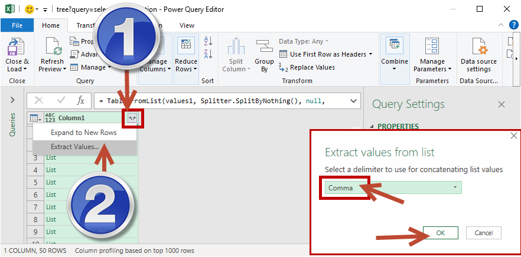

- Click **Close & Load**


- Highlight Column A and Insert->Pivot Table

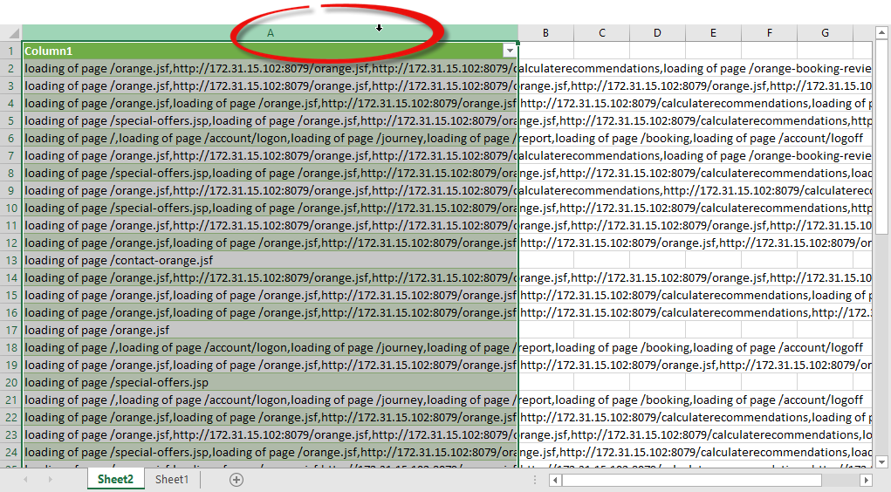

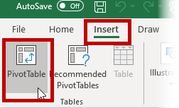

- Select box for Column 1 and drag Column 1 to Values


- Select a value in Column B and sort Largest to Smallest. Resize Column A as neccessary


**Final Result**

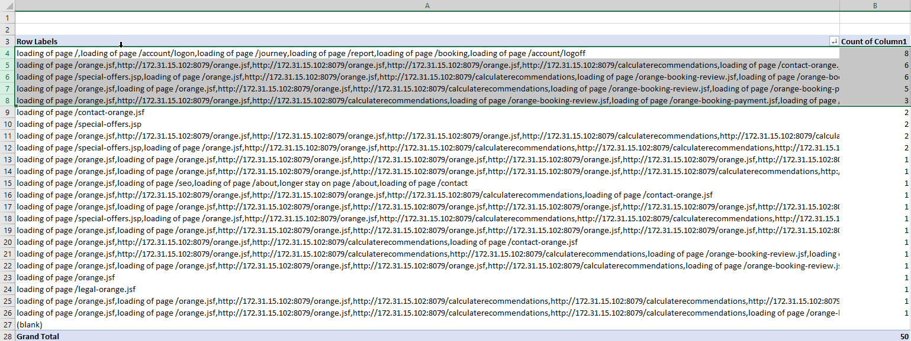

13. Save spreadsheet

<!-- ------------------------ -->
## Advanced USQL for BizOps use cases

### FUNNEL Query

```SQL
SELECT FUNNEL(useraction.name="Loading of page /easytravel/home" AS "Home", 
useraction.name = "/easytravel/rest/login" AS "LOGIN",
useraction.name = "/easytravel/rest/locations" AS "Search", 
useraction.matchingConversionGoals = "Credit card validated" AS "Payment") 
FROM usersession
```


### FILTER Query

**Use Case:** I want all the user sessions & avg(duration) that hit validate credit card and the avg duration for all user actions is longer than 2 seconds.

Query
```SQL
SELECT usersession.usersessionid, avg(useraction.duration)
FROM usersession
WHERE useraction.application='www.angular.easytravel.com'
AND useraction.duration>2000
AND useraction.name="/easytravel/rest/validate-creditcard"
GROUP BY usersession.usersessionid
```
Result: If **any one** of user action in the session has duration>2 seconds

So if we pull from `useraction` table, will it give us what we want?

```SQL
SELECT usersession.usersessionid, avg(useraction.duration)
FROM useraction
WHERE useraction.application='www.angular.easytravel.com'
AND useraction.duration>2000
AND useraction.name="/easytravel/rest/validate-creditcard"
GROUP BY usersession.usersessionid
```

Looks better.


But am I getting the result that I want? Take any Usersession ID...

`SELECT usersession.usersessionid FROM usersession WHERE usersession.usersessionid=<anyid>`

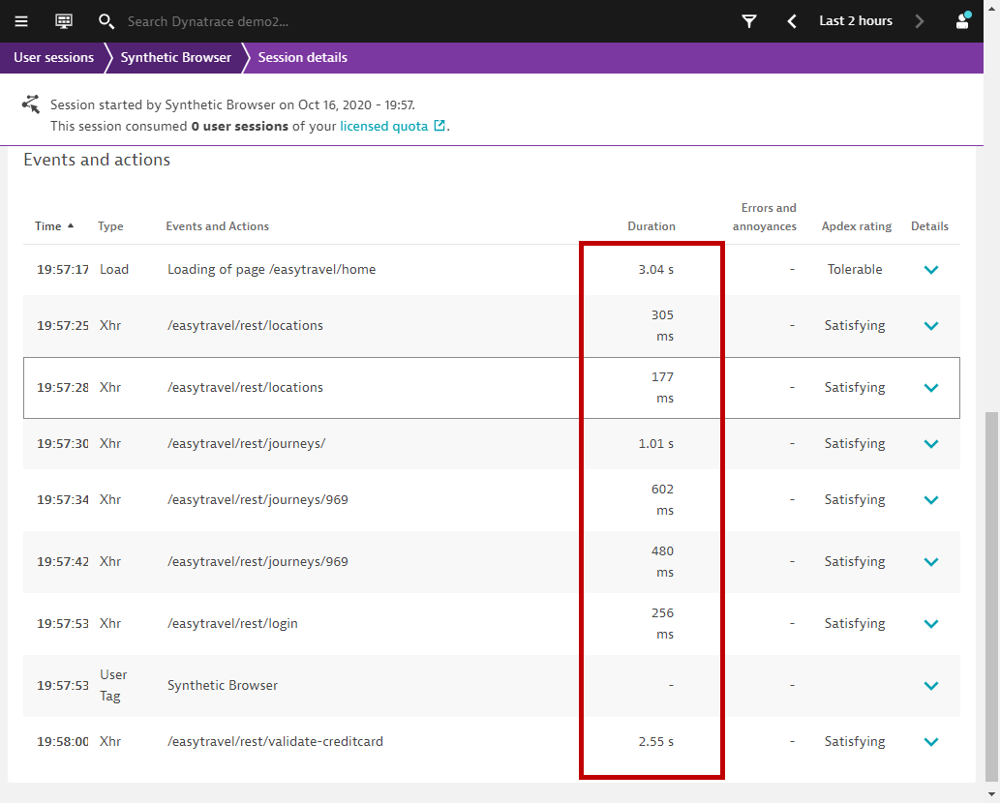

What is the average user action duration here? (i.e. SUM(useraction duration) divide by total number of user actions)

What I really want: average user action >2 sec for **every** usersession.

**Solution**

If avg of **all** user actions duration>2 seconds

```SQL
SELECT usersession.usersessionid, avg(useraction.duration) FILTER>2000
FROM usersession
WHERE useraction.application='www.angular.easytravel.com'
AND useraction.name="/easytravel/rest/validate-creditcard"
GROUP BY usersession.usersessionid
```

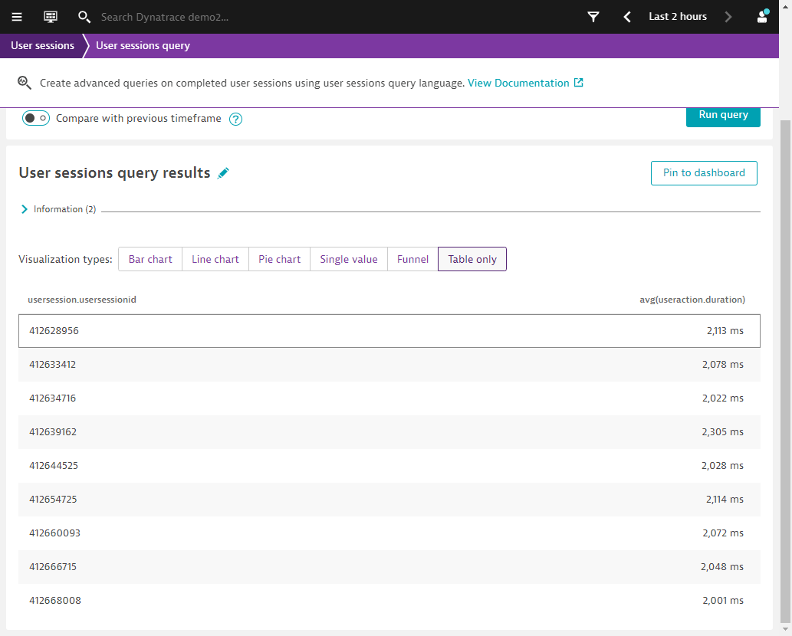

Take any **Usersession ID**...

`SELECT usersession.usersessionid FROM usersession WHERE usersession.usersessionid=<anyid>`

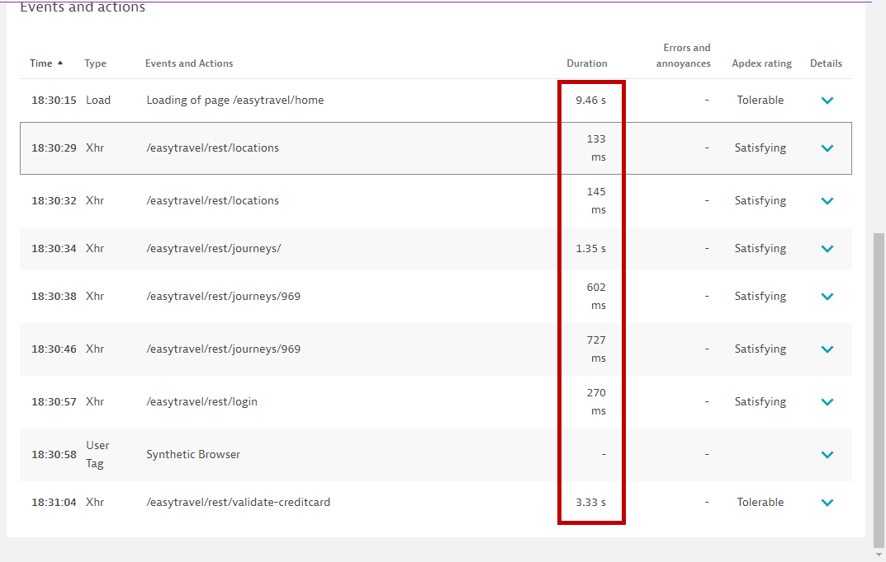

(9.46+0.133+0.145+1.35+0.602+0.727+0.27+3.33)/8 = 2.0002

GOAL!
<!-- ------------------------ -->

## Feedback
Duration: 3

We hope you enjoyed this lab and found it useful. We would love your feedback!
<form>
  <name>How was your overall experience with this lab?</name>
  <input value="Excellent" />
  <input value="Good" />
  <input value="Average" />
  <input value="Fair" />
  <input value="Poor" />
</form>

<form>
  <name>What did you benefit most from this lab?</name>
  <input value="USQL tips and ticks in the field" />
  <input value="Hands on exercise" />
</form>


Positive
: 💡 For other ideas and suggestions, please **[reach out via email](mailto:APAC-SE-Central@dynatrace.com?subject=AdvancedUSQL)**.